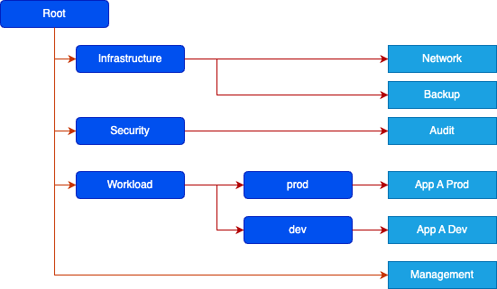
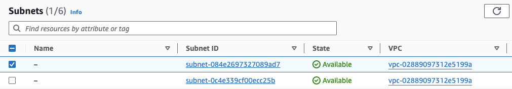
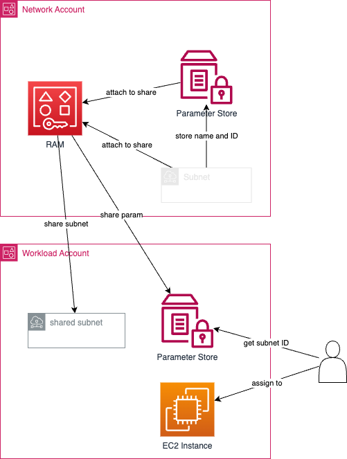

In an AWS landing zone setup, you typically have several infrastructure
accounts, which create resources and share them with other member accounts.

A typical AWS landing zone organization structure might look something like
this:



The management account contains your definition of the organizational structure.
The network account defines several VPCs with their subnets and routing. In the
case of the network resources, you might share the subnets with your member
accounts using the AWS Resource Access Manager, or RAM.

```hcl
# create a subnet in your network account and share it with member accounts
# of your organization.

resource "aws_subnet" "dev_private" {
    ...
    tags = {
        Name = "dev_private"
    }
}

resource "aws_ram_resource_share" "dev_subnets" { ... }

resource "aws_ram_resource_association" "subnet_dev_private" {
    resource_arn       = aws_subnet.dev_private.arn
    resource_share_arn = aws_ram_resource_share.dev_subnets.arn
}

resource "aws_ram_principal_association" "dev_subnets_dev" {
    principal          = data.aws_organizations_organizational_unit.dev.arn
    resource_share_arn = aws_ram_resource_share.example.arn
}
```

So far, so good. Easy and straight-forward. Now let's take a look at what this
new subnet looks like in the member account.



Well, it worked. But the subnet has no name! This is because the name of a
subnet is stored in its tags (see the Terraform example above). And RAM does not
share tags with target accounts. So if we only have access to the member
account, we don't know which subnet to choose, unless we already know its ID. If
you work in UI, this makes it pretty error-prone and your resources might end up
using the wrong subnet. And if you're working with Infrastructure as Code, which
you should, you might have to hard-code these subnet IDs somewhere, which is
also mehh.

One simple solution to this would be to grant member accounts read access to
subnets in the network account through a special role. This is not very
difficult to set up, but when you need the subnet information, you always have
to assume a role first. In Terraform, this is done through a separate provider
definition, which you need to configure just for this purpose.

You could also just tag the subnets manually in all member accounts. But again,
this is not very pretty.

Enter AWS Systems Manager Parameter Store! This service lets you store simple
key-value pairs to be consumed by other services. And these parameters can even
be shared - for a small fee - with other accounts through RAM. When we create
and share our subnets, we just store their ID in an SSM parameter and share it
in the same RAM share with the member accounts. In your IaC definition you can
then pull the subnet ID out of the shared parameter and use it to attach an EC2
instance, for example.



Let's complete our Terraform code from above.

```hcl
resource "aws_ssm_parameter" "dev_subnet_ids" {
  name  = "dev-subnet-ids"
  type  = "String"
  tier  = "Advanced"

  value = jsonencode({
    private = aws_subnet.dev_private
  })
}

resource "aws_ram_resource_association" "param_dev_subnet_ids" {
    resource_arn       = aws_ssm_parameter.dev_subnet_ids
    resource_share_arn = aws_ram_resource_share.dev_subnets.arn
}

```

As you can see, we store the value as a JSON object. This makes it easier to
share multiple IDs in the same parameter. This saves a few cents and also makes
accessing the values on the other side faster and simpler.

Make sure the `tier` is set to "Advanced". Standard parameters are not shareable
via RAM!

On the consuming side, which will be the member accounts, we can access the
subnet IDs simply with a Terraform data source.

```hcl
# read the ids from the SSM parameter
data "aws_ssm_parameter" "dev_subnet_ids" {
  name = "dev-subnet-ids"
}

# put the ids into a local for easier access
locals {
    subnet_ids = jsondecode(data.aws_ssm_parameter.dev_subnet_ids.value)
}

resource "aws_instance" "web" {
  ...
  subnet_id = local.subnet_ids.private
}
```

That's it. If you use this a lot, you could also put the reading part into a
Terraform module and put the IDs into its output.

For the sake of simplicity, I left some details out. For example the handling of
sensitive values and also the possibility to store SSM parameters hierarchically
using paths (see `aws_ssm_parameters_by_path`). But I'm sure you'll figure that
out.

Also, we only shared some subnet ID here. But this method lets you share all
sorts of stuff with member accounts. You could also share the organization
structure (IDs of organizational units or the IDs of other accounts). This
allows you to have information in member accounts without having to add
permissions.
