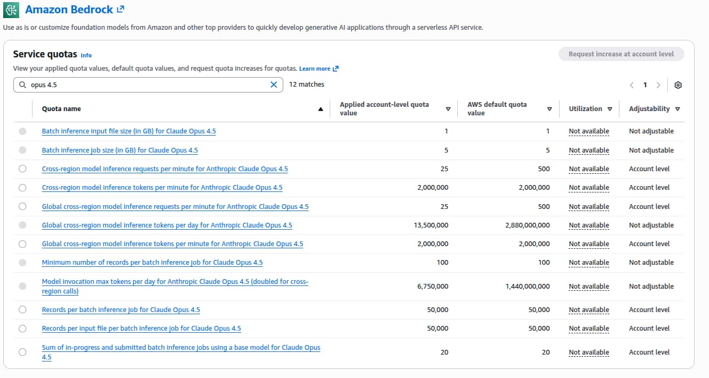

# Using Claude Code on AWS Bedrock

Claude Code works out of the box with the Anthropic API, but many teams need
more:

- Data residency controls
- IAM/SSO authentication
- Audit trails
- Consolidated AWS billing

AWS Bedrock provides all of this while running the same Claude models.

In this guide, we will walk through the full setup, from enabling model access
and configuring IAM to scaling Claude Code across a multi-account organization.

## Prerequisites

1. [AWS CLI](https://docs.aws.amazon.com/cli/latest/userguide/getting-started-install.html)
   installed
2. [Claude Code](https://code.claude.com/docs/en/overview) installed
3. [AWS SSO](https://docs.aws.amazon.com/cli/latest/userguide/cli-configure-sso.html)
   configured (recommended for security, no static credentials)

## Enable Model Access

1. Log in to the AWS Console and select the region where you want to run (e.g.,
   `eu-central-2`).
2. Go to **Amazon Bedrock > Model catalog** and find **Claude Opus 4.6** (or
   Sonnet 4.6 / Haiku 4.5 see
   [Choosing the Right Model](#choosing-the-right-model-and-inference-profile)
   below).
3. Click **Request model access**. AWS will ask for a brief use case
   description. A one-sentence explanation is sufficient, e.g., "AI-assisted
   software development using Claude Code." For most Claude models, approval is
   automatic and takes less than a minute.

## Create an IAM Policy

Claude Code needs permissions to invoke Bedrock models and list inference
profiles.

Create an IAM policy with the following permissions.

```json
{
  "Version": "2012-10-17",
  "Statement": [
    {
      "Sid": "AllowModelAndInferenceProfileAccess",
      "Effect": "Allow",
      "Action": [
        "bedrock:InvokeModel",
        "bedrock:InvokeModelWithResponseStream",
        "bedrock:ListInferenceProfiles"
      ],
      "Resource": [
        "arn:aws:bedrock:*:*:inference-profile/*",
        "arn:aws:bedrock:*:*:application-inference-profile/*",
        "arn:aws:bedrock:*:*:foundation-model/*"
      ]
    },
    {
      "Sid": "AllowMarketplaceSubscription",
      "Effect": "Allow",
      "Action": [
        "aws-marketplace:ViewSubscriptions",
        "aws-marketplace:Subscribe"
      ],
      "Resource": "*",
      "Condition": {
        "StringEquals": {
          "aws:CalledViaLast": "bedrock.amazonaws.com"
        }
      }
    }
  ]
}
```

See
[IAM configuration for Claude Code](https://code.claude.com/docs/en/amazon-bedrock#iam-configuration)
and
[Creating IAM policies](https://docs.aws.amazon.com/IAM/latest/UserGuide/access_policies_create-console.html).

## Attach the Policy

A policy on its own does nothing; you need to attach it to the identity that
developers use to authenticate.

**If you use AWS SSO (recommended)**, attach the policy to your SSO permission
set:

1. Go to **IAM Identity Center > Permission sets**.
2. Open (or create) the permission set your developers use.
3. Under **Permissions policies**, click **Attach policies** and select the
   `claude-code-bedrock-access` policy you created above.
4. Assign the permission set to the relevant AWS accounts

**If you use IAM users or roles instead**, attach the policy directly:

- **IAM user/group**: Go to **IAM > Users** (or **Groups**), select the target,
  and attach the policy under **Permissions**.
- **IAM role**: Go to **IAM > Roles**, select the role, and attach the policy.

See
[Attaching IAM policies](https://docs.aws.amazon.com/IAM/latest/UserGuide/access_policies_manage-attach-detach.html)
for detailed instructions.

## Configure Claude Code

For the best experience with AWS SSO (recommended, no static credentials),
configure Claude Code to handle SSO session refresh and set all required
environment variables in one place.

Add this to your `~/.claude/settings.json`:

```json
{
  "awsAuthRefresh": "aws sso login --profile myprofile",
  "env": {
    "CLAUDE_CODE_USE_BEDROCK": "1",
    "AWS_PROFILE": "myprofile",
    "AWS_REGION": "eu-central-2",
    "ANTHROPIC_MODEL": "eu.anthropic.claude-opus-4-6-v1",
    "CLAUDE_CODE_MAX_OUTPUT_TOKENS": "16384",
    "MAX_THINKING_TOKENS": "10000"
  }
}
```

- **awsAuthRefresh**: Automatically runs the SSO login command when your session
  expires.
- **CLAUDE_CODE_USE_BEDROCK**: Enables AWS Bedrock as the provider (set to `1`).
- **AWS_PROFILE**: The AWS CLI profile to use for credentials.
- **AWS_REGION**: The region for the Bedrock API endpoint.
- **ANTHROPIC_MODEL**: The inference profile ID. Must match a model you have
  enabled. See
  [Choosing the Right Model](#choosing-the-right-model-and-inference-profile)
  for alternatives like Sonnet or Haiku.
- **CLAUDE_CODE_MAX_OUTPUT_TOKENS** and **MAX_THINKING_TOKENS**: Control the
  maximum response and thinking budget per request. Lower values reduce cost per
  request but may cause Claude to truncate long answers or cut reasoning short.
  The defaults above (16384 output, 10000 thinking) are a reasonable starting
  point, increase them if you find responses getting cut off, or decrease them
  if you want tighter cost control.

> If you are not using SSO, you can omit the `awsAuthRefresh` line and configure
> credentials via environment variables (`AWS_ACCESS_KEY_ID` /
> `AWS_SECRET_ACCESS_KEY`) or any other
> [AWS credential method](https://docs.aws.amazon.com/cli/latest/userguide/cli-chap-authentication.html).

## Verify It Works

Run a quick check to confirm Claude Code is using Bedrock:

```bash
claude "What model are you?"
```

You should see a response confirming the model, for example:

```
I'm Claude Opus 4.6 (model ID: eu.anthropic.claude-opus-4-6-v1), running through Claude Code, Anthropic's CLI tool.
```

If you see an authentication or access error, verify your `AWS_PROFILE`,
`AWS_REGION`, and that you have [enabled model access](#enable-model-access) for
the configured model.

## Choosing the Right Model and Inference Profile

### Models

Claude Code on Bedrock supports multiple Claude models. Choose based on your
needs and budget:

| Model             | Inference Profile ID (EU)                     | Best For                        |
| ----------------- | --------------------------------------------- | ------------------------------- |
| Claude Opus 4.6   | `eu.anthropic.claude-opus-4-6-v1`             | Complex reasoning, architecture |
| Claude Sonnet 4.6 | `eu.anthropic.claude-sonnet-4-6`              | Everyday coding (best value)    |
| Claude Haiku 4.5  | `eu.anthropic.claude-haiku-4-5-20251001-v1:0` | Quick tasks, lowest cost        |

See the full list of available inference profiles in the
[Amazon Bedrock cross-region inference documentation](https://docs.aws.amazon.com/bedrock/latest/userguide/cross-region-inference-support.html).

To switch models, change the `ANTHROPIC_MODEL` value in your
`~/.claude/settings.json`. Make sure you have
[enabled access](#enable-model-access) for the model you choose.

> Sonnet 4.6 is what most teams start with. It handles the vast majority of
> coding tasks well and costs roughly 40% less than Opus per token. If you find
> yourself needing deeper reasoning on complex problems, switch to Opus.

### Inference Profiles

Each model is available via three inference profiles that control where your
requests are routed:

| Profile    | Prefix    | Routes To             |
| ---------- | --------- | --------------------- |
| **US**     | `us.`     | US regions only       |
| **EU**     | `eu.`     | EU regions only       |
| **Global** | `global.` | All regions worldwide |

Choose based on your data residency requirements. For example, if your
organization requires that data stays within the EU, use the `eu.` prefix (e.g.,
`eu.anthropic.claude-sonnet-4-6`).

> The AWS European Sovereign Cloud (`eusc-de-east-1`) launched in January 2026.
> As of this writing, Claude models are not available there yet, but this is
> worth monitoring if your compliance requirements specifically mandate the
> sovereign cloud rather than standard EU regions.

## Pricing

Bedrock is **pay-as-you-go**, no seats, no contracts. You pay a single per-token
price to AWS.

There is no separate Anthropic bill. The following prices are from
[Anthropic's models page](https://docs.anthropic.com/en/docs/about-claude/models).

| Model             | Input            | Output            |
| ----------------- | ---------------- | ----------------- |
| Claude Opus 4.6   | $5.00 / M tokens | $25.00 / M tokens |
| Claude Sonnet 4.6 | $3.00 / M tokens | $15.00 / M tokens |
| Claude Haiku 4.5  | $1.00 / M tokens | $5.00 / M tokens  |

### What Does This Cost in Practice?

| Option         | Est. Cost / Dev / Month | Data Residency | IAM / CloudTrail |
| -------------- | ----------------------- | -------------- | ---------------- |
| Bedrock Sonnet | ~$180                   | Yes            | Yes              |
| Bedrock Opus   | ~$300-900               | Yes            | Yes              |
| Claude Max     | $100-200 (flat)         | No             | No               |

Sonnet estimate is based on
[Anthropic's data](https://code.claude.com/docs/en/costs) (~$6/day). Opus
estimate is extrapolated from the token pricing difference. Actual costs depend
on usage intensity and thinking budget.

For teams without compliance requirements, Claude Max is cheaper.

For organizations that need IAM, audit trails, and data residency, Bedrock is
the only option.

## Quotas and Rate Limits

Bedrock enforces quotas on requests per minute (RPM) and tokens per minute
(TPM). With Claude Code, you can hit these limits quickly, each coding
interaction may involve multiple API calls under the hood.



## Scaling for Teams: Multi-Account Strategy

Bedrock quotas are **per AWS account**. With a default of 25 RPM for Opus 4.6
(upgradable to 500 RPM), a single account will not support a large team.

### Solution: Dedicated Accounts Per Team

Structure your AWS Organization with dedicated Bedrock accounts per team:

```
AWS Organization
├── platform-team-bedrock
│   └── Platform Engineers (8 devs) → 500 RPM
│
├── backend-team-bedrock
│   └── Backend Team (12 devs) → 500 RPM
│
├── frontend-team-bedrock
│   └── Frontend Team (10 devs) → 500 RPM
│
├── data-team-bedrock
│   └── Data Engineering (10 devs) → 500 RPM
│
└── mobile-team-bedrock
    └── Mobile Team (10 devs) → 500 RPM
```

> **In practice**, developer usage is bursty, most teams are active during the
> same working hours, and individual coding sessions can generate bursts of
> rapid API calls. Plan for peak load rather than averages. If a team of 10
> developers regularly sees throttling at 500 RPM, consider splitting them
> across two accounts.

If you are already running a multi-account AWS architecture, the organizational
setup, StackSets, and automation patterns we described in
[No Account Left Behind: Automating Cross-Account Observability in AWS](/en/blog/no-account-left-behind)
translate well to this use case. The Terraform in that post handles account
provisioning and OU structure that you can reuse when creating dedicated Bedrock
accounts.

## Budget Alarms

Both the Anthropic API and Bedrock are pay-as-you-go. With the Anthropic API,
you can set spending limits directly in the console. With Bedrock, use AWS
Budgets:

1. Create a monthly budget scoped to Amazon Bedrock.
2. Set alerts at 50%, 80%, and 100% thresholds.
3. Enable "forecasted spend" alerts for early warnings.

For teams using the multi-account strategy, create per-account budgets to track
spending by team.

See
[AWS Budgets documentation](https://docs.aws.amazon.com/cost-management/latest/userguide/budgets-managing-costs.html)
for setup instructions.

## Bedrock vs Anthropic API

**Use Bedrock when:**

- You have data residency requirements: EU, US, or global inference profiles
  route traffic within those regions
- You need IAM/SSO integration and AWS CloudTrail audit logs
- Consolidated AWS billing and cost attribution per team matters
- You have existing AWS infrastructure and want to stay in that ecosystem

**Use the Anthropic API when:**

- No data residency requirements
- Simpler setup for small teams or personal use
- No existing AWS footprint

## References

- [Claude Code on Amazon Bedrock](https://code.claude.com/docs/en/amazon-bedrock)
- [Manage costs effectively](https://code.claude.com/docs/en/costs)
- [Amazon Bedrock Pricing](https://aws.amazon.com/bedrock/pricing/)
- [AWS Service Quotas](https://docs.aws.amazon.com/servicequotas/latest/userguide/request-quota-increase.html)
- [Claude for Enterprise on AWS Marketplace](https://aws.amazon.com/blogs/awsmarketplace/claude-for-enterprise-premium-seats-with-claude-code-now-available-in-aws-marketplace/)
- [No Account Left Behind: Automating Cross-Account Observability in AWS](/en/blog/no-account-left-behind)

**Interested in running your own Claude Code?** Check out our
[Pragmatic AI Adoption](https://bespinian.io/en/services/pragmatic-ai-adoption?utm_source=bespinian_blog&utm_medium=blog&utm_campaign=claude_code_using_aws_bedrock).
