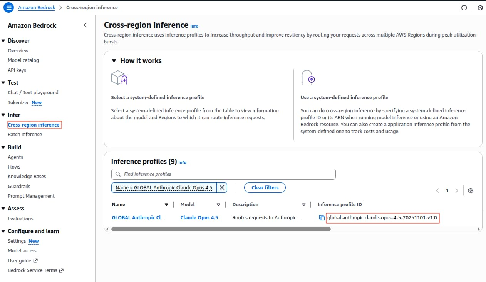
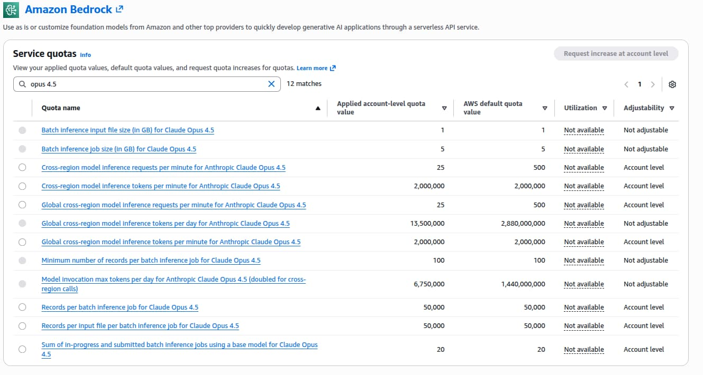

# Claude Code using AWS Bedrock

Claude Code works out of the box with the Anthropic API, but many teams need
more: data residency controls, IAM/SSO authentication, audit trails, and
consolidated AWS billing.

AWS Bedrock provides all of this while running the same Claude models.

This guide covers how to set up Claude Code with Bedrock, configure SSO
authentication, choose the right inference profile for your compliance
requirements, and scale for teams.

## Prerequisites

1. [AWS CLI](https://docs.aws.amazon.com/cli/latest/userguide/getting-started-install.html)
   installed
2. [Claude Code](https://code.claude.com/docs/en/overview) installed
3. [AWS SSO](https://docs.aws.amazon.com/cli/latest/userguide/cli-configure-sso.html)
   (optional but preferred)

## Enable Model Access

- By default, Bedrock models are disabled. You must enable them manually.

1. Log in to the AWS Console and select the region where you want to run.
2. Go to Amazon Bedrock > Model catalog and select Claude Opus 4.5.
3. Submit the use case details.
4. Select Cross-region inference to find the Inference profile ID.



## Create an IAM policy with the required permissions

```json
{
  "Version": "2012-10-17",
  "Statement": [
    {
      "Sid": "AllowModelAndInferenceProfileAccess",
      "Effect": "Allow",
      "Action": [
        "bedrock:InvokeModel",
        "bedrock:InvokeModelWithResponseStream",
        "bedrock:ListInferenceProfiles"
      ],
      "Resource": [
        "arn:aws:bedrock:*:*:inference-profile/*",
        "arn:aws:bedrock:*:*:application-inference-profile/*",
        "arn:aws:bedrock:*:*:foundation-model/*"
      ]
    },
    {
      "Sid": "AllowMarketplaceSubscription",
      "Effect": "Allow",
      "Action": [
        "aws-marketplace:ViewSubscriptions",
        "aws-marketplace:Subscribe"
      ],
      "Resource": "*",
      "Condition": {
        "StringEquals": {
          "aws:CalledViaLast": "bedrock.amazonaws.com"
        }
      }
    }
  ]
}
```

See
[IAM configuration for Claude Code](https://code.claude.com/docs/en/amazon-bedrock#iam-configuration)
and
[Creating IAM policies](https://docs.aws.amazon.com/IAM/latest/UserGuide/access_policies_create-console.html).

## Configure Claude Code for AWS SSO

For the best experience with AWS SSO (recommended for security - no static
credentials), configure Claude Code to automatically handle SSO session refresh
and set all required environment variables in one place.

Add this to your `~/.claude/settings.json`:

```json
{
  "awsAuthRefresh": "aws sso login --profile myprofile",
  "env": {
    "CLAUDE_CODE_USE_BEDROCK": 1,
    "AWS_PROFILE": "myprofile",
    "AWS_REGION": "us-east-1",
    "ANTHROPIC_MODEL": "global.anthropic.claude-opus-4-5-20251101-v1:0",
    "CLAUDE_CODE_MAX_OUTPUT_TOKENS": "4096",
    "MAX_THINKING_TOKENS": "1024"
  }
}
```

- **awsAuthRefresh**: Automatically runs the SSO login command when your session
  expires
- **CLAUDE_CODE_USE_BEDROCK**: Enables AWS Bedrock as the provider instead of
  the direct Anthropic API (set to `1` to enable)
- **AWS_PROFILE**: Sets the AWS profile for credentials
- **AWS_REGION**: The AWS region for the Bedrock API endpoint
- **ANTHROPIC_MODEL**: The inference profile (must match your data residency
  requirements)
- **CLAUDE_CODE_MAX_OUTPUT_TOKENS** and **MAX_THINKING_TOKENS**: Recommended
  token limits for Bedrock

### Verify It Works

```bash
claude "What model are you?"
```

You should see a response confirming Opus 4.5:

```
I'm Claude Opus 4.5, Anthropic's most recent frontier model. The exact model ID is global.anthropic.claude-opus-4-5-20251101-v1:0.
```

## Choosing the Right Inference Profile

Opus 4.5 is available via three inference profiles. Choose based on your data
residency and availability requirements:

| Profile    | Inference Profile ID                             | Routes To             |
| ---------- | ------------------------------------------------ | --------------------- |
| **EU**     | `eu.anthropic.claude-opus-4-5-20251101-v1:0`     | EU regions only       |
| **US**     | `us.anthropic.claude-opus-4-5-20251101-v1:0`     | US regions only       |
| **Global** | `global.anthropic.claude-opus-4-5-20251101-v1:0` | All regions worldwide |

The AWS European Sovereign Cloud launched January 14, 2026 (`eusc-de-east-1`,
Brandenburg, Germany), but **Claude models are not yet available there**.

## Watch Out: Bedrock Quotas

Bedrock enforces quotas on requests per minute (RPM). With Claude Code, you can
hit these limits fast, especially if you have a team using the same AWS account
during intensive coding sessions where the tool makes multiple API calls.



### Scaling for Teams: Multi-Account Strategy

Here's the reality for teams: Bedrock quotas are **per AWS account**. With a
default of 25 RPM for Opus 4.5 (upgradable to 500), a single account won't
support a large team.

### Solution: Accounts Per Developer Group

Structure your AWS Organization with dedicated accounts per team:

```
AWS Organization
├── platform-team-bedrock
│   └── Platform Engineers (8 devs) → 500 RPM
│
├── backend-team-bedrock
│   └── Backend Team (12 devs) → 500 RPM
│
├── frontend-team-bedrock
│   └── Frontend Team (10 devs) → 500 RPM
│
├── data-team-bedrock
│   └── Data Engineering (10 devs) → 500 RPM
│
└── mobile-team-bedrock
    └── Mobile Team (10 devs) → 500 RPM
```

**Result:** 50 developers across 5 accounts = 2,500 RPM total, 50 RPM per
developer.

### Set Up Budget Alarms

- Both Anthropic API and Bedrock are pay-as-you-go.
- Anthropic lets you set spending limits directly in the console.
- With Bedrock, set up AWS Budget alarms to control costs:
  - Create a monthly budget for Amazon Bedrock
  - Set alerts at 50%, 80%, and 100% thresholds
  - Use "forecasted spend" alerts to get early warnings

For teams using the multi-account strategy, create per-account budgets to track
spending by team.

See
[AWS Budgets documentation](https://docs.aws.amazon.com/cost-management/latest/userguide/budgets-managing-costs.html)
for setup instructions.

## Bedrock vs Anthropic: It's About Compliance

- Pricing is nearly identical.

**Use Bedrock when:**

- You need compliance controls and audit
- You need IAM/SSO integration
- Consolidated AWS billing matters
- You have existing AWS infrastructure

**Use Anthropic API when:**

- No data residency requirements
- Simpler setup for small teams / personal use
- No existing AWS footprint

## References

- [Claude Code on Amazon Bedrock](https://code.claude.com/docs/en/amazon-bedrock) -
  Official setup documentation
- [Amazon Bedrock Pricing](https://aws.amazon.com/bedrock/pricing/)
