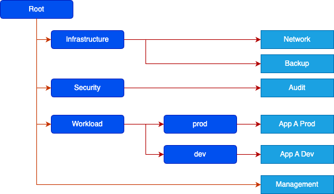
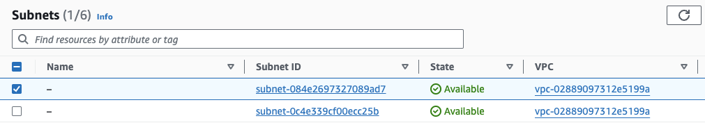
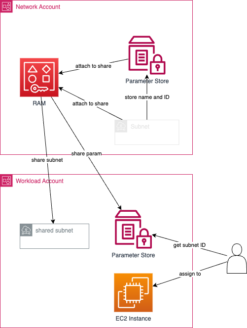

---
title:
  Netzwerk- und Organisationsinfos mit AWS-Landing-Zone-Member-Accounts teilen
author: Philippe Haessig
pubDate: 2024-07-04
tags: ["aws", "infrastructure", "terraform", "networking", "cloud"]
description:
  "Erfahre, wie du Netzwerkkonfiguration und Organisationsinformationen über SSM
  Parameter Store und Resource Access Manager (RAM) mit
  AWS-Landing-Zone-Member-Accounts teilst. Ein praktischer Leitfaden, um
  Subnet-IDs und andere Metadaten ohne manuelles Tagging zu verteilen."
image: ../../../assets/blog/landing.jpg
---

In einem AWS-Landing-Zone-Setup hast du typischerweise mehrere
Infrastruktur-Accounts, die Ressourcen erstellen und mit anderen Member Accounts
teilen.

Eine typische Organisationsstruktur einer AWS Landing Zone könnte etwa so
aussehen:



Der Management Account enthält deine Definition der Organisationsstruktur. Der
Network Account definiert mehrere VPCs mit ihren Subnets und dem Routing. Im
Fall der Netzwerkressourcen teilst du die Subnets vielleicht über den AWS
Resource Access Manager (RAM) mit deinen Member Accounts.

```hcl
# Ein Subnet im Network Account erstellen und mit den Member Accounts
# der Organisation teilen.

resource "aws_subnet" "dev_private" {
    ...
    tags = {
        Name = "dev_private"
    }
}

resource "aws_ram_resource_share" "dev_subnets" { ... }

resource "aws_ram_resource_association" "subnet_dev_private" {
    resource_arn       = aws_subnet.dev_private.arn
    resource_share_arn = aws_ram_resource_share.dev_subnets.arn
}

resource "aws_ram_principal_association" "dev_subnets_dev" {
    principal          = data.aws_organizations_organizational_unit.dev.arn
    resource_share_arn = aws_ram_resource_share.example.arn
}
```

So weit, so gut. Einfach und geradlinig. Schauen wir uns jetzt an, wie dieses
neue Subnet im Member Account aussieht.



Nun, es hat funktioniert. Aber das Subnet hat keinen Namen! Das liegt daran,
dass der Name eines Subnets in seinen Tags gespeichert ist (siehe das
Terraform-Beispiel oben). Und RAM teilt keine Tags mit den Ziel-Accounts. Wenn
wir also nur Zugriff auf den Member Account haben, wissen wir nicht, welches
Subnet wir wählen sollen – ausser wir kennen dessen ID bereits. Wenn du im UI
arbeitest, ist das ziemlich fehleranfällig und deine Ressourcen landen womöglich
im falschen Subnet. Und wenn du mit Infrastructure as Code arbeitest, was du
solltest, musst du diese Subnet-IDs eventuell irgendwo hartcodieren – auch
mässig schön.

Eine einfache Lösung wäre, den Member Accounts über eine spezielle Rolle
Lesezugriff auf die Subnets im Network Account zu geben. Das ist nicht besonders
schwierig einzurichten, aber wenn du die Subnet-Informationen brauchst, musst du
jedes Mal zuerst eine Rolle annehmen. In Terraform geschieht das über eine
separate Provider-Definition, die du nur zu diesem Zweck konfigurieren musst.

Du könntest die Subnets auch einfach in allen Member Accounts manuell taggen.
Aber auch das ist wenig elegant.

Auftritt AWS Systems Manager Parameter Store! Mit diesem Service kannst du
einfache Key-Value-Paare ablegen, die von anderen Services konsumiert werden.
Und diese Parameter lassen sich – gegen eine kleine Gebühr – sogar über RAM mit
anderen Accounts teilen. Wenn wir unsere Subnets erstellen und teilen, legen wir
deren ID einfach in einem SSM-Parameter ab und teilen ihn im selben RAM Share
mit den Member Accounts. In deiner IaC-Definition kannst du die Subnet-ID dann
aus dem geteilten Parameter ziehen und damit zum Beispiel eine EC2-Instanz
anhängen.



Vervollständigen wir unseren Terraform-Code von oben.

```hcl
resource "aws_ssm_parameter" "dev_subnet_ids" {
  name  = "dev-subnet-ids"
  type  = "String"
  tier  = "Advanced"

  value = jsonencode({
    private = aws_subnet.dev_private
  })
}

resource "aws_ram_resource_association" "param_dev_subnet_ids" {
    resource_arn       = aws_ssm_parameter.dev_subnet_ids
    resource_share_arn = aws_ram_resource_share.dev_subnets.arn
}

```

Wie du siehst, speichern wir den Wert als JSON-Objekt. Damit lassen sich mehrere
IDs im selben Parameter teilen. Das spart ein paar Rappen und macht den Zugriff
auf die Werte auf der anderen Seite schneller und einfacher.

Achte darauf, dass `tier` auf «Advanced» gesetzt ist. Standard-Parameter lassen
sich nicht über RAM teilen!

Auf der konsumierenden Seite – also in den Member Accounts – können wir auf die
Subnet-IDs einfach über eine Terraform-Data-Source zugreifen.

```hcl
# Die IDs aus dem SSM-Parameter lesen
data "aws_ssm_parameter" "dev_subnet_ids" {
  name = "dev-subnet-ids"
}

# Die IDs für einfacheren Zugriff in eine Local legen
locals {
    subnet_ids = jsondecode(data.aws_ssm_parameter.dev_subnet_ids.value)
}

resource "aws_instance" "web" {
  ...
  subnet_id = local.subnet_ids.private
}
```

Das war's. Wenn du das häufig brauchst, könntest du den lesenden Teil auch in
ein Terraform-Modul auslagern und die IDs in dessen Output legen.

Der Einfachheit halber habe ich einige Details weggelassen. Zum Beispiel den
Umgang mit sensiblen Werten sowie die Möglichkeit, SSM-Parameter hierarchisch
über Pfade abzulegen (siehe `aws_ssm_parameters_by_path`). Aber das kriegst du
sicher selbst hin.

Ausserdem haben wir hier nur eine Subnet-ID geteilt. Mit dieser Methode kannst
du aber alles Mögliche mit Member Accounts teilen. Du könntest auch die
Organisationsstruktur teilen (IDs von Organizational Units oder die IDs anderer
Accounts). So stehen in den Member Accounts Informationen zur Verfügung, ohne
dass du zusätzliche Berechtigungen vergeben musst.
