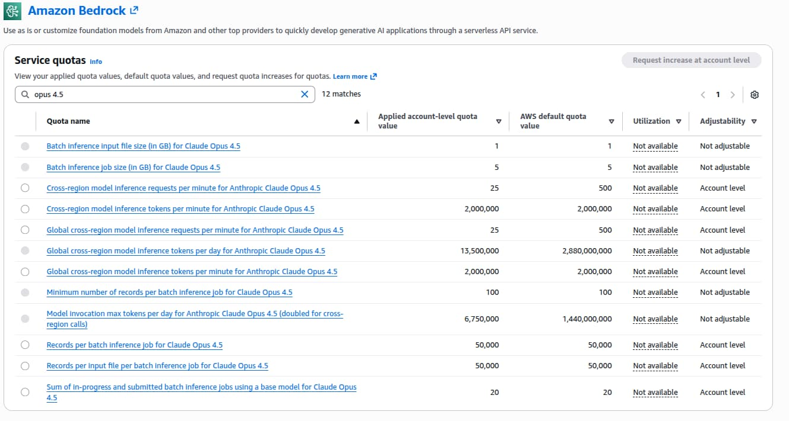

# Claude Code auf AWS Bedrock nutzen

Claude Code funktioniert out of the box mit der Anthropic-API, aber viele Teams
brauchen mehr:

- Kontrolle über die Datenresidenz
- IAM-/SSO-Authentifizierung
- Audit Trails
- Konsolidierte AWS-Abrechnung

AWS Bedrock bietet all das – und betreibt dabei dieselben Claude-Modelle.

In diesem Leitfaden gehen wir das komplette Setup durch: vom Aktivieren des
Modellzugriffs über die IAM-Konfiguration bis zur Skalierung von Claude Code
über eine Multi-Account-Organisation hinweg.

## Voraussetzungen

1. [AWS CLI](https://docs.aws.amazon.com/cli/latest/userguide/getting-started-install.html)
   installiert
2. [Claude Code](https://code.claude.com/docs/en/overview) installiert
3. [AWS SSO](https://docs.aws.amazon.com/cli/latest/userguide/cli-configure-sso.html)
   konfiguriert (aus Sicherheitsgründen empfohlen, keine statischen Credentials)

## Modellzugriff aktivieren

1. Melde dich in der AWS-Konsole an und wähle die Region, in der du arbeiten
   willst (z.B. `eu-central-2`).
2. Gehe zu **Amazon Bedrock > Model catalog** und suche **Claude Opus 4.6**
   (oder Sonnet 4.6 / Haiku 4.5, siehe
   [Das richtige Modell](#das-richtige-modell-und-inference-profile) weiter
   unten).
3. Klicke auf **Request model access**. AWS fragt nach einer kurzen Beschreibung
   des Anwendungsfalls. Ein Satz genügt, z.B. «KI-unterstützte
   Softwareentwicklung mit Claude Code». Für die meisten Claude-Modelle erfolgt
   die Freigabe automatisch und dauert weniger als eine Minute.

## Eine IAM-Policy erstellen

Claude Code braucht Berechtigungen, um Bedrock-Modelle aufzurufen und Inference
Profiles aufzulisten.

Erstelle eine IAM-Policy mit den folgenden Berechtigungen.

```json
{
  "Version": "2012-10-17",
  "Statement": [
    {
      "Sid": "AllowModelAndInferenceProfileAccess",
      "Effect": "Allow",
      "Action": [
        "bedrock:InvokeModel",
        "bedrock:InvokeModelWithResponseStream",
        "bedrock:ListInferenceProfiles"
      ],
      "Resource": [
        "arn:aws:bedrock:*:*:inference-profile/*",
        "arn:aws:bedrock:*:*:application-inference-profile/*",
        "arn:aws:bedrock:*:*:foundation-model/*"
      ]
    },
    {
      "Sid": "AllowMarketplaceSubscription",
      "Effect": "Allow",
      "Action": [
        "aws-marketplace:ViewSubscriptions",
        "aws-marketplace:Subscribe"
      ],
      "Resource": "*",
      "Condition": {
        "StringEquals": {
          "aws:CalledViaLast": "bedrock.amazonaws.com"
        }
      }
    }
  ]
}
```

Siehe
[IAM configuration for Claude Code](https://code.claude.com/docs/en/amazon-bedrock#iam-configuration)
und
[Creating IAM policies](https://docs.aws.amazon.com/IAM/latest/UserGuide/access_policies_create-console.html).

## Die Policy zuweisen

Eine Policy allein bewirkt nichts – du musst sie der Identität zuweisen, mit der
sich deine Entwicklerinnen und Entwickler authentifizieren.

**Wenn du AWS SSO verwendest (empfohlen)**, weist du die Policy deinem
SSO-Permission-Set zu:

1. Gehe zu **IAM Identity Center > Permission sets**.
2. Öffne (oder erstelle) das Permission Set, das deine Entwicklerinnen und
   Entwickler nutzen.
3. Klicke unter **Permissions policies** auf **Attach policies** und wähle die
   oben erstellte Policy `claude-code-bedrock-access`.
4. Weise das Permission Set den relevanten AWS-Accounts zu

**Wenn du stattdessen IAM-User oder -Rollen verwendest**, weist du die Policy
direkt zu:

- **IAM-User/-Gruppe**: Gehe zu **IAM > Users** (oder **Groups**), wähle das
  Ziel und weise die Policy unter **Permissions** zu.
- **IAM-Rolle**: Gehe zu **IAM > Roles**, wähle die Rolle und weise die Policy
  zu.

Detaillierte Anweisungen findest du unter
[Attaching IAM policies](https://docs.aws.amazon.com/IAM/latest/UserGuide/access_policies_manage-attach-detach.html).

## Claude Code konfigurieren

Für die beste Erfahrung mit AWS SSO (empfohlen, keine statischen Credentials)
konfigurierst du Claude Code so, dass es die Erneuerung der SSO-Session
übernimmt und alle nötigen Umgebungsvariablen an einem Ort setzt.

Füge das in deine `~/.claude/settings.json` ein:

```json
{
  "awsAuthRefresh": "aws sso login --profile myprofile",
  "env": {
    "CLAUDE_CODE_USE_BEDROCK": "1",
    "AWS_PROFILE": "myprofile",
    "AWS_REGION": "eu-central-2",
    "ANTHROPIC_MODEL": "eu.anthropic.claude-opus-4-6-v1",
    "CLAUDE_CODE_MAX_OUTPUT_TOKENS": "16384",
    "MAX_THINKING_TOKENS": "10000"
  }
}
```

- **awsAuthRefresh**: Führt automatisch den SSO-Login-Befehl aus, wenn deine
  Session abläuft.
- **CLAUDE_CODE_USE_BEDROCK**: Aktiviert AWS Bedrock als Provider (auf `1`
  setzen).
- **AWS_PROFILE**: Das AWS-CLI-Profil, das für die Credentials verwendet wird.
- **AWS_REGION**: Die Region für den Bedrock-API-Endpunkt.
- **ANTHROPIC_MODEL**: Die ID des Inference Profile. Muss zu einem Modell
  passen, für das du den Zugriff aktiviert hast. Alternativen wie Sonnet oder
  Haiku findest du unter
  [Das richtige Modell](#das-richtige-modell-und-inference-profile).
- **CLAUDE_CODE_MAX_OUTPUT_TOKENS** und **MAX_THINKING_TOKENS**: Steuern das
  maximale Antwort- und Thinking-Budget pro Request. Tiefere Werte senken die
  Kosten pro Request, können aber dazu führen, dass Claude lange Antworten
  abschneidet oder das Denken zu früh beendet. Die obigen Werte (16384 Output,
  10000 Thinking) sind ein vernünftiger Ausgangspunkt – erhöhe sie, wenn
  Antworten abgeschnitten werden, oder senke sie, wenn du die Kosten enger
  kontrollieren willst.

> Wenn du kein SSO verwendest, kannst du die Zeile `awsAuthRefresh` weglassen
> und die Credentials über Umgebungsvariablen (`AWS_ACCESS_KEY_ID` /
> `AWS_SECRET_ACCESS_KEY`) oder jede andere
> [AWS-Credential-Methode](https://docs.aws.amazon.com/cli/latest/userguide/cli-chap-authentication.html)
> konfigurieren.

## Prüfen, ob es funktioniert

Führe eine kurze Prüfung aus, um zu bestätigen, dass Claude Code Bedrock nutzt:

```bash
claude "Welches Modell bist du?"
```

Du solltest eine Antwort sehen, die das Modell bestätigt, zum Beispiel:

```
Ich bin Claude Opus 4.6 (Modell-ID: eu.anthropic.claude-opus-4-6-v1) und laufe über Claude Code, das CLI-Tool von Anthropic.
```

Wenn du einen Authentifizierungs- oder Zugriffsfehler siehst, überprüfe
`AWS_PROFILE`, `AWS_REGION` und ob du den
[Modellzugriff aktiviert](#modellzugriff-aktivieren) hast für das konfigurierte
Modell.

## Das richtige Modell und Inference Profile

### Modelle

Claude Code auf Bedrock unterstützt mehrere Claude-Modelle. Wähle nach deinen
Bedürfnissen und deinem Budget:

| Modell            | Inference-Profile-ID (EU)                     | Am besten für                        |
| ----------------- | --------------------------------------------- | ------------------------------------ |
| Claude Opus 4.6   | `eu.anthropic.claude-opus-4-6-v1`             | Komplexes Reasoning, Architektur     |
| Claude Sonnet 4.6 | `eu.anthropic.claude-sonnet-4-6`              | Tägliches Coding (bestes Verhältnis) |
| Claude Haiku 4.5  | `eu.anthropic.claude-haiku-4-5-20251001-v1:0` | Schnelle Aufgaben, tiefste Kosten    |

Die vollständige Liste der verfügbaren Inference Profiles findest du in der
[Dokumentation zu Cross-Region Inference in Amazon Bedrock](https://docs.aws.amazon.com/bedrock/latest/userguide/cross-region-inference-support.html).

Um das Modell zu wechseln, änderst du den Wert `ANTHROPIC_MODEL` in deiner
`~/.claude/settings.json`. Stelle sicher, dass du den
[Zugriff aktiviert](#modellzugriff-aktivieren) hast für das gewählte Modell.

> Die meisten Teams starten mit Sonnet 4.6. Es bewältigt die grosse Mehrheit der
> Coding-Aufgaben gut und kostet pro Token rund 40 % weniger als Opus. Wenn du
> merkst, dass du bei komplexen Problemen tieferes Reasoning brauchst, wechsle
> zu Opus.

### Inference Profiles

Jedes Modell ist über drei Inference Profiles verfügbar, die steuern, wohin
deine Requests geroutet werden:

| Profil     | Präfix    | Routet nach            |
| ---------- | --------- | ---------------------- |
| **US**     | `us.`     | nur US-Regionen        |
| **EU**     | `eu.`     | nur EU-Regionen        |
| **Global** | `global.` | alle Regionen weltweit |

Wähle nach deinen Anforderungen an die Datenresidenz. Wenn deine Organisation
zum Beispiel verlangt, dass Daten in der EU bleiben, verwendest du das Präfix
`eu.` (z.B. `eu.anthropic.claude-sonnet-4-6`).

> Die AWS European Sovereign Cloud (`eusc-de-east-1`) ist im Januar 2026
> gestartet. Zum Zeitpunkt des Schreibens sind Claude-Modelle dort noch nicht
> verfügbar – das lohnt sich aber zu beobachten, falls deine
> Compliance-Anforderungen explizit die Sovereign Cloud statt der
> Standard-EU-Regionen vorschreiben.

## Preise

Bedrock ist **Pay-as-you-go** – keine Seats, keine Verträge. Du bezahlst AWS
einen einzigen Preis pro Token.

Es gibt keine separate Rechnung von Anthropic. Die folgenden Preise stammen von
der
[Modellseite von Anthropic](https://docs.anthropic.com/en/docs/about-claude/models).

| Modell            | Input              | Output              |
| ----------------- | ------------------ | ------------------- |
| Claude Opus 4.6   | $5.00 / Mio. Token | $25.00 / Mio. Token |
| Claude Sonnet 4.6 | $3.00 / Mio. Token | $15.00 / Mio. Token |
| Claude Haiku 4.5  | $1.00 / Mio. Token | $5.00 / Mio. Token  |

### Was kostet das in der Praxis?

| Option         | Gesch. Kosten / Dev / Monat | Datenresidenz | IAM / CloudTrail |
| -------------- | --------------------------- | ------------- | ---------------- |
| Bedrock Sonnet | ~$180                       | Ja            | Ja               |
| Bedrock Opus   | ~$300–900                   | Ja            | Ja               |
| Claude Max     | $100–200 (pauschal)         | Nein          | Nein             |

Die Schätzung für Sonnet basiert auf
[Daten von Anthropic](https://code.claude.com/docs/en/costs) (~$6/Tag). Die
Schätzung für Opus ist aus der Preisdifferenz pro Token extrapoliert. Die
tatsächlichen Kosten hängen von der Nutzungsintensität und vom Thinking-Budget
ab.

Für Teams ohne Compliance-Anforderungen ist Claude Max günstiger.

Für Organisationen, die IAM, Audit Trails und Datenresidenz brauchen, ist
Bedrock die einzige Option.

## Quotas und Rate Limits

Bedrock erzwingt Quotas für Requests pro Minute (RPM) und Token pro Minute
(TPM). Mit Claude Code erreichst du diese Limits schnell – jede
Coding-Interaktion kann im Hintergrund mehrere API-Aufrufe auslösen.



## Für Teams skalieren: Multi-Account-Strategie

Bedrock-Quotas gelten **pro AWS-Account**. Mit einem Standardwert von 25 RPM für
Opus 4.6 (erhöhbar auf 500 RPM) reicht ein einzelner Account für ein grosses
Team nicht aus.

### Lösung: Dedizierte Accounts pro Team

Strukturiere deine AWS Organization mit dedizierten Bedrock-Accounts pro Team:

```
AWS Organization
├── platform-team-bedrock
│   └── Platform Engineers (8 devs) → 500 RPM
│
├── backend-team-bedrock
│   └── Backend Team (12 devs) → 500 RPM
│
├── frontend-team-bedrock
│   └── Frontend Team (10 devs) → 500 RPM
│
├── data-team-bedrock
│   └── Data Engineering (10 devs) → 500 RPM
│
└── mobile-team-bedrock
    └── Mobile Team (10 devs) → 500 RPM
```

> **In der Praxis** ist die Nutzung stossweise: Die meisten Teams sind während
> derselben Arbeitszeiten aktiv, und einzelne Coding-Sessions können Schübe
> schneller API-Aufrufe erzeugen. Plane für Spitzenlast statt für Durchschnitte.
> Wenn ein Team von 10 Entwicklerinnen und Entwicklern regelmässig bei 500 RPM
> gedrosselt wird, solltest du es auf zwei Accounts aufteilen.

Wenn du bereits eine Multi-Account-AWS-Architektur betreibst, lassen sich das
Organisations-Setup, die StackSets und die Automatisierungs-Patterns, die wir in
[No Account Left Behind: Cross-Account-Observability in AWS automatisieren](/de/blog/no-account-left-behind)
beschrieben haben, gut auf diesen Anwendungsfall übertragen. Das Terraform in
jenem Beitrag deckt Account-Provisioning und OU-Struktur ab, die du beim
Erstellen dedizierter Bedrock-Accounts wiederverwenden kannst.

## Budget-Alarme

Sowohl die Anthropic-API als auch Bedrock sind Pay-as-you-go. Bei der
Anthropic-API kannst du Ausgabenlimits direkt in der Konsole setzen. Bei Bedrock
nutzt du AWS Budgets:

1. Erstelle ein monatliches Budget mit Scope auf Amazon Bedrock.
2. Setze Alerts bei Schwellen von 50 %, 80 % und 100 %.
3. Aktiviere Alerts für «forecasted spend», um frühzeitig gewarnt zu werden.

Teams mit Multi-Account-Strategie erstellen Budgets pro Account, um die Ausgaben
pro Team zu verfolgen.

Eine Anleitung zur Einrichtung findest du in der
[AWS-Budgets-Dokumentation](https://docs.aws.amazon.com/cost-management/latest/userguide/budgets-managing-costs.html).

## Bedrock vs. Anthropic-API

**Nutze Bedrock, wenn:**

- du Anforderungen an die Datenresidenz hast: EU-, US- oder globale Inference
  Profiles routen den Traffic innerhalb dieser Regionen
- du IAM-/SSO-Integration und AWS-CloudTrail-Audit-Logs brauchst
- konsolidierte AWS-Abrechnung und Kostenzuordnung pro Team wichtig sind
- du bestehende AWS-Infrastruktur hast und in diesem Ökosystem bleiben willst

**Nutze die Anthropic-API, wenn:**

- keine Anforderungen an die Datenresidenz bestehen
- du ein einfacheres Setup für kleine Teams oder den persönlichen Gebrauch
  willst
- kein bestehender AWS-Fussabdruck vorhanden ist

## Referenzen

- [Claude Code on Amazon Bedrock](https://code.claude.com/docs/en/amazon-bedrock)
- [Manage costs effectively](https://code.claude.com/docs/en/costs)
- [Amazon Bedrock Pricing](https://aws.amazon.com/bedrock/pricing/)
- [AWS Service Quotas](https://docs.aws.amazon.com/servicequotas/latest/userguide/request-quota-increase.html)
- [Claude for Enterprise on AWS Marketplace](https://aws.amazon.com/blogs/awsmarketplace/claude-for-enterprise-premium-seats-with-claude-code-now-available-in-aws-marketplace/)
- [No Account Left Behind: Cross-Account-Observability in AWS automatisieren](/de/blog/no-account-left-behind)

**Willst du dein eigenes Claude Code betreiben?** Schau dir unseren Service
[Pragmatic AI Adoption](https://bespinian.io/de/services/pragmatic-ai-adoption?utm_source=bespinian_blog&utm_medium=blog&utm_campaign=claude_code_using_aws_bedrock)
an.
