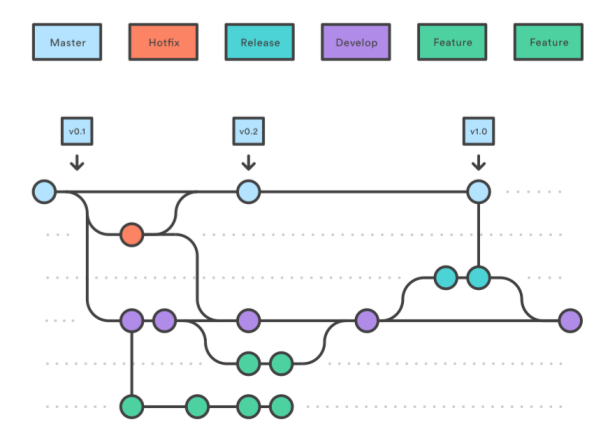
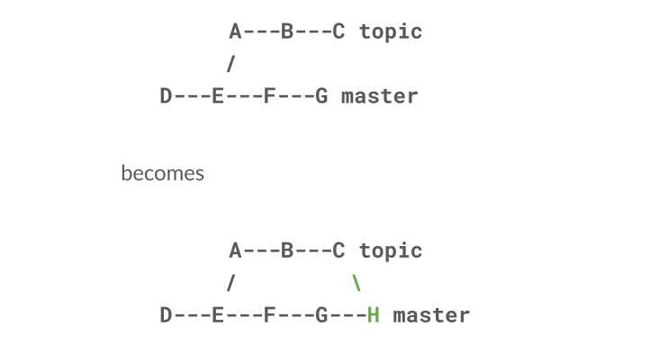
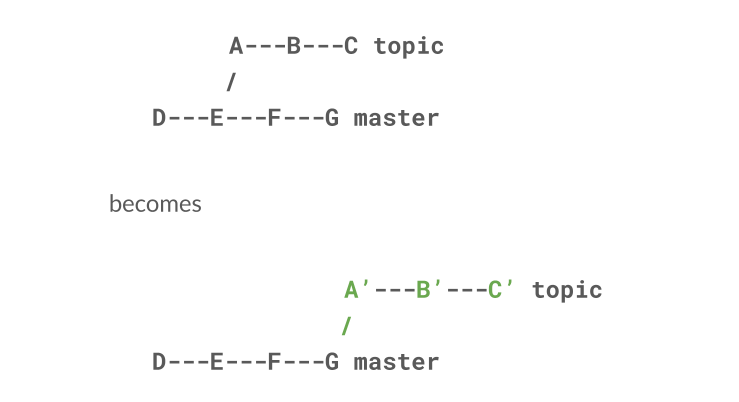
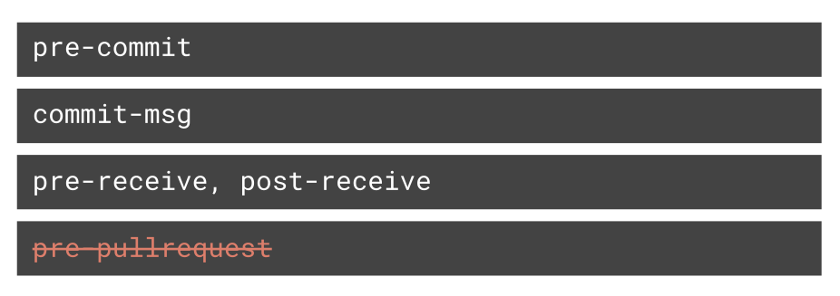

Dieser Blogbeitrag ist der erste Teil einer dreiteiligen Serie, die auf einer
GitOps-Webinar-Reihe basiert, die wir gemeinsam mit unseren Freunden von
[VSHN](https://www.vshn.ch/) produziert haben.

In diesem ersten Teil schauen wir uns Git an und was bei der Nutzung im Team
wichtig ist. Im zweiten Teil geht es um Infrastructure as Code, ein praktisches
Konzept, das hilft, Umgebungen zu vereinheitlichen und die genauen Änderungen an
verschiedenen Teilen deiner Infrastruktur nachzuvollziehen. Im dritten und
letzten Teil kombinieren wir diese Ideen und tauchen ins Konzept GitOps ein.
Diese Prinzipien zu befolgen, kann deinem Team helfen, die Kommunikation zu
verbessern, Probleme leichter zu untersuchen und effizienter zu arbeiten. Sei
dir aber bewusst, dass es bei der Einführung dieser Konzepte einige Fallstricke
gibt. Deshalb schauen wir uns auch häufige Stolpersteine an und sprechen über
unsere Erfahrungen, Teams mit diesen Tools zu starten.

Wenn du Fragen hast, stell sie gerne als Kommentar zu diesem Blogbeitrag. Wenn
du dich lieber zurücklehnen und diesen Teil als Webinar geniessen willst, schau
dir [die Aufzeichnung auf YouTube](https://www.youtube.com/watch?v=jGEDq4gz3zA)
an.

## Was ist Git?

Schauen wir zuerst, was Git ist und wie es funktioniert. Git ist ein sehr
verbreitetes Versionskontrollsystem, das sich zu einem der Standardwerkzeuge
moderner Softwareentwicklung entwickelt hat. Es hilft uns, Änderungen an unserem
Quellcode nachzuverfolgen. In der Zusammenarbeit im Team lässt es alle
Entwicklerinnen und Entwickler auf einer eigenen Kopie des Codes an ihrem
Feature arbeiten, ohne sich gegenseitig in die Quere zu kommen.

Zudem erlaubt uns Git, mühelos durch die Historie unseres Quellcodes zu reisen
und Änderungen zu verstehen, indem wir ihre Reihenfolge betrachten und die
kleinen Dokumentationsstücke lesen, die ihre Autorinnen und Autoren hinterlassen
haben. Das hilft enorm beim Debuggen von Code, den andere geschrieben haben –
oder sogar von Code, den ich selbst vor einiger Zeit geschrieben habe. Ich kann
zwischen verschiedenen Zeitpunkten springen, einzelne Änderungen ansehen und sie
sogar rückgängig machen, um ein neues, korrigiertes Release zu erstellen.

Wir nehmen das vielleicht als selbstverständlich hin – aber stell dir vor, wie
fummelig die Arbeit an Code in einem grossen Team ohne diese Funktionen wäre.

## Commit-Messages

Wie du vielleicht schon weisst, nehmen Entwicklerinnen und Entwickler in Git
Änderungen am Quellcode in Form sogenannter Commits vor. Ein Commit ist eine
kleine Menge von Änderungen an einer oder mehreren Dateien und enthält
Informationen über die Autorin bzw. den Autor und den Zeitpunkt der Änderungen.

Damit sich diese Änderungen verstehen lassen, sind Entwicklerinnen und
Entwickler angehalten, ihre Commits mit kurzen Texten zu dokumentieren – den
«Commit-Messages». Deren Qualität ist ein wesentlicher Teil der Gesundheit
unserer Codebasis. Gute Commit-Messages helfen unseren Teammitgliedern und
unserem zukünftigen Ich, den Zweck von Änderungen und bestimmte Umsetzungswege
zu verstehen. Gut gemacht, liefern sie entscheidende Informationen auf einen
Blick und sind so strukturiert, dass wir die Änderungshistorie unserer Codebasis
durchstöbern und sogar durchsuchen können.

### Schlechte Commit-Messages

Schauen wir uns zuerst ein paar schlechte Commit-Messages an und warum sie
schlecht sind. Danach sehen wir, wie man sie verbessert.

```shell
""
```

Die schlechteste Commit-Message ist natürlich gar keine. Zum Glück gilt es bei
den meisten Engineers als schlechte Praxis, dem Commit keine Message zu geben.
Sie gibt Leuten, die unsere Änderungen durchsehen, überhaupt keinen Kontext und
überlässt es ihnen, Wirkung und Zweck unserer Änderungen selbst herauszufinden.
Sie zwingt Entwickelnde auch nicht dazu, über ihre Änderungen nachzudenken und
darüber, warum sie sie auf eine bestimmte Weise machen. Dieser Prozess ist
wichtig, weil er zu bewussteren und fokussierteren Änderungen führt.

Eine nichtssagende Commit-Message wie

```shell
did some stuff, now it works.
```

ist offensichtlich kaum hilfreicher als gar keine Message.

```shell
Extended the flux capacitor and added a left-trim feature to the tractor beam and implemented the emergency self-destruct button.
```

Ein weiteres Anzeichen für eine schlechte Message ist eine sehr lange
Commit-Message, die das Wort «and» ein- oder sogar mehrmals enthält. Erstens
sind lange Messages schwer zu lesen und zu erfassen. Zweitens deuten sie stark
darauf hin, dass zu viele unzusammenhängende Änderungen in einen einzigen Commit
gepresst wurden. Solche Commits sind schwer zu verstehen und zu verwalten und
sollten vermieden werden. Es ist viel einfacher, eine Reihe kleiner Änderungen
mit klarer, in den einzelnen Messages dokumentierter Historie zu verstehen als
einen riesigen Commit mit unzusammenhängenden Änderungen.

### Gute Commit-Messages

Gute Commit-Messages dagegen sind klar und knapp. Sie beschreiben in
menschenlesbarer Form, was die Änderungen des Commits bewirken, und enthalten
keine überflüssige Interpunktion oder Wörter. Gute Beispiele sind

```shell
Upgrade lodash dependency
```

```shell
Fix typo in README
```

```shell
Return correct error codes for all errors
```

Diese Beispiele lassen sich leicht lesen und verstehen, ohne den gesamten
Kontext der Applikation zu kennen.

Zusammengefasst lautet die wichtigste Regel für gute Commit-Messages: sie
überhaupt zu schreiben – und zwar in einer knappen Form, die andere und unser
zukünftiges Ich leicht verstehen.

### Der Body einer Commit-Message

Bisher haben wir nur den Betreff einer Commit-Message behandelt – also die erste
Zeile. Die meisten beschreiben ihre Änderung nur über die Betreffzeile, was für
fast jeden Commit ausreicht. Ist ein Commit aber etwas komplexer oder lassen
sich die Änderungen und die Überlegungen dahinter nicht leicht nachvollziehen,
kann es helfen, den Commit ausführlicher zu erklären. Genau dafür ist der Body
einer Commit-Message da. Hier siehst du ein Beispiel einer Commit-Message mit
knapper Betreffzeile und einem Body, der sie weiter erläutert.

```shell
Return correct error codes for all errors

We used to always return 500 error codes from our HTTP API. This is not according to the HTTP specification. Because of that, this commit changes the API to return correct 4XX and 5XX error codes respectively.
```

Der Body ist durch eine Leerzeile von der ersten Zeile getrennt und in
ordentlicher Sprache geschrieben, damit er für unsere Kolleginnen und Kollegen
gut lesbar ist. Meist erklärt er, warum ein Commit gemacht wurde. Bei Bedarf
kann er auch die Änderungen selbst ausführlicher erklären, wenn sie sich nicht
intuitiv erschliessen.

### Richtlinien für Commit-Messages

Für ordentliche Commit-Messages gibt es einige Richtlinien. Sie helfen uns, die
Formatierung von Commits im Team zu standardisieren und den Konventionen zu
folgen, an die sich Git selbst beim Erstellen von Commits hält – etwa bei einem
Merge Commit.

#### Betreff und Body durch eine Leerzeile trennen

Erstens sollten wir Betreff und Body durch eine Leerzeile trennen, sofern es
überhaupt einen Body gibt. Das hilft Git-Tools, die Commit-Message korrekt zu
parsen, und dem menschlichen Auge, schnell zu erkennen, dass es eine
Betreffzeile und einen separaten Body gibt, der uns die Überlegungen hinter dem
Commit näher bringt.

#### Die Betreffzeile auf 50 Zeichen begrenzen

Zweitens ist es hilfreich, die Betreffzeile auf rund fünfzig Zeichen zu
begrenzen. Das ist vor allem eine Leitplanke, um unsere Messages knapp zu halten
und das Durchsehen einer Commit-Liste auf der Suche nach dem richtigen Commit zu
erleichtern. Es ergibt aber auch deshalb Sinn, weil viele Git-Tools beim
Anzeigen von Commit-Messages keine unbegrenzte Zeichenzahl darstellen können.

#### Die Betreffzeile gross beginnen

Die dritte gute Praxis ist, die Betreffzeile einer Git-Commit-Message mit einem
Grossbuchstaben zu beginnen. So sieht man leichter, wo sie anfängt, und liest
sie flüssiger, weil es natürlicher wirkt.

#### Die Betreffzeile nicht mit Satzzeichen beenden

Die vierte Richtlinie: Satzzeichen in einer Commit-Message verlängern sie
unnötig. Meist sind Commit-Messages ohnehin keine vollständigen Sätze und
verdienen keinen Punkt am Ende.

#### Die Betreffzeile im Imperativ schreiben

Die fünfte Richtlinie ist, sie im Imperativ zu schreiben. Das heisst, sie im
Präsens zu formulieren und wie einen Befehl klingen zu lassen. Ein guter Test:
Denk dir den Satz «If applied, this commit will …» und häng deine Message an.
Ergibt das einen korrekten englischen Satz, hast du den Imperativ höchst-
wahrscheinlich richtig verwendet.

Auch für den Body gibt es einige Richtlinien.

#### Den Body bei 72 Zeichen umbrechen

Nummer sechs: Der Body sollte bei rund 72 Zeichen umgebrochen werden. Der Grund:
Das menschliche Auge verarbeitet Text in dieser Breite am leichtesten. Da der
Body lange Fliesstext-Sätze enthalten kann, hilft diese Breitenbegrenzung beim
Lesen.

#### Den Body für das Was und Warum nutzen, nicht für das Wie

Die letzte und siebte gute Praxis ist, im Body das Was und Warum unserer
Änderungen weiter zu erläutern. Er soll Lesenden helfen zu verstehen, welche
Änderungen gemacht wurden und welche Überlegungen dahinterstehen. Er soll nicht
den Code selbst erklären und nicht schildern, wie die Änderungen gemacht oder
wie ein bestimmtes Problem gelöst wurde. Dafür sind Code-Kommentare oder –
besser noch – intuitiv geschriebener Code da.

## Branching-Strategien

Ein weiterer wichtiger Teil der Git-Nutzung sind Branches. Du hast sie
wahrscheinlich schon verwendet – vielleicht für ein bestimmtes, noch nicht
fertiges Feature oder einfach, um etwas auszuprobieren. In der Teamarbeit ist es
essenziell, sich an eine Branching-Strategie zu halten, auf die sich alle
einigen. Je nach Grösse deines Teams und Komplexität der Applikation, die es
entwickelt und released, ergeben unterschiedliche Arten der Git-Nutzung Sinn. Im
Folgenden schauen wir uns zwei der häufigsten Branching-Strategien an und wann
sie Sinn ergeben.

### Gitflow



Die erste Strategie heisst «Gitflow». Sie erlaubt einfache Zusammenarbeit und
die gleichzeitige Arbeit an mehreren Features.

Das Herz von Gitflow ist der sogenannte «develop»-Branch, hier in Violett, auf
dem die ganze Arbeit passiert. Für ein neues Feature erstellen Entwickelnde vom
`develop`-Branch aus einen Feature-Branch, im Bild grün markiert. Sie machen
einen oder mehrere Commits auf diesem Feature-Branch, bis sie mit ihren
Änderungen zufrieden sind und das Feature als vollständig implementiert und
getestet betrachten. Sobald das erledigt ist, erstellen sie einen sogenannten
Pull Request. Das heisst, sie öffnen ihre Änderungen zum Review durch
Kolleginnen und Kollegen, bevor sie schliesslich alles zurück in den
`develop`-Branch mergen. Der `develop`-Branch sollte also immer in einem
gesunden, deploybaren Zustand sein, und Feature-Branches sind kurzlebig, weil
sie nach dem Merge des Features gelöscht werden.

Der zweite wichtige Branch in Gitflow ist der `master`- bzw. `main`-Branch, blau
hervorgehoben, der ausschliesslich bereits released Code enthält. Idealerweise
enthält er einen Commit pro Release, der mit der jeweiligen Release-Nummer
getaggt ist, und sollte immer stabil und releasefähig bleiben.

Aber wie kommen Commits von `develop` in den Main-Branch?

Sobald der `develop`-Branch releasefähig ist, wird davon ein neuer
Release-Branch abgezweigt – hier türkis hervorgehoben –, in dem alle Commits
gesammelt werden, die Teil dieses Releases sein sollen. Das kann geschehen,
indem der `develop`-Branch komplett so released wird, wie er ist, oder indem
bestimmte Commits aus «develop» per Cherry-Pick ins Release geholt werden. Ist
das Release bereit, wird der entsprechende Branch in den `master`-Branch
gemergt, sauber als Release getaggt und danach zurück nach `develop` gemergt. So
stellen wir sicher, dass es auf dem `master`-Branch keine Änderungen gibt, die
nicht auch auf dem `develop`-Branch sind.

Natürlich kann es passieren, dass wir ein fehlerhaftes Release erstellen. Für
diesen Fall führt Gitflow das Konzept der Hotfix-Branches ein – im Bild orange.
Wir zweigen sie vom `master`-Branch ab, nehmen die nötigen Korrekturen vor und
mergen den Hotfix-Branch dann zurück nach `master`, aber auch nach develop. Mit
dem neuen `master`-Branch, der diese Änderungen enthält, können wir dann ein
neues Release mit unserem Hotfix erstellen.

Zusammengefasst haben wir die zwei Hauptbranches `main` und `develop`, und über
Feature-, Release- und Hotfix-Branches setzen wir neue Features und Hotfixes um
und mergen sie zwischen den Hauptbranches. Das macht Gitflow recht strukturiert
und trotzdem flexibel. Es bringt allerdings etwas Overhead mit sich, der
besonders für kleinere Teams unnötige Last bedeuten kann. Für grössere, gut
eingespielte Teams kann es grossen Wert und Struktur bringen und Kommunikation
und Zusammenarbeit erleichtern.

Ein grosser Vorteil von Gitflow ist das umfangreiche Tooling drumherum. Eines
davon ist das [Gitflow-Plugin](https://github.com/nvie/gitflow) für die Git-CLI,
das praktische Befehle für die Arbeit mit Gitflow ergänzt. Hier ein Beispiel,
wie wir mit dem Gitflow-Plugin arbeiten würden:

#### Das Projekt initialisieren

Erstelle ein neues, leeres Verzeichnis und wechsle hinein. Initialisiere dann
das Projekt

```shell
git flow init
```

Das Tool fragt dann nach den Namenskonventionen unseres Teams für bestimmte
Branches – meist ist es aber gut, bei den Standardwerten zu bleiben. Eine
Ausnahme ist der `master`-Branch: In den letzten Monaten hat ein Umdenken
eingesetzt, den `master`-Branch in `main` umzubenennen, weil der Begriff
«master» politisch etwas belastet ist. Beim Rest können wir die Standardwerte
einfach übernehmen.

#### Ein Feature starten

Um ein Feature zu starten, nutzt Gitflow den Befehl

```shell
git flow feature start kitten
```

wobei `kitten` der Name des Features ist. Das Tool sagt uns dann, was es getan
hat: Es hat automatisch einen neuen Feature-Branch erstellt und ist darauf
gewechselt. Hier können wir unsere Änderungen machen. Als Beispiel erstellen wir
eine Datei `kitten.txt` mit dem Namen des Kätzchens und committen sie. Übrigens:
Wenn du beim Erstellen eines Commits das Flag `-m` weglässt, öffnet Git deinen
liebsten Texteditor, um die Message zu schreiben – ziemlich praktisch.

#### Das Feature abschliessen

Um unser Kätzchen-Feature abzuschliessen, tippen wir einfach

```shell
git flow feature finish
```

und das Tool mergt den Feature-Branch automatisch zurück nach develop und
wechselt dorthin. Den Schritt mit dem Pull Request haben wir hier natürlich
übersprungen, weil wir so abgebrühte Engineers sind und nie Fehler machen.

#### Ein Release erstellen

Jetzt, wo das Kätzchen ergänzt ist, wollen wir dieses Feature releasen. Dazu
tippen wir

```shell
git flow release start 1.0.0
```

wobei `1.0.0` die Versionsnummer unseres Releases ist. Auch hier wechselt das
Tool auf den neu erstellten Release-Branch. Dort können wir Änderungen
vornehmen, um das Release vorzubereiten – zum Beispiel eine Versionsdatei mit
der aktuellen Versionsnummer erstellen. Die committen wir jetzt.

#### Das Release abschliessen

Als Nächstes sagen wir dem Tool, dass unser Release bereit ist:

```shell
git flow release finish
```

Das Tool fordert uns dann auf, die Commit-Messages anzupassen und unserem
Release-Tag eine Beschreibung zu geben. Sobald wir fertig sind, werden die
Änderungen zurück in den develop-Branch und auch in den Main-Branch gemergt –
mit dem entsprechenden Tag.

Ein Blick in unser Commit-Log zeigt jetzt eine saubere Historie mit gut lesbaren
Commit-Messages – darunter sogar eine mit Body, die das erzeugte Release
beschreibt. Unter dem Strich haben wir also einen schön automatisierten Prozess
für Gitflow!

### GitHub Flow


Als Nächstes schauen wir uns eine weitere Branching-Strategie an: «GitHub Flow».
Im Gegensatz zu Gitflow hat sie nur einen einzigen Hauptbranch (meist `master`
oder `main`), von dem alles abzweigt. Der Hauptbranch dient als Arbeitsbaum, von
dem Feature-Branches abgezweigt werden. Auch das Releasen der Software passiert
auf diesem einen Branch. Das erzwingt einen streng linearen Entwicklungsprozess,
weil man nur vorwärtsgehen und nicht einzelne Änderungen von einem Branch in
einen anderen cherry-picken kann.

Manche Entwickelnde sehen das als Einschränkung, es kann aber auch ein grosser
Vorteil sein: Es wird klarer, was wo released ist und welche Feature-Sets
zusammengehören und in ein Release gehören. Man sieht auf einen Blick, welche
Features in welchem Release enthalten sind, und weiss, wie sich die einzelnen
Releases unterscheiden. Das macht den Workflow einfacher und weniger
fehleranfällig, aber auch etwas weniger flexibel. Er eignet sich daher eher für
kleinere, agilere Teams und Projekte.

### Mergen



Als Nächstes schauen wir uns an, wie wir Änderungen von einem Branch in einen
anderen bringen. In Git gibt es dafür zwei Hauptwege: Mergen und Rebasen. Für
beide starten wir mit dem folgenden Beispiel-Setup, das du in der oberen
Bildhälfte siehst. Nehmen wir an, wir haben einen Branch `master` und einen
Branch `topic`, der bei einem bestimmten Commit E von `master` abzweigt und die
Commits A, B und C auf E aufsetzt. Inzwischen hat sich auch der `master`-Branch
ab Commit E mit den Commits F und G weiterentwickelt. Nehmen wir nun an, wir
wollen die Änderungen von `topic` zurück nach `master` bringen.

Tun wir das über den Mechanismus des Mergens, werden alle Änderungen aus dem
`topic`-Branch in einem einzigen neuen Commit H in den `master`-Branch
integriert. Dieser neue Commit heisst üblicherweise Merge Commit. Im besten Fall
haben die Commits F und G, die inzwischen auf dem `master`-Branch passiert sind,
nur Teile von Dateien berührt, die sich nicht mit den in den Commits A, B und C
auf dem `topic`-Branch berührten Teilen überschneiden. Dann führt Git den Merge
automatisch aus. Im schlimmsten Fall haben die Commits auf dem `topic`-Branch
aber Teile in Dateien berührt, die auch von den Commits auf dem `master`-Branch
berührt wurden. Das ist der gefürchtete Merge-Konflikt. In diesem Fall wird die
Person, die den Merge durchführt, aufgefordert, die Änderungen in den
konfliktbehafteten Dateien manuell zusammenzuführen.

Merge-Konflikte sind Gits Art, das grundlegende Problem zu lösen, dass mehrere
Leute gleichzeitig an denselben Dateien arbeiten. Dass sie gelegentlich
auftreten, ist ganz normal. Wenn es in deinem Projekt aber häufig zu
Merge-Konflikten kommt, deutet das meist darauf hin, dass etwas nicht stimmt:
Entweder versucht dein Team, Dinge umzusetzen, die sich irgendwie widersprechen,
oder Teile deiner Architektur sind überladen, weil jede Änderung sie berühren
muss, oder die Leute kommunizieren schlecht darüber, wer wann was macht. Es ist
also immer eine gute Idee, zu reflektieren, warum ein bestimmter Merge-Konflikt
auftritt.

Mergen hat im Vergleich zum Rebasen folgende Eigenschaften: Es ist sehr explizit
darin, wer wann einen Merge durchgeführt hat. Da ein Merge keine Commit-Historie
umschreibt, sondern dem Ziel-Branch nur einen neuen Commit hinzufügt, ist es
auch sicherer auf Branches, auf denen viele Leute gleichzeitig Änderungen
machen.

### Rebasen



Der andere Weg, Änderungen vom `topic`-Branch zurück nach `master` zu bringen,
ist der Mechanismus des Rebasens. Nehmen wir dasselbe Beispiel wie zuvor, das du
in der oberen Bildhälfte siehst. Den `topic`-Branch auf den `master`-Branch zu
rebasen heisst, dass wir alle Commits vom `master`-Branch auf dem `topic`-Branch
wiederholen. In unserem Beispiel würde das bedeuten, Commit F auf dem
`topic`-Branch anzuwenden und danach Commit G. Beim Wiederholen jedes einzelnen
Commits kann Git das Zusammenführen entweder automatisch erledigen, oder es
entsteht ein Konflikt, den ein Mensch auflösen muss. Das Ergebnis des Rebasens
des `topic`-Branch auf den `master`-Branch: Der `topic`-Branch enthält nun die
Commits F und G sowie die Commits A, B und C, die bei der Konfliktauflösung
möglicherweise verändert wurden – deshalb nennen wir sie im Bild A’, B’ und C’.

Rebasen hat folgende Vorteile: Da die Commits des Quell-Branch nacheinander auf
den Ziel-Branch angewendet werden, wird die entstehende Commit-Historie viel
sauberer und für Menschen leichter zu lesen und zu verstehen. Beim Rebasen
verstopfen keine Merge Commits deine Historie, die von Branches erzählen, die es
längst nicht mehr gibt.

## Pull Requests

Als Nächstes schauen wir uns Pull Requests an, die je nach Plattform, auf der du
deine Git-Repos hostest, auch Merge Requests heissen. Pull Requests sind zwar
nicht Teil von Git selbst, aber alle grossen Git-Plattformen wie GitHub, GitLab
oder Bitbucket bieten sie an. Pull Requests sind ein wichtiges Werkzeug für die
Zusammenarbeit an Git-Repos und für die saubere Umsetzung der zuvor
beschriebenen Branching-Strategien.

### Einreichen

Nehmen wir an, du hast gemäss Gitflow ein neues Feature auf einem Feature-Branch
umgesetzt.

Zuerst schauen wir uns ein paar gute Praktiken an, wenn du einen Pull Request
für deinen Feature-Branch einreichst. Diese Praktiken erleichtern deinen
Reviewenden das Leben, was wiederum dir hilft, das Maximum aus ihrem Review zu
holen.

#### Rebasen

Die erste gute Praxis: Stelle sicher, dass dein Feature-Branch die neuesten
Änderungen des Ziel-Branch enthält. Schliesslich willst du sichergehen, dass
deine Änderung auf der aktuellen Version von develop funktioniert – und nicht
nur auf einer Version von damals, als du deinen Feature-Branch abgezweigt hast.
Zudem willst du die Last, diese mögliche Lücke zu schliessen, nicht deinen
Reviewenden aufbürden. Gemäss dem, was wir vorhin besprochen haben, würdest du
deinen Feature-Branch also auf den aktuellen develop-Branch rebasen – das
heisst, alle Commits nacheinander anwenden, die seit dem Erstellen deines
Feature-Branch auf develop passiert sind. Schauen wir uns ein Beispiel an.
Nehmen wir an, wir arbeiten an einem Git-Repository mit Informationen über die
Planeten des Sonnensystems, und unser Repository sieht anfangs so aus:

```shell
* 2119e4e (HEAD -> feature/saturn-to-neptune, origin/feature/saturn-to-neptune) Add information on planet Neptune
* cc9e0d4 Add information on planet Uranus
* 4a30b63 Removed some wrong information about planet Saturn
* dae16ab Add some more information on Saturn that I had forgotten before
* a44fd69 Add information on the planet Saturn
| * bc91108 (origin/develop, develop) Add information on the planet Jupiter
| * d11edf4 Add information on the planet Mars
|/
* d212069 Add information on the planet Earth
* 9af8451 (origin/main, main) Add information on the planet Venus
* a1b8fc5 Add information on planet Mercury
```

Wir sehen den Feature-Branch `saturn-to-neptune`, an dem wir arbeiten und der
bei jenem Commit von `develop` abzweigt, der Informationen zum Planeten Erde
ergänzt. Inzwischen hat jemand anderes auf dem `develop`-Branch Informationen zu
den Planeten Mars und Jupiter ergänzt. Bevor wir unseren Feature-Branch zum
Review einreichen, müssen wir ihn also mit diesen zwei zusätzlichen Commits auf
`develop` auf Stand bringen. Das erreichen wir, indem wir unseren Feature-Branch
auf `develop` rebasen:

```shell
git rebase develop
```

– und zwar während wir auf dem Feature-Branch sind. Git fordert uns nun auf,
allfällige Merge-Konflikte aufzulösen, die beim Integrieren dieser beiden
Commits auf unserem Feature-Branch entstehen. Mit etwas Glück gibt es keine.
Nach dem Auflösen möglicher Merge-Konflikte sieht unser Repository so aus:

```shell
* 1d32960 (HEAD -> feature/saturn-to-neptune) Add information on planet Neptune
* f646f96 Add information on planet Uranus
* 21fdccb Removed some wrong information about planet Saturn
* 6d5b293 Add some more information on Saturn that I had forgotten before
* 1abfa9f Add information on the planet Saturn
* bc91108 (origin/develop, develop) Add information on the planet Jupiter
* d11edf4 Add information on the planet Mars
| * 2119e4e (origin/feature/saturn-to-neptune) Add information on planet Neptune
| * cc9e0d4 Add information on planet Uranus
| * 4a30b63 Removed some wrong information about planet Saturn
| * dae16ab Add some more information on Saturn that I had forgotten before
| * a44fd69 Add information on the planet Saturn
|/
* d212069 Add information on the planet Earth
* 9af8451 (origin/main, main) Add information on the planet Venus
* a1b8fc5 Add information on planet Mercury
```

Wir sehen, dass die lokale Kopie unseres Feature-Branch jetzt die beiden
zusätzlichen Commits von `develop` mit den Informationen zu Mars und Jupiter
enthält. Die Remote-Kopie des Feature-Branch enthält diese Commits aber noch
nicht. Das korrigieren wir, indem wir unsere Änderungen mit einem Force Push auf
den Feature-Branch schieben:

```shell
git push --force-with-lease
```

Force Pushing ist hier in Ordnung, weil wir allein auf dem Feature-Branch
arbeiten und somit keine anderen möglichen Änderungen stören. Danach sieht unser
Repository so aus:

```shell
* 1d32960 (HEAD -> feature/saturn-to-neptune, origin/feature/saturn-to-neptune) Add information on planet Neptune
* f646f96 Add information on planet Uranus
* 21fdccb Removed some wrong information about planet Saturn
* 6d5b293 Add some more information on Saturn that I had forgotten before
* 1abfa9f Add information on the planet Saturn
* bc91108 (origin/develop, develop) Add information on the planet Jupiter
* d11edf4 Add information on the planet Mars
* d212069 Add information on the planet Earth
* 9af8451 (origin/main, main) Add information on the planet Venus
* a1b8fc5 Add information on planet Mercury
```

Wir haben jetzt also eine schöne, lineare Historie auf unserem Feature-Branch
und sind fast bereit, ihn zum Review einzureichen.

#### Den Diff durchsehen

Die nächste gute Praxis vor dem Einreichen eines Merge Request ist, den Diff
durchzusehen, der aus deinen Änderungen entsteht. Dabei solltest du prüfen, dass
du nur Änderungen einreichst, die das Feature betreffen, an dem du baust. Achte
darauf, diese Änderungen nicht mit unzusammenhängenden zu vermischen – etwa
Dependency-Updates oder Code-Formatierung –, denn das erschwert Reviewenden zu
verstehen, was vor sich geht. Lassen sich die relevanten nicht von den
unzusammenhängenden Änderungen trennen, ist das ein klares Zeichen, dass du
deinen Pull Request überlädst.

#### Die Commit-Historie aufräumen

Eine weitere gute Praxis ist, die Commit-Historie des Feature-Branch
aufzuräumen. Deine Reviewenden sollen die Commit-Historie nutzen können, um den
Grund für bestimmte Änderungen zu verstehen. Dein Feature-Branch sollte daher
keine Commits enthalten, die aus Herumprobieren stammen, und keine Änderungen,
die durch spätere Commits ohnehin hinfällig werden. Aber wie räumen wir die
Commit-Historie im Nachhinein auf? Auch hier hilft der Rebase-Befehl – diesmal
rebasen wir den Feature-Branch auf sich selbst.

Schauen wir wieder auf unser Beispiel: Die Commit-Historie unseres
Feature-Branch enthält derzeit drei Commits zum Planeten Saturn:

```shell
* 21fdccb Removed some wrong information about planet Saturn
* 6d5b293 Add some more information on Saturn that I had forgotten before
* 1abfa9f Add information on the planet Saturn
```

Offenbar sind wir bei diesen Änderungen ein paar Schritte vor und zurück
gegangen – für die Reviewenden sind diese Schritte aber irrelevant, also wollen
wir sie alle zu einem einzigen Commit zusammenfassen (squashen). Dazu starten
wir mit folgendem Befehl ein interaktives Rebase auf dem Feature-Branch:

```shell
git rebase -i --root
```

Wir geben die Option `--root` an, damit Git uns die gesamte Historie fürs
Rebasen zeigt. Das öffnet unseren liebsten Texteditor mit der Git-Historie und
erlaubt uns, bestimmte Commits mit einem `s` zum Squashen zu markieren:

```shell
pick a1b8fc5 Add information on planet Mercury
pick 9af8451 Add information on the planet Venus
pick d212069 Add information on the planet Earth
pick d11edf4 Add information on the planet Mars
pick bc91108 Add information on the planet Jupiter
pick 1abfa9f Add information on the planet Saturn
s 6d5b293 Add some more information on Saturn that I had forgotten before
s 21fdccb Removed some wrong information about planet Saturn
pick f646f96 Add information on planet Uranus
pick 1d32960 Add information on planet Neptune

# Rebase 1d32960 onto f87a562 (10 commands)
#
# Commands:
# p, pick <commit> = use commit
# r, reword <commit> = use commit, but edit the commit message
# e, edit <commit> = use commit, but stop for amending
# s, squash <commit> = use commit, but meld into previous commit
# f, fixup [-C | -c] <commit> = like "squash" but keep only the previous
#                    commit's log message, unless -C is used, in which case
#                    keep only this commit's message; -c is same as -C but
#                    opens the editor
# x, exec <command> = run command (the rest of the line) using shell
# b, break = stop here (continue rebase later with 'git rebase --continue')
# d, drop <commit> = remove commit
# l, label <label> = label current HEAD with a name
# t, reset <label> = reset HEAD to a label
# m, merge [-C <commit> | -c <commit>] <label> [# <oneline>]
# .       create a merge commit using the original merge commit's
# .       message (or the oneline, if no original merge commit was
# .       specified); use -c <commit> to reword the commit message
#
# These lines can be re-ordered; they are executed from top to bottom.
#
# If you remove a line here THAT COMMIT WILL BE LOST.
#
# However, if you remove everything, the rebase will be aborted.
#
```

Wir haben uns hier entschieden, die Commits `21fdccb` und `6d5b293` in `1abfa9f`
zu squashen. Nach dem Verlassen dieses Dialogs fragt uns Git, was mit den
Commit-Messages der zu squashenden Commits geschehen soll:

```shell
# This is a combination of 3 commits.
# This is the 1st commit message:

Add information on the planet Saturn

# This is the commit message #2:

# Add some more information on Saturn that I had forgotten before

# This is the commit message #3:

# Removed some wrong information about planet Saturn

# Please enter the commit message for your changes. Lines starting
# with '#' will be ignored, and an empty message aborts the commit.
#
# Date:      Fri Mar 5 22:25:09 2021 +0100
#
# interactive rebase in progress; onto f87a562
# Last commands done (8 commands done):
#    squash 6d5b293 Add some more information on Saturn that I had forgotten before
#    squash 21fdccb Removed some wrong information about planet Saturn
# Next commands to do (2 remaining commands):
#    pick f646f96 Add information on planet Uranus
#    pick 1d32960 Add information on planet Neptune
# You are currently rebasing branch 'feature/saturn-to-neptune' on 'f87a562'.
#
# Changes to be committed:
#       new file:   saturn.txt
#
```

Wir haben uns hier entschieden, die Messages der gesquashten Commits einfach zu
verwerfen, indem wir sie im Editor-Dialog auskommentieren. Nach dem Bestätigen
des Dialogs sehen wir, dass unser Repo nun in folgendem Zustand ist:

```shell
* d61b82e (HEAD -> feature/saturn-to-neptune) Add information on planet Neptune
* 548ee1a Add information on planet Uranus
* d6db434 Add information on the planet Saturn
| * 1d32960 (origin/feature/saturn-to-neptune) Add information on planet Neptune
| * f646f96 Add information on planet Uranus
| * 21fdccb Removed some wrong information about planet Saturn
| * 6d5b293 Add some more information on Saturn that I had forgotten before
| * 1abfa9f Add information on the planet Saturn
|/
* bc91108 (origin/develop, develop) Add information on the planet Jupiter
* d11edf4 Add information on the planet Mars
* d212069 Add information on the planet Earth
* 9af8451 (origin/main, main) Add information on the planet Venus
* a1b8fc5 Add information on planet Mercury
```

Die Historie auf der lokalen Kopie unseres Feature-Branch sieht jetzt also
sauber aus. Als letzten Schritt übertragen wir das mit einem erneuten Force Push
auf die Remote-Kopie des Feature-Branch:

```shell
git push --force-with-lease
```

Damit sieht unser Repository vollständig aufgeräumt aus – bereit für unsere
Reviewenden:

```shell
* d61b82e (HEAD -> feature/saturn-to-neptune, origin/feature/saturn-to-neptune) Add information on planet Neptune
* 548ee1a Add information on planet Uranus
* d6db434 Add information on the planet Saturn
* bc91108 (origin/develop, develop) Add information on the planet Jupiter
* d11edf4 Add information on the planet Mars
* d212069 Add information on the planet Earth
* 9af8451 (origin/main, main) Add information on the planet Venus
* a1b8fc5 Add information on planet Mercury
```

#### Einen klaren, knappen Titel und eine Beschreibung hinterlassen

Die letzte gute Praxis ist eine grundlegende: Schreib einen klaren, knappen
Titel und eine Beschreibung, damit deine Reviewenden sofort den Kontext kennen,
in dem du die Änderungen vorschlägst. Im Grunde gelten hier dieselben Regeln wie
bei einzelnen Commit-Messages: Sag in menschenlesbarer Form, warum du etwas
tust. Zusätzlich ist es manchmal sinnvoll, den Reviewenden Hinweise mitzugeben,
die sie beim Lesen und Verstehen deiner Änderungen leiten – etwa: «Schau dir am
besten zuerst die Änderungen in awesome.go an und arbeite dich von dort vor.»

### Reviewen

Jetzt, wo wir wissen, wie man einen Pull Request einreicht, schauen wir uns an,
wie man einen reviewt.

#### Zuerst gedanklich eine eigene Lösung skizzieren

Sich in die Arbeit einer anderen Person hineinzudenken, kann ziemlich
einschüchternd sein. Ein guter Weg: Skizziere gedanklich deine eigene Lösung für
das vorliegende Problem, bevor du mit dem Review beginnst. Diese gedankliche
Skizze leitet dich dann durch das Review und lässt dich gezielt nach Änderungen
suchen, die du erwarten oder nicht erwarten würdest. Beim Review eines Pull
Request mit der Beschreibung «Allow users to enter their birthday in their
profile» würde deine Skizze zum Beispiel beinhalten: Der Profil-Screen bekommt
einen neuen Datumswähler, die Profil-API ein neues Datumsfeld und die
Profil-Datenbanktabelle eine neue Datumsspalte. Eine Änderung in der
Warenkorb-API wäre unerwartet und würde dich dazu bringen, die Autorin oder den
Autor um eine Erklärung zu bitten.

Neben der gedanklichen Skizze der erwarteten Lösung gibt es einige weitere
Richtlinien, an die du dich beim Review eines Pull Request halten solltest:

#### Sei konstruktiv

Die erste ist ziemlich offensichtlich: Sei konstruktiv! Bei jedem Problem, das
du entdeckst, solltest du nicht nur darauf hinweisen, sondern eine bessere
Lösung parat haben, die du vorschlägst. Denk zudem immer daran, dass du Code
reviewst und nicht die Person, die ihn geschrieben hat. Deine Kommentare sollten
also Schwächen im Code ansprechen, nicht in der Person.

#### Sei mehr als ein Linter

Die zweite Richtlinie: Sei nicht bloss ein Linter! Der ganze Sinn von Reviews
ist, dass sie von Menschen gemacht werden, welche die Semantik des vorliegenden
Problems, die Architektur des Systems und die Designentscheidungen dahinter
kennen. Rechne also damit, in den Code einzutauchen. Deine Zeit mit dem
Korrigieren von Einrückungsfehlern zu verbringen, wäre Verschwendung – das lässt
sich durch automatisiertes Linting ohnehin automatisch erledigen.

#### Auch fehlenden Code und fehlende Testfälle beachten

Die dritte Richtlinie: Reviewe auch, was nicht da ist! Es liegt nahe, nur auf
die Codeänderungen zu schauen, die im Pull Request vorgeschlagen werden. Das
reicht aber meist nicht. Du musst auch darüber nachdenken, was fehlt. Hier hilft
dir deine gedankliche Skizze erneut. Gibt es Änderungen, die du erwartet
hättest, aber nicht siehst? Und die Tests? Gibt es Testfälle, welche die Autorin
oder der Autor vergessen hat – ein Hinweis darauf, dass gewisse Randbedingungen
nicht bedacht wurden?

#### Grosse Reviews interaktiv durchführen

Die letzte Richtlinie: Reviews werden zwischen Autor bzw. Autorin und
Reviewenden interaktiv durchgeführt, sobald der Pull Request eine gewisse
Komplexität überschreitet. Sich zusammenzusetzen und synchron zu sprechen, spart
meist viel Hin und Her für Rückfragen. Es hilft auch, Missverständnisse und
sogar unnötige Emotionen zu vermeiden, die durch unterschiedliche Stile in der
schriftlichen Kommunikation entstehen.

## Git Hooks

Bisher haben wir Best Practices nur als Konventionen beschrieben. In diesem
letzten Teil schauen wir uns Git Hooks an, mit denen du einige dieser
Konventionen automatisieren und technisch durchsetzen kannst.

### Anwendungsfälle



Git Hooks sind eigene Skripte, die an bestimmten Punkten des
Entwicklungsprozesses laufen. Sie werden durch Skripte definiert, die im
Verzeichnis `.git/hooks` deines Repos liegen. Wenn du ein neues Git-Repo mit dem
Befehl `git init` aufsetzt, werden dir dort automatisch einige Beispielskripte
angelegt. Es gibt zwei Arten von Hooks: clientseitige und serverseitige.

Clientseitige Hooks laufen auf deiner Maschine. Von Natur aus dienen sie dazu,
Dinge in Codeänderungen zu prüfen, bevor diese Änderungen in ein
Remote-Repository gelangen dürfen.

Zwei clientseitige Hooks empfehlen wir ausdrücklich. Der erste heisst
pre-commit. Er erlaubt dir, Prüfungen auf deinem Repository auszuführen, bevor
ein Commit angenommen wird. Das ist der ideale Ort für deine Linter und Tests,
damit keine Änderung je in dein Repository gelangt, die Formatierungsregeln
verletzt oder Tests kaputtmacht. Diese Dinge automatisch zu prüfen, nimmt sie
den Reviewenden des Pull Request ab und lässt sie sich auf Wichtigeres
konzentrieren.

Der zweite clientseitige Hook, den wir empfehlen, heisst commit-msg. Wie der
Name andeutet, erlaubt er dir, eigenen Code auszuführen, um das Format der
Commit-Message zu prüfen. Mit dem commit-msg-Hook kannst du die zuvor genannten
Richtlinien für Commit-Messages leicht durchsetzen.

Serverseitige Hooks laufen auf einem Git-Server. Mit ihnen lassen sich
Änderungen prüfen, die auf diesen Server gepusht werden, und bei Bedarf
ablehnen. Zwei serverseitige Hooks wollen wir hervorheben. Der erste ist
pre-receive, mit dem sich Änderungen validieren und nötigenfalls vom Push ins
Repo ausschliessen lassen. Du könntest pre-receive zum Beispiel nutzen, um zu
prüfen, dass niemand seine eigenen Feature-Branches nach develop mergt oder
historienverändernde Operationen wie Force Pushing auf dem `master`-Branch
verwendet.

Der zweite serverseitige Hook ist post-receive. Mit ihm lässt sich auf
Änderungen reagieren, die einen bestimmten Branch erreichen. Du willst zum
Beispiel vielleicht ein Ticket schliessen, sobald ein Feature-Branch nach
develop gemergt wird.

Vielleicht fragst du dich, warum wir keine Hooks rund um Pull Requests erwähnen.
Wäre so etwas wie ein `pre-pullrequest`-Hook nicht schön, um Logik an das
Erstellen oder Genehmigen eines Pull Request zu hängen? Wäre es tatsächlich, und
einige Git-Plattformen bieten Features in diese Richtung. Wichtig ist aber:
Diese sind plattformspezifisch und nicht Teil von Git – genau wie die Pull
Requests selbst.

Damit sind wir am Ende des ersten Teils dieser GitOps-Blogserie. Wir hoffen, er
hat dir gefallen – und dass dir auch der zweite Teil gefallen wird, in dem es um
«Infrastructure as Code» geht. Der nächste Teil kommt bald!
