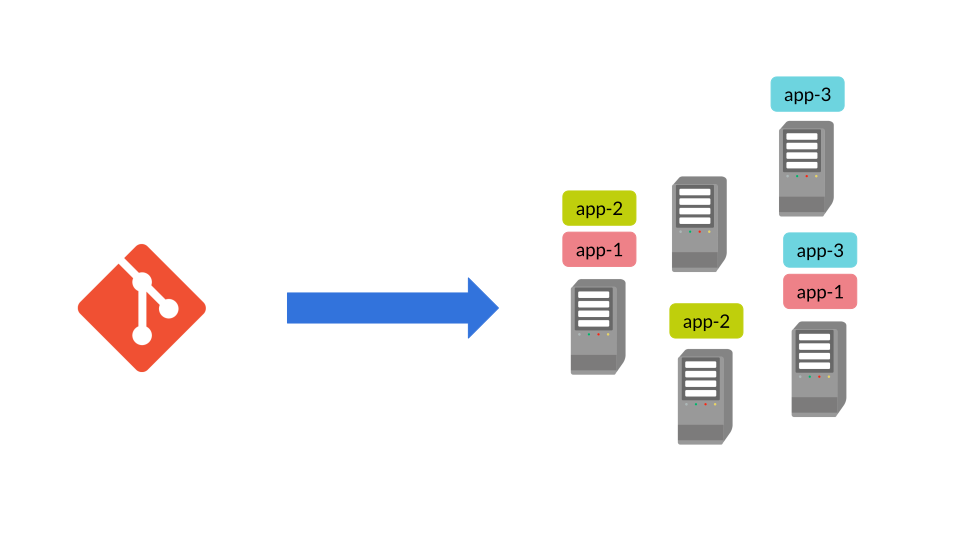
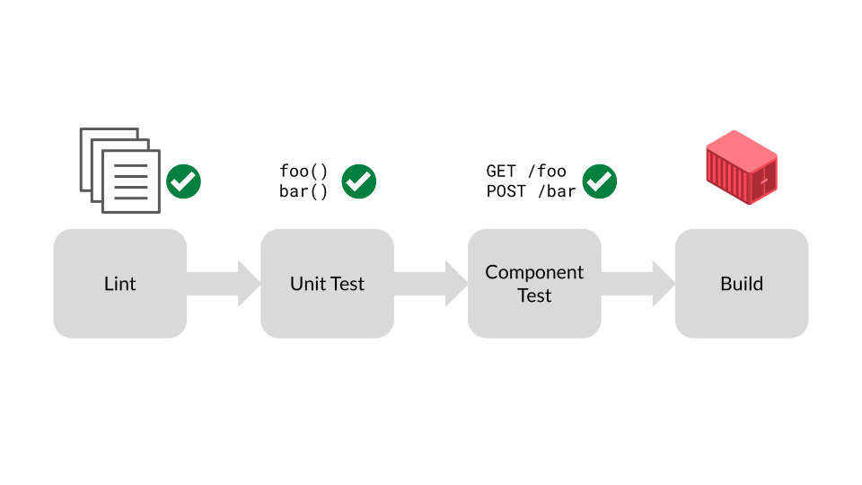
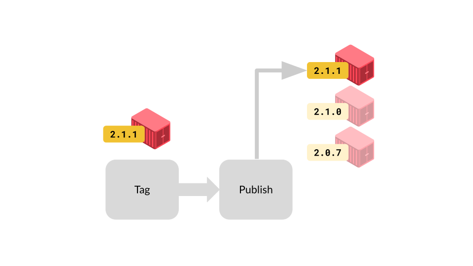
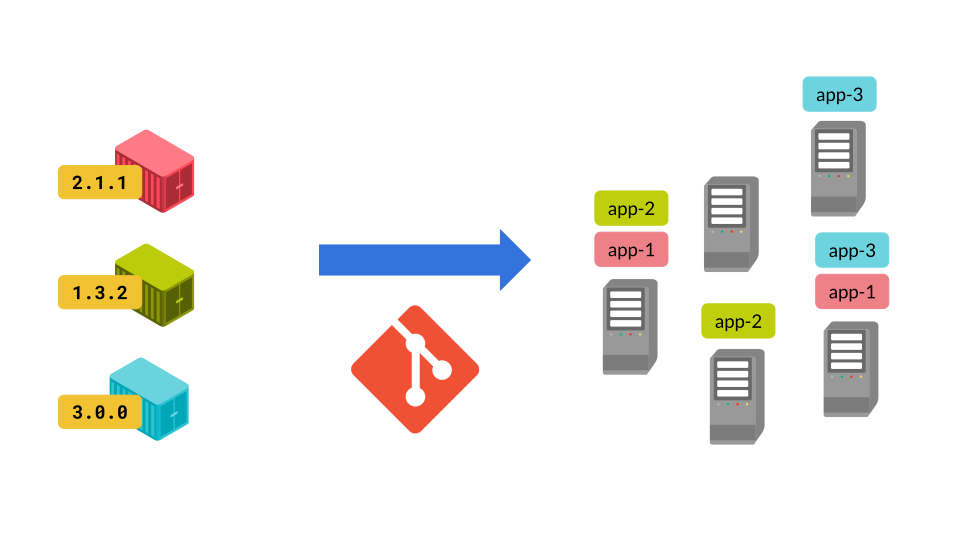
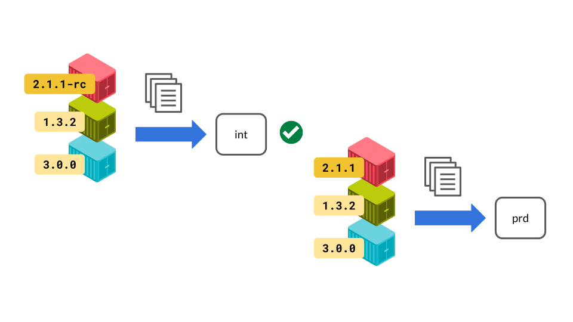
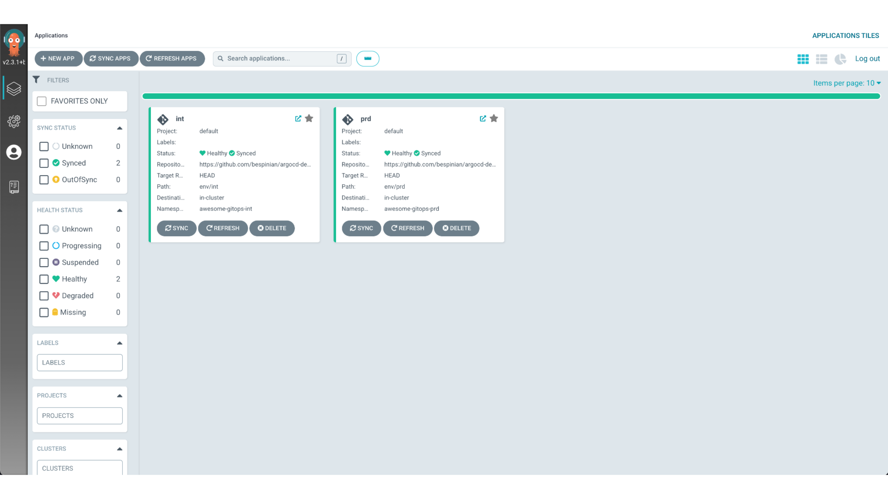
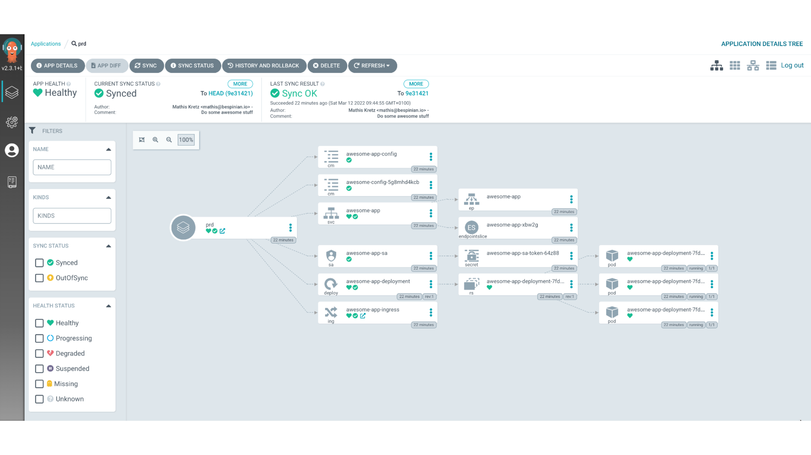
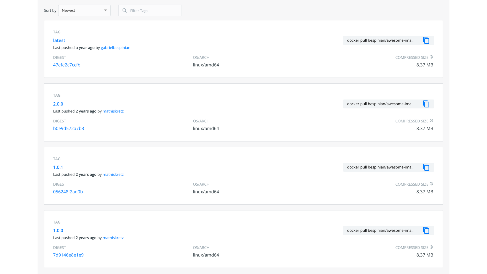
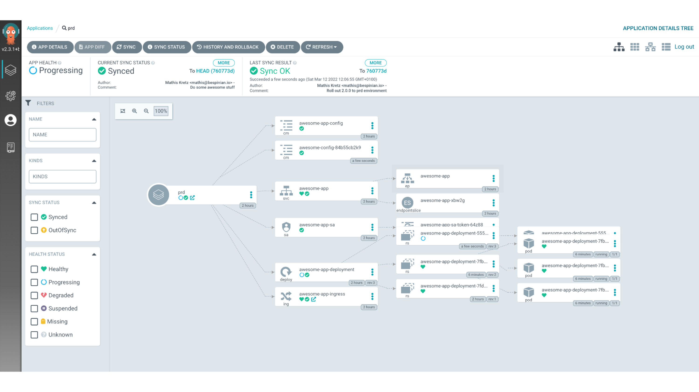
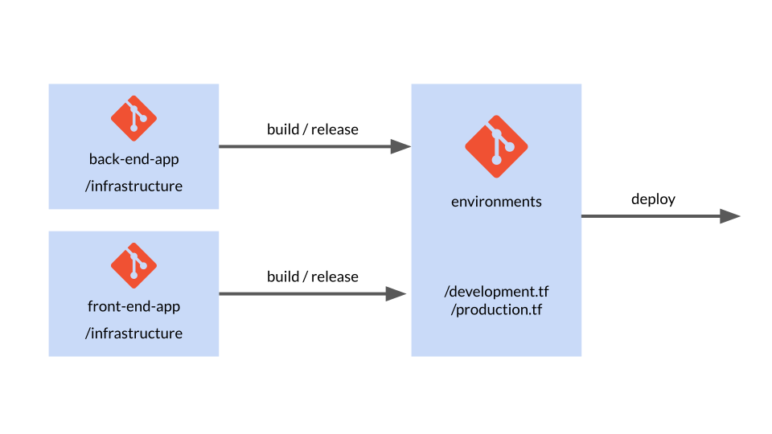

Dieser Blogbeitrag ist der dritte Teil einer dreiteiligen Serie, die auf einer
GitOps-Webinar-Reihe basiert, die wir gemeinsam mit unseren Freunden von
[VSHN](https://www.vshn.ch/) produziert haben.

In diesem dritten Teil zeigen wir dir, wie du Git aus Teil 1 mit Infrastructure
as Code aus Teil 2 kombinierst. Die Verbindung dieser beiden Welten führt uns zu
GitOps, wo wir dir Konzepte und Technologien zeigen, mit denen du deine
Infrastruktur und Applikationen vollständig über Git-Repositories betreiben
kannst. Wir gehen in zwei Schritten vor: zuerst GitOps für Applikationen, danach
die Übertragung derselben Prinzipien auf deinen gesamten Infrastruktur-Stack.

Wenn du Fragen hast, stell sie gerne als Kommentar zu diesem Blogbeitrag. Wenn
du dich lieber zurücklehnen und diesen Teil als Webinar geniessen willst, schau
dir [die Aufzeichnung auf YouTube](https://youtu.be/F4ZgpxBCL7s) an.

# Die Idee

Bevor wir eintauchen, wie wir GitOps für Applikationen und Infrastruktur
umsetzen, schauen wir uns zuerst die grundlegenden Ideen und Annahmen hinter
GitOps an.



Schauen wir zuerst, welches Problem GitOps lösen will. Applikationen aus vielen
Microservices sind schwer im Blick zu behalten, wenn sie in vielen Umgebungen
deployt sind. Umgebungen driften leicht auseinander und werden zu Schneeflocken.
GitOps schlägt folgende Lösung vor: Wir bilden den gewünschten Zustand unserer
Applikationen und Umgebungen deklarativ als Code ab und versionieren diese
deklarative Repräsentation in Git. Die deklarative Repräsentation in Git wird
von einem automatischen Prozess gelesen, der sie auf Basis bestimmter Ereignisse
auf die Zielumgebung anwendet. Das wichtigste Ereignis ist eine Änderung im
Git-Repository, das den gewünschten Zustand hält. Je nachdem, wie strikt wir
unser Setup wollen, kann der automatische Prozess aber auch auf manuelle
Änderungen an den Applikationen oder der Infrastruktur der Umgebung reagieren.
In einem strikten Setup würde der Prozess solche Änderungen mit dem gewünschten
Zustand aus Git überschreiben. Das heisst, Änderungen an deinen Applikationen
und deiner Infrastruktur passieren ausschliesslich über Operationen in Git. Das
wiederum heisst, dass dir all die Git-Vorzüge, die wir dir in Teil 1 dieser
Serie gezeigt haben, jetzt bei diesen Änderungen helfen: Du bekommst automatisch
eine Historie aller Änderungen und wer sie gemacht hat. Du kannst vorgeschlagene
Änderungen Teammitgliedern zum Review geben. Du kannst Freigabeprozesse über
Merge Requests umsetzen. Und deine Umgebungen bleiben ohne Zusatzaufwand
automatisch dokumentiert.

# Deklarative Applikationen

In diesem ersten Teil konzentrieren wir uns darauf, wie du GitOps für deine
Applikationen umsetzt. Vielleicht bist du Teil eines Teams, das eine komplexe
microservice-basierte Applikation baut, während ein anderes Team dir die
Infrastrukturplattform bereitstellt. Dann enthält dieser erste Teil bereits alle
Konzepte, die du brauchst. Vielleicht provisioniert dein Team aber auch seine
eigene Infrastruktur. Dann zeigt dir der zweite Teil zu deklarativer
Infrastruktur, wie du deinen gesamten Stack mit GitOps steuerst.

Für diesen ersten Teil haben wir Kubernetes als Beispiel-Infrastruktur gewählt
und nehmen an, dass sie uns bereitgestellt wird. Natürlich hätten wir viele
andere Beispiele nehmen können, etwa AWS Lambda oder jede andere
Infrastrukturplattform, die dir ein Anbieter zur Verfügung stellt.

## Build



Bevor wir unseren Microservice in eine Umgebung deployen können, müssen wir ihn
natürlich bauen. Das geschieht meist mit einer Continuous-Build-Pipeline, die
läuft, sobald Code ins Repo unseres Microservice gepusht wird. In dieser
Pipeline linten wir idealerweise den Code, führen Unit Tests darauf aus und
prüfen mit Component Tests, dass sich unser Microservice in einer gemockten
Umgebung wie erwartet verhält. Streng genommen haben diese Schritte nichts mit
GitOps zu tun, aber sie sind entscheidend für unser Vertrauen, dass sich der
Microservice beim späteren automatischen Deployment so verhält, wie wir es
erwarten. Nehmen wir also an, all diese Schritte in der Pipeline waren
erfolgreich.

An dieser Stelle wird der eigentliche Build-Schritt ausgeführt. Er paketiert
unseren Microservice in ein Artefakt, das alles enthält, was der Microservice
zum Laufen braucht. In unserem durchgehenden Beispiel denken wir natürlich an
ein Container-Image, es gibt aber auch andere Formate wie mit Packer gebaute
VMs, JAR-Dateien oder Tarballs – je nachdem, wie deine Zielplattform aussieht.
Entscheidend ist, dass die Build-Pipeline ein Artefakt erzeugt, das unabhängig
von den potenziell vielen Zielumgebungen ist, in die es deployt wird. Wir wollen
ein Artefakt einmal bauen und potenziell viele Male deployen.

## Release



Während unsere Continuous-Build-Pipeline munter Artefakte aus Commits des
Quellcodes ausspuckt, brauchen wir einen zweiten, separaten Schritt, um
bestimmte dieser Artefakte als Releases zu markieren. Das passiert meist in
einer zweiten Pipeline, die erkennt, wenn im Repo unseres Microservice Git-Tags
erstellt werden, und diesen Tag den Metadaten des entsprechenden Artefakts
hinzufügt. In unserem Beispiel hiesse das, das Container-Image mit der Version
aus dem Git-Tag zu taggen.

Der zweite Schritt der Release-Pipeline lädt das getaggte Artefakt in einen
zentralen Store hoch, wo diese Version später beim Deployment referenziert und
gepullt werden kann. In unserem Beispiel denken wir wieder an eine Image
Registry, die dann aus Kubernetes-YAML-Dateien referenziert wird, wenn wir
unseren Microservice zusammen mit anderen deployen. Je nach Zielplattform
verwendest du hier aber vielleicht einen anderen Store-Typ, etwa einen S3-Bucket
oder ein Maven-Repository. In jedem Fall ist es etwas, das deine gebauten
Artefakte in verschiedenen Versionen hält und eine bestimmte Version auf Abruf
ausliefert.

## Deploy



Mit unseren gebauten und veröffentlichten Artefakten, sauber nach Version in
einem zentralen Store abgelegt, sind wir bereit für echtes GitOps. Hier kommen
die Themen der beiden vorherigen Folgen ins Spiel: Wir setzen eine Pipeline auf,
die eine in einem Git-Repository abgelegte deklarative Repräsentation unserer
Microservice-Architektur anwendet.

Immer wenn wir unsere deklarative Repräsentation aktualisieren – etwa für eine
Konfigurationsänderung, aber auch um neue Versionen einzelner Microservices
einzuführen –, tun wir das über das Git-Repository, und unsere Pipeline
übernimmt den Deployment-Schritt. Da wir deklarativ vorgehen, muss unsere
Pipeline die prozeduralen Details nicht kennen, wie unsere Applikation zu
deployen ist. Sie wendet die Repräsentation einfach idempotent an und verlässt
sich darauf, dass die darunterliegende Technologie die nötigen Schritte zum
gewünschten Zustand ermittelt.

In unserem Beispiel sind die deklarative Repräsentation die
Kubernetes-YAML-Dateien mit Deployments, die Container-Images referenzieren. Die
Pipeline selbst ist in Argo CD umgesetzt, weil Argo die naheliegendste
Kubernetes-native Option ist. Je nach Zielplattform würdest du aber andere
Technologien wie GitLab CI oder Circle CI für deine Pipeline verwenden.

## Integrationstests



Aber was, wenn wir in mehrere Umgebungen deployen müssen? Vielleicht muss unser
Team Integrationstests neuer Versionen der Microservice-Architektur durchführen,
bevor das Ganze in die Produktionsumgebung geht. Für GitOps ist das kein
Problem. In diesem Fall halten wir eine deklarative Repräsentation unserer
Microservice-Architektur pro Zielumgebung und erstellen für jede Zielumgebung
eine Deployment-Pipeline, welche die entsprechende Repräsentation überwacht. In
unserem Kubernetes-Beispiel siehst du, wie wir Kustomize nutzen, um die
Unterschiede zwischen zwei Umgebungen ohne Wiederholungen zu verwalten und dabei
deklarativ zu bleiben.

Zurück zum Integrationstest-Szenario: Hier würden wir die Repräsentation der
int-Umgebung in unser Git-Repo pushen und den roten Microservice auf eine neue
Release-Candidate-Version pinnen, sagen wir `2.1.1-rc`, und so sein Deployment
auslösen. Danach führen wir unsere Integrationstests durch. Nehmen wir an, sie
sind erfolgreich. Dann taggen wir das Artefakt des roten Microservice neu, um
daraus ein richtiges Release `2.1.1` zu machen. Schliesslich pushen wir die
Repräsentation der `prd`-Umgebung in unser Git-Repo, pinnen die Version des
roten Microservice auf `2.1.1` und lösen so sein Deployment aus.

## Argo CD

Nachdem wir alle Schritte bis zu einem Deployment in GitOps besprochen haben,
sind wir bereit für ein Beispiel aus der Praxis. Wir nehmen eine einfache, aber
sehr grossartige Applikation auf Kubernetes und schauen, wie sie mit Argo CD
deployt und verwaltet wird. Für unser Beispiel läuft Argo CD auf unserem
Kubernetes-Cluster und verwaltet zwei Umgebungen derselben Applikation. Wir
nennen sie `int` und `prd`.



Klicken wir auf die `prd`-Umgebung, sehen wir die Details, wie unsere
grossartige Applikation deployt ist. Sie besteht aus einer
Kubernetes-`Deployment`-Ressource, die mit mehreren Replicas läuft, um Rolling
Upgrades ohne Downtime zu garantieren. Sie definiert zudem einen `Ingress`, um
von ausserhalb des Clusters erreichbar zu sein.



Schauen wir uns an, wie sich dieses Setup als Code in unserem
[Beispiel-Repo auf GitHub](https://github.com/bespinian/argocd-demo)
widerspiegelt.

```shell
argocd-demo [main] l
.git
LICENSE
README.md
application-int.yml
application-prd.yml
env
ingress
resources
```

In unserem Repo liegen zwei YAML-Dateien namens `application-int.yml` und
`application-prd.yml`. Das sind zwei Custom Resources, die im Namespace `argocd`
auf unser Cluster angewendet werden und Argo CD mitteilen, dass es zwei
Applikationsumgebungen zu verwalten gibt. Schauen wir uns die Ressource für die
`int`-Umgebung an.

```yaml
apiVersion: argoproj.io/v1alpha1
kind: Application
metadata:
  name: int
  namespace: argocd
spec:
  project: default
  source:
    repoURL: https://github.com/bespinian/argocd-demo.git
    targetRevision: HEAD
    path: env/int
  destination:
    server: https://kubernetes.default.svc
    namespace: awesome-gitops-int
  syncPolicy:
    automated:
      prune: true
      selfHeal: true
```

Wie du siehst, ist das eine Ressource vom Kind `Application` – eine von Argo CD
eingeführte Custom Resource Definition. Jede `Application` hat eine `source`,
die die URL des Git-Repos angibt, in dem Argo CD das Setup der Applikation
erwartet. In unserem Fall haben wir zusätzlich ein Attribut `path` gesetzt, das
Argo CD sagt, welchen Unterpfad des Git-Repos es auf Änderungen überwachen soll.
Hier zeigen wir auf den Pfad `env/int`, wo Argo CD eine Kustomization findet,
welche die `int`-Umgebung unserer Applikation definiert. Wir könnten hier auch
eine `targetRevision` angeben, wenn wir unser Deployment auf einen Branch, einen
Tag oder einen bestimmten Commit pinnen wollten. Zudem erwartet Argo CD ein
Element `destination`, das ihm sagt, wohin diese Applikation deployt werden
soll. In unserem Fall deployen wir in den Namespace `awesome-gitops-int` auf dem
lokalen Cluster. Ausserdem haben wir eine `syncPolicy` angegeben, die im Kern
festlegt, wie strikt Argo CD seinen GitOps-Prozess fährt. Dort haben wir die
Option `prune` gesetzt, die Argo CD anweist, jede Ressource zu entfernen, die es
im Namespace `awesome-gitops-int` findet, die aber keine Repräsentation im
Git-Repo hat. Zusätzlich haben wir die Option `selfHeal` gesetzt, mit der Argo
CD jede manuelle Änderung an Ressourcen, die im Git-Repo repräsentiert sind, mit
dem in diesem Repo committeten Zustand überschreibt.

Die `prd`-Umgebung unserer Applikation ist in einem eigenen `Application`-Objekt
definiert, in dem sich nur wenige Parameter unterscheiden:

```yaml
apiVersion: argoproj.io/v1alpha1
kind: Application
metadata:
  name: prd
  # ...
spec:
  source:
    repoURL: https://github.com/bespinian/argocd-demo.git
    # ...
    path: env/prd
  destination:
    # ...
    namespace: awesome-gitops-prd
  syncPolicy:
    # ...
```

Natürlich unterscheidet sich der `name` unserer produktiven `Application`. Das
Git-Repo ist dasselbe, aber der `path` zeigt hier auf die Kustomization für die
produktive Umgebung. Zudem ist der Ziel-Namespace hier der produktive.

Prüfen wir die Kustomizations unserer beiden Umgebungen, sehen wir, dass die
`prd`-Umgebung derzeit Version `1.0.0` unserer Applikation betreibt, während die
`int`-Umgebung bereits auf Version `2.0.0` ist.

```yaml
apiVersion: kustomize.config.k8s.io/v1beta1
kind: Kustomization
bases:
  - ../../resources
images:
  - name: bespinian/awesome-image
    newTag: 1.0.0
configMapGenerator:
  - name: awesome-config
    literals:
      - appTitle=Something awesome!
      - dbHost=db.bespinian.io
      - appVersion=1.0.0
```

Und tatsächlich: Schauen wir in
[Docker Hub](https://registry.hub.docker.com/r/bespinian/awesome-image/tags) –
den Artefakt-Store, den wir in diesem Beispiel für unseren Release-Prozess
nutzen –, sehen wir die Versionen `1.0.0` und `2.0.0` des `awesome-image`, die
unser Build-Prozess veröffentlicht hat.



Schauen wir nun, wie wir unsere `prd`-Umgebung mit GitOps auf Version `2.0.0`
aktualisieren. Dazu bearbeiten wir einfach unsere deklarative Repräsentation, in
diesem Fall unsere Kustomization. Nehmen wir an, wir kommen auf folgende neue
Fassung.

```yaml
apiVersion: kustomize.config.k8s.io/v1beta1
kind: Kustomization
bases:
  - ../../resources
images:
  - name: bespinian/awesome-image
    newTag: 2.0.0
configMapGenerator:
  - name: awesome-config
    literals:
      - appTitle=Something even more awesome!
      - dbHost=db.bespinian.io
      - appVersion=2.0.0
```

Unsere Änderungen führen zu folgendem Git-Diff

```diff
--- a/env/prd/kustomization.yml
+++ b/env/prd/kustomization.yml
@@ -4,10 +4,10 @@ bases:
   - ../../resources
 images:
   - name: bespinian/awesome-image
-    newTag: 1.0.0
+    newTag: 2.0.0
 configMapGenerator:
   - name: awesome-config
     literals:
-      - appTitle=Something awesome!
+      - appTitle=Something even more awesome!
       - dbHost=db.bespinian.io
-      - appVersion=1.0.0
+      - appVersion=2.0.0
```

Jetzt können wir diese Änderungen in unser Repo committen

```shell
argocd-demo [main] git add .
argocd-demo [main] git commit -m "Roll out 2.0.0 to prd environment"
argocd-demo [main] git push
```

Wenn der Git-Push abgeschlossen ist, erkennt Argo CD unsere Änderungen im
Git-Repo und wendet sie auf das Kubernetes-Cluster an – in diesem Fall mit
Kustomize. Im UI von Argo CD siehst du das daran, dass die `prd`-Umgebung nach
kurzer Zeit auf unseren neuesten Commit re-synchronisiert wird.



Damit ist der Deployment-Zyklus mit Argo CD abgeschlossen, und wir sind am Ende
des ersten Teils dieses Blogbeitrags zu GitOps für Applikationen.

# Deklarative Infrastruktur

Wenn dein Team auch die Infrastrukturschicht verwaltet oder ihr ein Platform
Team seid, geht GitOps weiter. Immer wieder ist die Trennung zwischen
Applikationen und Infrastruktur nicht eindeutig. Ein Beispiel sind eigene
VM-Images, die deine Applikationen enthalten. Da ist nicht so klar, ob das
Erstellen und Hosten dieser Images beim Applikations- oder beim
Infrastrukturteam liegen sollte. Wie du sehen wirst, sind die meisten Konzepte
und Workflows zwischen Applikations- und Infrastrukturcode aber sehr ähnlich.

Wir haben uns für Terraform als durchgehendes Beispiel für deklarative
Infrastruktur entschieden. Natürlich gibt es viele andere Beispiele wie AWS
CloudFormation, Ansible Tower usw.

## Repo-Struktur



Natürlich gibt es viele Wege, deine Komponenten, Teams und Git-Repositories zu
strukturieren. Eine Form, die wir oft sehen: die applikationsspezifische
Infrastruktur bei den Applikationen selbst zu halten. Wie du siehst, haben wir
in jeder Applikation ein Infrastruktur-Verzeichnis, das den jeweiligen
Terraform-Code für die Applikation und all ihre Abhängigkeiten wie Datenbanken
oder Message Queues enthält. So können wir die Applikation als Ganzes releasen –
inklusive ihrer Runtime und aller Abhängigkeiten. Separat bleibt einzig die
Konfiguration der Apps.

Da diese je Umgebung unterschiedlich ist, haben wir ein Repo, das jede Umgebung
zusammenführt. Es instanziiert jede Komponente und konfiguriert und
parametrisiert sie für die jeweilige Umgebung. Hier haben wir zum Beispiel eine
Datei `production.tf` mit allen für Prod konfigurierten Komponenten. Daneben
gibt es eine separate `development.tf` mit denselben Komponenten – nur sind die
Server vielleicht etwas schwächer dimensioniert oder ich nutze ein paar
Debug-Optionen.

Genau dort kommen auch Release und Build der Apps und Komponenten ins Spiel. In
der Entwicklung kann ich zum Beispiel immer die neuesten Versionen der Backend-
und Frontend-Apps nutzen. Für die Produktion will ich die Versionen aber
vielleicht pinnen. Wenn ich dann ein neues Release erstelle, erhöhe ich die
jeweilige Version in der Konfiguration `production.tf`, was wiederum ein neues
Deployment in diese Umgebung auslöst.

## Build

Schauen wir uns das genauer an.

Zuerst schauen wir uns den Build-Schritt deiner Infrastrukturmodule an. Genau
wie beim Applikationscode ist es sinnvoll, Build-, Release- und Deployment-Phase
zu trennen. Bei Terraform mag der Begriff «Build» etwas verwirren, weil der Code
gar nicht gebaut werden muss. Trotzdem ergibt es Sinn, deine Commits zu
validieren und für ein Release vorzubereiten. «Prepare» wäre hier vielleicht der
bessere Name.

```shell
$ terraform validate
```

```shell
$ terraform fmt -check
```

Da Infrastrukturcode meist recht aufwendig zu testen und zu deployen ist, ist es
wichtig, Probleme so früh wie möglich zu erkennen. Eine umfassende
Build-Pipeline mit Sanity Checks auf deinem Code ist daher entscheidend. Wie bei
jeder Pipeline ist es sinnvoll, die schnelleren und leichtgewichtigeren Aufgaben
zuerst auszuführen, um bei Fehlern früh zu scheitern. Terraform bietet zum
Beispiel eine Validitätsprüfung, die deinen Code auf Syntaxfehler prüft und bei
Fehlern fehlschlägt. Ähnlich können wir schnell prüfen, ob der Code gemäss den
Best Practices der Terraform-Community korrekt formatiert ist. Praktischerweise
bietet Terraform den eingebauten Befehl `terraform fmt` (vermutlich von `go fmt`
entlehnt) mit einem Check-Flag. Das ist ein müheloser Weg, um sicherzustellen,
dass unser Code leicht zu lesen und zu verstehen ist.

```shell
$ tflint && tfsec
```

Der nächste Schritt nach einem einfachen Sanity Check ist Linting. Beliebte
Tools sind `tflint` und `tfsec`, die wir in Teil 2 dieser Serie vorgestellt
haben. `tflint` ist ein allgemeiner Linter, während sich `tfsec`, wie der Name
andeutet, auf Sicherheitsthemen konzentriert. Beide lassen sich anpassen und
bringen grossen Nutzen, indem sie dir und deinem Team helfen, Best Practices
rund um Terraform zu befolgen und potenzielle Probleme früh zu erkennen.

```shell
$ make test
```

Der letzte Schritt, bevor wir tatsächlich neue Versionen unserer
Infrastrukturmodule releasen, sind isolierte Tests. Terratest ist ein
hervorragendes Tool dafür. Es hilft dir, jedes Modul isoliert zu instanziieren,
Tests darauf auszuführen – etwa HTTP-Requests abzusetzen oder zu prüfen, ob
bestimmte Parameter korrekt gesetzt wurden – und danach das ganze Deployment
wieder abzubauen.

Im Fall von Terraform ist es überflüssig, unseren Build in einen Artefakt-Store
hochzuladen, denn das Git-Repository und seine Tags repräsentieren das Modul.

## Release

```shell
$ git tag v1.0.0-rc1
```

Das Releasen deiner Infrastrukturmodule funktioniert sehr ähnlich wie bei
Applikationen. Jedes Modul wird einzeln released. Das geschieht zum Beispiel,
indem du einen Git-Tag auf einen Commit setzt, den wir als
Release-Candidate-Version veröffentlichen wollen.

```shell
$ make integration-test
```

Unsere Automatisierungs-Pipeline greift das auf und führt eine Reihe von
Integrationstests auf unserer Infrastruktur aus, inklusive des neu erstellten
Release Candidate. Das kann über Terratest geschehen, das unsere gesamte
Umgebung separat instanziieren und ein paar Smoke Tests auf dieser kurzlebigen
Umgebung ausführen kann.

```shell
$ git tag v1.0.0
```

Sobald wir zufrieden sind, erstellen wir mit einem weiteren Git-Tag ohne das
Suffix `rc` ein integrationsgetestetes Release. Das markiert das finale Release,
das bei Terraform nirgends hochgeladen werden muss, weil das Repository selbst
das Artefakt enthält – nämlich unsere Infrastrukturdefinitionen zu einem
bestimmten Commit. Jetzt sind wir bereit, das neu released Infrastrukturmodul zu
deployen.

## Deploy

Deployt wird, wie oben erwähnt, aus einem zentralen Repository, das festhält,
welche Version welches Moduls wo deployt ist. Das Deployment wird also dadurch
ausgelöst, dass wir die Versionsnummer eines bestimmten Moduls ändern, etwa in
der Datei `production.tf`. Wenn wir diese Änderung committen und pushen, greift
die Deployment-Pipeline das auf und nimmt die nötigen Änderungen über Terraform
in der jeweiligen Umgebung vor.

## Beispiel

Schauen wir uns ein Beispiel an, um zu sehen, wie das alles in der Praxis
funktioniert. Nehmen wir an, wir haben eine Applikation namens `demo-app`, die
auf drei Git-Repositories aufgeteilt ist:

```shell
/demo-app/
  + -- frontend
  + -- backend
  + -- environments
```

Betrachten wir die Struktur des `backend`-Repos, sehen wir, dass es eine ganz
normale Node.js-Applikation mit einem Unterordner `infrastructure` ist. Dieser
enthält zwei Terraform-Module namens `back_end` und `db`. Das Modul `back_end`
instanziiert die komplette Infrastruktur, die das Backend zum Laufen braucht –
in diesem Fall unter anderem eine AWS-Lambda-Funktion und eine Datenbank.

```shell
/demo-app/backend/
  > -- .github/
  v -- infrastructure/modules/
         v -- back_end/
                api_gateway.tf
                db.tf
                dns.tf
                function.tf
                main.tf
                networking.tf
                tls_certificate.tf
                variables.tf
         v -- db/
                + -- db.tf
                + -- firewalling.tf
                + -- main.tf
                + -- networking.tf
                + -- outputs.tf
                + -- variables.tf
  > -- src/
  .env
  .eslintrc.json
  .gitignore
  package-lock.json
  package.json
  README.md
```

Das Modul `db` enthält die gesamte Infrastruktur, die speziell für das Hosting
der Datenbank nötig ist. Es wird im Modul `back_end` durch die Datei `db.tf`
instanziiert, die so aussieht:

```terraform
module "db" {
  source = "../db"

  environment     = var.environment
  resource_suffix = var.resource_suffix
}
```

Mit diesem Mechanismus können wir Infrastrukturblöcke voneinander trennen und
jeden über klare Schnittstellen aus Terraform-Inputs und -Outputs
parametrisieren.

Unsere Applikation wird in verschiedene Umgebungen ausgerollt. Genau dafür ist
das Repo `environments` da. Es enthält Terraform-Dateien, welche die
Entwicklungsumgebung definieren (Präfix `dev_`), und Terraform-Dateien für die
produktive Umgebung (Präfix `prod_`). Zudem enthält das Repo einige globale
Dateien. Diese definieren Ressourcen, die über alle Umgebungen hinweg geteilt
werden, etwa einen gemeinsamen Monitoring-Stack.

```shell
/demo-app/environments/
  > -- .github/
  > -- .terraform/
  > -- modules/
  > -- state/
  .gitignore
  .terraform.lck.hcl
  dev_back_end.tf
  dev_dns.tf
  dev_front_end.tf
  global_artifacts.tf
  global_continous_deployment.tf
  global_monitoring.tf
  main.tf
  Makefile
  prod_back_end.tf
  prod_dns.tf
  prod_front_end.tf
  README.md
  secrets.auto.tfvars
  variables.tf
```

Schauen wir uns die Datei `dev_back_end.tf` an:

```terraform
module "dev_back_end" {
  source = "../backend/infrastructure/modules/back_end"

  base_domain                 = aws_route53_zone.dev.name
  db_url                      = module.dev_db.db_url
  db_vpc_id                   = module.dev_db.vpc_id
  db_client_security_group_id = module.dev_db.db_client_security_group_id
  db_vpc_private_subnet_ips   = module.dev_db.db_vpc_private_subnet_ips
  dfp_api_key                 = var.dfp_api_key
  alarms_topic_arn            = module.monitoring.alarms_topic_arn
  environment                 = local.dev_environment
  resource_suffix             = local.dev_resource_suffix
}
```

Wie du siehst, wird die Entwicklungsumgebung mit `dev`-spezifischen Werten
initialisiert, und die Source des Moduls ist der neueste Commit des Moduls
`back_end`. Letzteres, weil wir wollen, dass die Entwicklungsumgebung immer den
aktuellsten Stand der Infrastruktur hat. Anders sieht es beim analogen Modul
`prod_back_end.tf` für die Produktionsumgebung aus:

```terraform
module "dev_back_end" {
  source = "../backend/infrastructure/modules/back_end?ref=v2.0.0"

  base_domain                 = aws_route53_zone.main.name
  db_url                      = module.db.db_url
  db_vpc_id                   = module.db.vpc_id
  db_client_security_group_id = module.db.db_client_security_group_id
  db_vpc_private_subnet_ips   = module.db.db_vpc_private_subnet_ips
  dfp_api_key                 = var.dfp_api_key
  alarms_topic_arn            = module.monitoring.alarms_topic_arn
  environment                 = local.environment
}
```

Hier referenzieren wir eine bestimmte Version des Moduls `back_end`, weil wir
unsere produktive Umgebung auf einen getesteten Stand pinnen wollen. Schauen wir
in die Commit-Historie des Moduls `back_end`, sehen wir, dass die Version
`v2.0.0` dort einem Git-Tag entspricht und dass es zwischenzeitlich neuere
Commits auf diesem Modul gab.

```txt
commit 68e85d80a90a905d44554fedfcc621b65375c57d (HEAD -> main, origin/main)
Author: Lena Fuhrimann <lena.fuhrimann@users.noreply.github.com>
Date:   Tue May 17 14:49:46 2022 +0200

    Add more awesomeness

commit cf3275a16174230a906bd536c242ee0b281b81b5
Author: Lena Fuhrimann <lena.fuhrimann@users.noreply.github.com>
Date:   Tue May 17 14:47:52 2022 +0200

    Fix a nasty bug

commit 8c64e3382973a93621fdac5dd67a9080eb43b4ef (tag: v2.0.0)
Author: Lena Fuhrimann <lena.fuhrimann@users.noreply.github.com>
Date:   Tue May 17 14:33:02 2022 +0200

    Deploy a stable state
```

Schauen wir schliesslich ins Frontend-Repo unserer Beispiel-App, sehen wir, dass
es eine schlichte Single-Page-Application ohne Ordner `infrastructure` ist:

```shell
/demo-app/frontend/
  > -- .github/
  > -- public/
  > -- src/
  .env
  .gitignore
  package-lock.json
  package.json
  README.md
```

Das liegt daran, dass Single-Page-Applications sehr generisch deployt werden und
wir dafür ein bestehendes Terraform-Modul eines Drittanbieters nutzen können.
Wie das geht, sehen wir in der Datei `dev_front_end.tf`:

```terraform
module "dev_front_end" {
  source = "github.com/cloudlena/terraform-spa?ref=1.0.2"

  providers = {
    aws.us_east = aws.us_east
  }

  service_name    = "cp_front_end"
  domain          = aws_route53_zone.dev.name
  environment     = local.dev_environment
  resource_suffix = local.dev_resource_suffix
}
```

Wie du siehst, können wir jedes auf GitHub gehostete Drittanbieter-Modul als
Source des Moduls referenzieren.

# Fortgeschrittene Konzepte

GitOps an sich ist ein sehr spannendes Konzept, das deinen Projekten grossen
Nutzen und Stabilität bringen kann. Es gibt aber noch fortgeschrittenere
Konzepte, die wir an dieser Stelle kurz beleuchten wollen, um dir Ideen zu
geben, was nach stabilen GitOps-Workflows möglich ist.

## Echtes Continuous Deployment

### Jeder Commit wird automatisch deployt

Bisher haben wir nur davon gesprochen, gezielt getaggte oder anderweitig
markierte Releases zu deployen. Rund um GitOps gibt es aber ein weiteres
spannendes Konzept: «Continuous Deployment». Echtes Continuous Deployment
heisst, dass jeder Commit auf einen Branch direkt in eine oder mehrere
Umgebungen deployt wird. Ja, manchmal sogar in produktive. Mein Team könnte zum
Beispiel einen einzigen `main`-Branch haben, und alle Änderungen darauf gehen
direkt in die Produktion. Es gibt also keine spezielle Versionierung, kein
Tagging, kein Releasing. Mein Team und ich sind überzeugt, dass jede Änderung,
die wir machen, sicher genug für Prod ist.

### Die Bedeutung von Tests

Natürlich braucht es entweder ein grosses Ego oder eine ernstzunehmende
Testabdeckung, um so weit zu kommen, alles nach Prod zu releasen. Gute
Testabdeckung auf Unit-, Integrations- und End-to-End-Ebene ist entscheidend, um
häufig zu releasen.

### Erfordert Feature Flags und ein striktes Git-Modell

Ein weiterer wichtiger Punkt: Wir haben womöglich Features auf unserem
Main-Branch, die unsere Endnutzenden noch nicht sehen sollen. Dafür können
Feature Flags helfen. Im einfachsten Fall heisst das, wir haben ein
`if`-Statement im Code, das prüft, ob ein bestimmtes Feature in dieser Umgebung
aktiviert sein soll, und das neue Feature nur bei aktiviertem Flag anzeigt. So
steuern wir Features und ihre Verfügbarkeit in verschiedenen Umgebungen
unabhängig von unseren Code-Releases.

### Meist wird Continuous Deployment ausserhalb der Produktion gemacht

Derzeit betreiben viele echtes Continuous Deployment nur in nicht-produktiven
Umgebungen. Es braucht viel Reife und Mut, diesen Prozess auf produktive
Umgebungen auszuweiten – wir können dich aber nur ermutigen, danach zu streben.

## ChatOps


Ein weiteres unterhaltsames Konzept und Buzzword ist «ChatOps». Es bedeutet,
dass wir bestimmte Schritte unserer Automatisierungs-Pipelines über unsere
normalen Kommunikationstools auslösen können. Wir könnten zum Beispiel eine
Slack- oder Rocket.Chat-Instanz haben, die wir auch für die übliche
Teamkommunikation nutzen. Darin könnte es einen «Deployment»-Channel geben, in
dem Leute einfach «Deploy production» als Chatnachricht schreiben. Unser
Automatisierungsserver lauscht in diesem Channel auf bestimmte Nachrichten und
legt los, sobald sie gepostet werden.

Das ist nicht ganz so durchautomatisiert wie reines GitOps, weil der manuelle
Schritt des Schreibens einer Chatnachricht dazukommt. Eine Kombination aus
GitOps und ChatOps kann aber interessant sein: Das Deployment in Entwicklungs-
und Staging-Umgebungen läuft vollautomatisch über GitOps, ohne manuelle
Interaktion. Beim Deployment in die Produktion wollen wir aber etwas
vorsichtiger sein und es erst nach gründlichen manuellen Tests auslösen. Wir
können also erst testen und lösen das Deployment dann per Chatnachricht aus,
wenn alle zufrieden sind.

## Sicherheit

### Audit Trail

GitOps bringt grosse Vorteile in Sachen Sicherheit. Indem du alle Änderungen an
deinen Applikationen und auch an deiner Infrastruktur in Git nachverfolgst,
erhältst du einen klaren Audit Trail darüber, was wann von wem gemacht wurde.
Damit das trägt, ist es entscheidend, nur signierte Commits zu akzeptieren – so
ist sichergestellt, dass die Person, die einen Commit gemacht haben will, ihn
auch gemacht hat. Das geht über GPG und wird von den meisten
Git-Server-Anbietern wie GitHub unterstützt.

### Linting und Pull Requests

Ein weiterer Sicherheitsvorteil: Du kannst deinen gesamten Code linten und im
Code Review prüfen und so sicherstellen, dass du Best Practices befolgst und
keine Sicherheitslücken hast, die sich durch statische Codeanalyse oder von
Kolleginnen und Kollegen beim Durchsehen leicht finden lassen. Alle Änderungen
laufen durch das Team und werden strukturiert ausgerollt.

### Klarer, knapper Überblick über den Code

Zudem gibt dir GitOps jederzeit eine aktuelle Übersicht darüber, was wo deployt
ist und wie deine Infrastruktur und Applikationen konfiguriert sind. Das ist
hervorragend für manuelle Sicherheitsaudits – und schlicht, um den Code von Zeit
zu Zeit im Team durchzugehen.

# Danke!

Damit sind wir am Ende dieser dreiteiligen Blogserie. Wir schätzen dein
Interesse sehr und freuen uns auf deine Kommentare und Fragen.

Als letzte wichtige Erkenntnis: Sei dir bewusst, dass verschiedene Teams
unterschiedlich weit sein können. Applikationsteams übernehmen solche
Deployment- und Lifecycle-Strategien meist recht schnell. Es ist also möglich,
dass deine Apps bereits per GitOps deployt werden, während deine Infrastruktur
noch traditionell gepflegt wird – etwa per GUI und Herumklicken. Diese Lücke
kann gefährlich sein, weil die Infrastruktur dem schnellen Änderungstempo
womöglich nicht folgen kann, das GitOps den Applikationsteams ermöglicht.
Deshalb ist es wichtig, sich dieser Lücke bewusst zu sein und zwischen den
verschiedenen Teams und Komponenten, die deine Umgebungen ausmachen, klar zu
kommunizieren.
