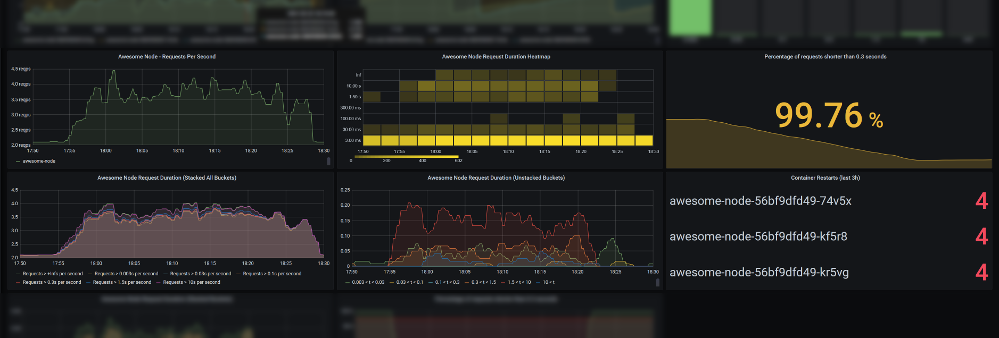
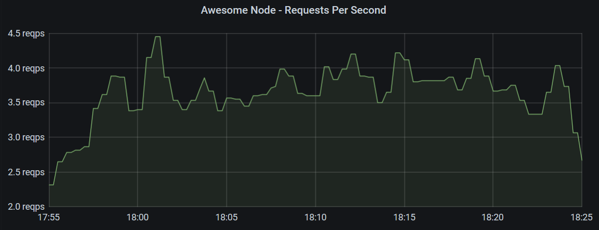
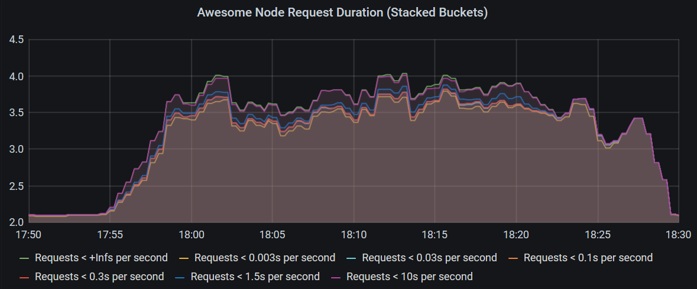
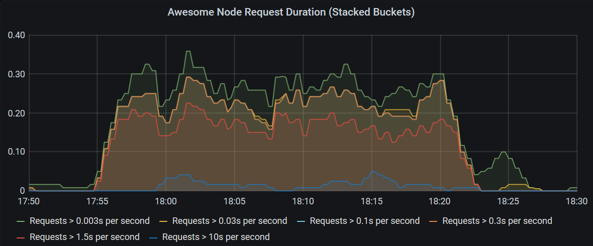
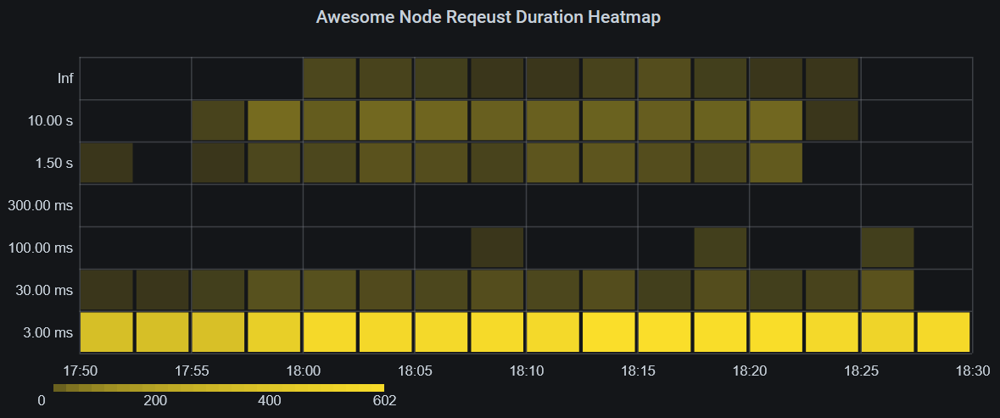
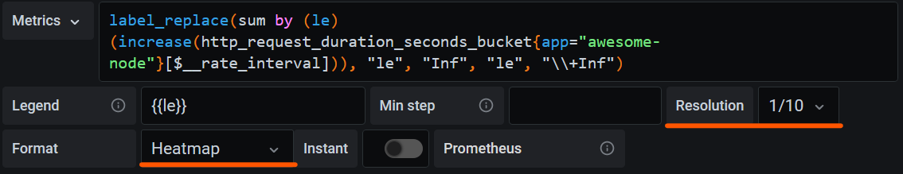
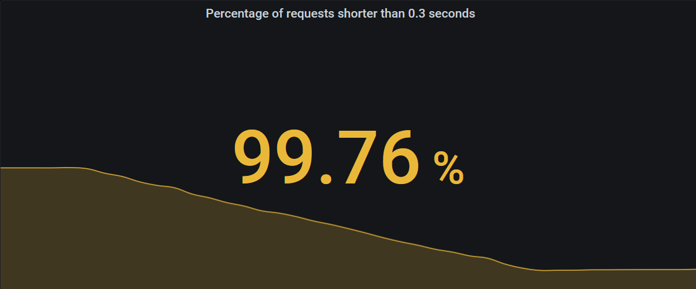
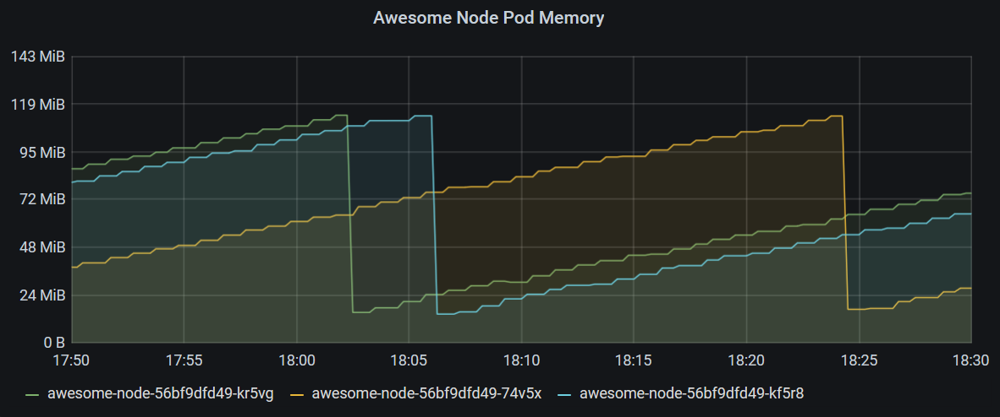
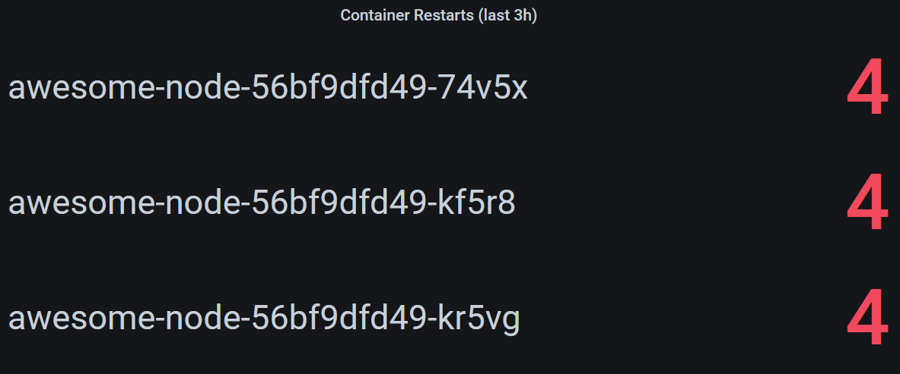

Viele Kubernetes-Deployments enthalten Prometheus und Grafana, damit
Applikationsteams ihre Applikationen überwachen können. Während die Nutzung von
Grafana für viele relativ einfach ist, sind das Datenmodell von Prometheus und
dessen Abfragesprache PromQL vielen Entwicklerinnen und Entwicklern unbekannt
und wenig intuitiv. Dieser Blogbeitrag erklärt, wie du ein Dashboard mit einem
bewährten Set an Metriken für deine Node.js-Applikationen auf Kubernetes
erstellst.



## Voraussetzungen

Wir gehen davon aus, dass du Zugriff auf ein Kubernetes-Cluster mit folgenden
installierten Komponenten hast:

- Einem Prometheus-Server, der deine Applikationen scrapet
- Grafana, mit der Prometheus-Instanz als vorkonfigurierter Data Source

Deine Applikationsmetriken mit Metadaten aus Kubernetes zu kombinieren, ergibt
aussagekräftigere Dashboards. Wir empfehlen daher, auch die folgenden
Komponenten zu installieren. Sie werden für den Abschnitt zu
Kubernetes-Metadaten in diesem Beitrag benötigt.

- Prometheus Node Exporter, der es Prometheus ermöglicht, Informationen wie CPU-
  und Memory-Nutzung zu scrapen
- Kube State Metrics, das Kubernetes-Informationen im Prometheus-Metrikformat
  bereitstellt

## Metriken exportieren

Prometheus scrapet Metriken per HTTP-Polling. Deine Applikation muss deshalb
einen HTTP-Endpunkt bereitstellen, der ihre internen Metriken ausliefert.

### Metrikformat

Prometheus verwendet ein einfaches textbasiertes Format, wie unten gezeigt. Die
[Prometheus-Doku](https://prometheus.io/docs/instrumenting/exposition_formats/#text-format-example)
liefert weitere Informationen.

```txt
# HELP http_request_duration_seconds duration histogram of http responses labeled with: status_code, method
# TYPE http_request_duration_seconds histogram
http_request_duration_seconds_bucket{le="0.003",status_code="200",method="GET"} 1204
http_request_duration_seconds_bucket{le="0.03",status_code="200",method="GET"} 1214
http_request_duration_seconds_bucket{le="0.1",status_code="200",method="GET"} 1215
http_request_duration_seconds_bucket{le="0.3",status_code="200",method="GET"} 1215
http_request_duration_seconds_bucket{le="1.5",status_code="200",method="GET"} 1230
http_request_duration_seconds_bucket{le="10",status_code="200",method="GET"} 1257
http_request_duration_seconds_bucket{le="+Inf",status_code="200",method="GET"} 1260
http_request_duration_seconds_sum{status_code="200",method="GET"} 159.43762229599974
http_request_duration_seconds_count{status_code="200",method="GET"} 1260
.
.
.

# HELP up 1 = up, 0 = not up
# TYPE up gauge
up 1
```

Wie du siehst, liefert der Endpunkt in diesem Fall mehrere Metriken namens
`http_request_duration_seconds_bucket` mit unterschiedlichen Werten für das
Label `le`. Für andere Statuscodes gibt es diese doppelt, sie wurden in diesem
Beispiel aber weggelassen. Wenn Prometheus den Endpunkt scrapet, ergänzt es
zusätzliche Labels als Metadaten für spätere Abfragen. Prometheus bringt
eingebaute Service-Discovery-Optionen mit, um Kubernetes-Metadaten wie den
Namespace des Pods, den Pod-Namen und die dem Pod zugewiesenen Kubernetes-Labels
hinzuzufügen.

Die Metrik `http_request_duration_seconds_count` von oben könnte nach dem
Scrapen etwa so aussehen:

```txt
http_request_duration_seconds_count{app="awesome-node", instance="10.244.2.130:8080", job="kubernetes-pods", kubernetes_namespace="awesome-node", kubernetes_pod_name="awesome-node-56bf9dfd49-74v5x", method="GET", pod_template_hash="56bf9dfd49", status_code="200"}
```

### Bibliotheken für Node.js

Für Node.js gibt es eine Reihe von Bibliotheken, die grundlegende Metriken für
viele Node.js-Webserver exportieren.

In diesem Beispiel verwenden wir das
[Express Prometheus Bundle](https://github.com/jochen-schweizer/express-prom-bundle),
das auch Koa unterstützt und Metriken sehr passend für das Datenmodell und die
Abfragesprache von Prometheus bereitstellt.

Das Express Prometheus Bundle exportiert automatisch eine Reihe nützlicher
Metriken zur Request-Dauer und basiert auf
[prom-client](https://github.com/siimon/prom-client), mit dem du zusätzliche
eigene Metriken für deine Applikation exportieren kannst.

## Beispielapplikation

In diesem Beispiel arbeiten wir mit bespinians Express-basierter
Beispielapplikation [Awesome Node](https://github.com/bespinian/awesome-node).
Sie ist in einen Namespace namens `awesome-node` deployt, exportiert Metriken
über das Express Prometheus Bundle und läuft mit 3 Replicas.

Wenn deine Applikation bereits Metriken bereitstellt und in deinem
Kubernetes-Cluster eingerichtet ist, folge einfach mit und baue das Dashboard
Schritt für Schritt nach. Andernfalls ist es eine gute Übung, die Applikation
Awesome Node zu deployen und das Beispiel-Dashboard mit den dabei entstehenden
Daten aufzubauen.

## Requests pro Sekunde

Fangen wir an, ein paar Diagramme zu erstellen. In einem ersten Panel willst du
vielleicht einen Graphen zeigen, der die Requests pro Sekunde an deine
Applikation über die Zeit darstellt – so wie unten.



Dieses Grafana-Panel zeigt mit der folgenden Abfrage die Requests pro Sekunde,
die über 30 Minuten auf alle Instanzen der Applikation treffen.

```txt
sum by (app) (rate(http_request_duration_seconds_count{app="awesome-node"}[2m]))
```

Die Abfrage holt einen Range Vector über 2 Minuten mit Datenpunkten der Metrik
`http_request_duration_seconds_count`, bei der das Label `app` auf
`awesome-node` gesetzt ist. In unserem Beispiel scrapet Prometheus die Metriken
jede Minute, pro Zwei-Minuten-Intervall gibt es also zwischen 1 und 3
Datenpunkte.

Die Funktion `rate()` berechnet dann die durchschnittliche Rate pro Sekunde
unter Berücksichtigung der exakten Intervalle zwischen den Datenpunkten.

Das ergibt weiterhin mehrere Metriken, die sich in ihren Labels `satus_code` und
`kubernetes_pod_name` unterscheiden und sich zu einer einzigen Zahl für die
gesamte Applikation aufsummieren lassen.

Um einen Graphen über die Zeit darzustellen, macht Grafana eine Query Range über
30 Minuten mit 15-Sekunden-Intervallen (diese Werte lassen sich in Grafana
anders konfigurieren). Prometheus berechnet die Abfrage dann für jedes dieser
Intervalle, sodass Grafana ein Diagramm zeichnen kann.

### Der Metriktyp Counter

In diesem Graphen haben wir den Metriktyp Counter verwendet, der monoton steigt.
Bei solchen Metriken interessiert uns meist der relative Zuwachs in einem
Zeitraum, nicht der absolute Wert. Die Funktion `rate()` berechnet diesen
Zuwachs und berücksichtigt die exakte Zeit zwischen je zwei Datenpunkten. Sie
berücksichtigt auch Counter-Resets, die beim Neustart einer Instanz auftreten
können.

### Der Metriktyp Gauge

Anders als Counter sind Gauges Metriken, deren Wert auch sinken kann. Dadurch
sind sie sehr intuitiv zu nutzen und benötigen weder Ableitung noch die Funktion
`rate()`.

Beispiele für Gauges wären Temperatur oder CPU-Last. Die CPU-Last über Gauges zu
messen, ist allerdings nicht ratsam, da ein Gauge nur eine Momentaufnahme zum
Messzeitpunkt darstellt und Schwankungen zwischen zwei Messungen nicht
berücksichtigt. Tools wie der Prometheus Node Exporter exportieren die
CPU-Nutzung deshalb in Sekunden als Metrik vom Typ Counter.

## Request-Performance

Der Metrik-Endpunkt unserer Applikation exportiert Metriken
`http_request_duration_seconds_bucket` mit unterschiedlichen Werten `n` für das
Label `le`, das angibt, wie viele Requests kürzer als `n` Sekunden waren. Diese
Buckets bilden zusammen mit den Metriken `http_request_duration_seconds_sum` und
`http_request_duration_seconds_count` eine sogenannte Histogramm-Metrik.

Wichtig: Die Buckets einer Histogramm-Metrik schliessen sich nicht gegenseitig
aus. Ein Request, der 0,7 Sekunden dauerte, wird je einmal in den Buckets
`le: 1.5`, `le: 10` und `le: +Inf` gezählt. Das vereinfacht die Berechnung von
Verhältnissen und Prozentwerten, erfordert aber eine Subtraktion, um
herauszufinden, wie viele Requests z.B. zwischen 1,5 und 10 Sekunden lagen.

Dieses Histogramm erlaubt uns zu überwachen, ob unsere Applikation gut und
innerhalb ihrer Service Level Objectives performt. Schauen wir uns nun
verschiedene Wege an, die Histogrammdaten zu visualisieren. Je nach
Anwendungsfall wählst du den einen oder den anderen.

### Histogramm als Liniendiagramm

Das einfachste Diagramm zeigt schlicht alle Buckets des Histogramms als einzelne
Graphen.



Die folgende Abfrage berechnet die Rate für jeden Bucket und Pod und summiert
sie dann pro Bucket, um das obige Diagramm zu erzeugen.

```txt
sum by (le) (rate(http_request_duration_seconds_bucket{kubernetes_namespace="awesome-node"}[3m]))
```

Ein Nachteil dieses Diagramms: Die meisten Requests liegen im Bucket
`le: 0.003`, und die Graphen der übrigen Buckets werden alle in einen winzigen
Bereich gequetscht.

Wir können den Bucket der kürzesten Requests ausschliessen und aus der Summe
entfernen, indem wir die Buckets umdrehen und die Anzahl Requests berechnen, die
grösser als die `le`-Schwellen sind.



Verwende die folgende Abfrage, um dieses Diagramm zu erzeugen:

```txt
sum by (app, le) (rate(http_request_duration_seconds_count{app="awesome-node"}[3m]) - ignoring (le) group_right rate(http_request_duration_seconds_bucket{le!="+Inf"}[3m]))
```

> #### Erklärung der Abfrage
>
> Diese Abfrage nutzt
> [One-to-Many](https://prometheus.io/docs/prometheus/latest/querying/operators/#many-to-one-and-one-to-many-vector-matches)-Matching,
> um viele Metriken (die Buckets) von einer einzelnen Metrik (dem Count)
> abzuziehen. Dazu müssen wir Prometheus mit dem Modifier `group_right` sagen,
> dass der rechte Teil die höhere Kardinalität hat.
>
> Ausserdem matcht Prometheus standardmässig Metriken mit übereinstimmenden
> Label-Werten. In diesem Fall existiert das Label `le` aber nur auf den
> Buckets. Damit das Matching gelingt, weisen wir Prometheus mit dem Modifier
> `ignoring (le)` an, das Label `le` zu ignorieren.

### Histogramm als Heatmap

Ein weiterer interessanter Weg, Histogramme zu visualisieren, sind Heatmaps –
und Grafanas Heatmap-Implementierung eignet sich dafür gut.



Wie du in dieser Heatmap siehst, zeigt sich die Menge langer Requests deutlich
in den oberen Bereichen, wobei eine intensivere Farbe mehr Requests in diesem
Bucket bedeutet. Im Idealfall sind – von wenigen Ausnahmen abgesehen – überhaupt
nur die untersten 1 bis 3 Reihen eingefärbt.

Die Abfrage für diese Heatmap ist einfach:

```txt
label_replace(sum by (le) (increase(http_request_duration_seconds_bucket{app="awesome-node"}[$__rate_interval])), "le", "Inf", "le", "\\+Inf")
```

> #### Hinweis!
>
> Absolute Zahlen statt Raten pro Sekunde können praktisch sein, wenn man wie
> hier in grössere Intervalle gruppiert.
>
> Die Funktion `label_replace()` ersetzt hier das Label `le: +Inf` durch
> `le: Inf`, weil Grafana das Label `+Inf` falsch verwenden würde.
>
> Wir verwenden $\_\_rate_interval statt einer festen Zeitspanne wie `3m`, damit
> alle Datenpunkte nur einmal und im richtigen Heatmap-Abschnitt gezählt werden.

Die Metrik muss in Grafana als Heatmap konfiguriert werden; in diesem Fall ist
es sinnvoll, die Auflösung der Heatmap zu reduzieren.



> #### Wichtig!
>
> Achte im Panel-Bereich des Grafana-Panels im Unterabschnitt `Axis` darauf, im
> Feld `Data Format` `Time series buckets` auszuwählen.

Deine Heatmap sollte jetzt korrekt dargestellt werden.

Ich empfehle dir, 0-Werte auszublenden und mit den Farben zu experimentieren. Im
Beispiel war es sinnvoll, `opacity` als Farbmodus zu wählen und `sqrt` als Skala
zu verwenden, um den Kontrast bei Buckets mit niedrigen Werten zu erhöhen.

### Der Metriktyp Summary

Das letzte Beispiel sollte dir geholfen haben, dich mit dem Metriktyp Histogramm
vertraut zu machen.

Jetzt wenden wir uns dem Metriktyp Summary zu, der die vier grundlegenden
Metriktypen in Prometheus abschliesst.

Eine Summary-Metrik ähnelt einem Histogramm, da sie ebenfalls aus mehreren
Einzelmetriken zusammengesetzt ist – sie unterscheidet sich aber darin, dass sie
eine Reihe von Quantilen (z.B. das 50., 90., 95. und 99. Perzentil) exakt
berechnet. Dieser Metriktyp ist für den Export aufwendiger zu berechnen, ist
aber der beste Weg zu exakten Quantilen, wenn du sie brauchst.

Prometheus erlaubt dir auch, Quantile aus Histogrammen zu berechnen – mit der
[Funktion histogram_quantile()](https://prometheus.io/docs/prometheus/latest/querying/functions/#histogram_quantile).
Diese Funktion berechnet die Quantile aber über Interpolation und ist daher
nicht exakt.

## Deine Service Level Objectives überwachen

Ein Service Level Objective wird oft so formuliert, dass ein bestimmter
Prozentsatz der Requests über einen bestimmten Zeitraum kürzer als eine
festgelegte Schwelle sein muss – zum Beispiel «99 Prozent der Requests müssen in
jedem 24-Stunden-Zeitraum in unter 0,3 Sekunden bedient werden». Üblicherweise
wird der Zeitraum in Tagen (wie im Beispiel), Wochen oder Monaten gemessen. In
unserem Beispiel nennt man den Prozentsatz der Requests unter 0,3 Sekunden über
24 Stunden einen Service Level Indicator (SLI), und den wollen wir mit der
folgenden Abfrage auf unserem Dashboard anzeigen.

```txt
(sum by (app) (increase(http_request_duration_seconds_bucket{app="awesome-node", le="0.3"}[1d])) / sum by (app) (increase(http_request_duration_seconds_count{app="awesome-node"}[1d]))) * 100
```

In diesem Fall interessiert uns eine einzelne Zahl. Wir sollten deshalb ein
Stat-Panel verwenden.



Unter der Zahl kann das Stat-Panel zusätzlich einen Graphen zeigen, der dir
andeutet, ob dein SLI steigt, sinkt oder stabil bleibt.

Das Stat-Panel lässt sich im Bereich «Thresholds» des Tabs «Field» in Grafana so
konfigurieren, dass es die Farbe anhand bestimmter Schwellen wechselt. Hier habe
ich es so eingestellt, dass es rot ist, wenn der SLI unter 99 % liegt, gelb,
wenn er unter 99,9 % liegt, und nur grün, wenn er grösser oder gleich 99,9 %
ist. Im Screenshot oben siehst du diese Schwellen angewendet: Der Wert 99,76 %
für unseren SLI liegt zwischen 99 % und 99,9 % und ist deshalb gelb.

## CPU- und Memory-Nutzung

Die Applikation gibt keine Informationen zur CPU- und Memory-Nutzung auf ihrem
Metrik-Endpunkt aus. Stattdessen scrapet Prometheus diese Informationen in
unserem Fall direkt von den Kubernetes-Nodes selbst – über den Prometheus Node
Exporter, der Statistiken der virtuellen Maschinen als Metriken bereitstellt und
es erlaubt, diese Metriken mit Kubernetes-Metadaten wie Pod- und
Namespace-Informationen zu labeln.



In diesem Diagramm zeigen wir die Memory-Nutzung aller Pods im Namespace
`awesome-node`, deren Pod-Name mit `awesome-node-` beginnt.

> #### Hinweis!
>
> Prometheus unterstützt Regex-Abfragen auf Metrik-Labels über den Operator
> `=~`.

```txt
container_memory_working_set_bytes{namespace="awesome-node", pod=~"awesome-node-.*", container=""}
```

Zusätzlich wählen wir nur die Metrik aus, bei der das Label `container` fehlt,
denn diese Metrik steht für die Memory-Nutzung des gesamten Pods, während sich
die anderen Metriken auf die einzelnen Container eines Pods beziehen.

> #### Hinweis!
>
> Die Rücksetzer beim Memory, die du hier siehst, stammen von
> Container-Restarts, die durch ein absichtlich in die Applikation Awesome Node
> eingebautes Memory Leak ausgelöst werden.

Für die Darstellung von CPU-Metriken verwenden wir ebenfalls ein Liniendiagramm
und fragen einen Counter ab, der die verbrauchten CPU-Sekunden misst. Da es sich
um einen Counter handelt, ist es wieder sinnvoll, die Funktion `rate()` zu
verwenden, um den CPU-Zuwachs zu erhalten – wie in der Abfrage unten.

```txt
rate(container_cpu_user_seconds_total{pod=~"notification-api-deployment-.*", container=""}[2m])*1000
```

Diese Abfrage liefert die verbrauchten CPU-Millicores, da wir in Kubernetes
häufig die Einheit Millicores verwenden, um die CPU-Ressourcen zu begrenzen, die
ein Pod oder Container nutzen darf.

## Container-Restarts

In unserem Beispiel scheinen einige Container häufig neu zu starten. Wenn du
Pods anzeigen willst, die kürzlich Restarts hatten, verwendest du ein Stat-Panel
und fragst die Metrik `kube_pod_container_status_restarts_total` ab.

Diese Metrik wird von der Komponente Kube State Metrics exportiert, die den
Zustand von Kubernetes-Objekten überwacht und einen Endpunkt zum Scrapen durch
Prometheus bereitstellt.



Dieses Panel bleibt leer, wenn in den letzten 3 Stunden keine Container-Restarts
auftraten. Es lässt sich mit der folgenden Abfrage erzeugen.

```txt
increase(kube_pod_container_status_restarts_total{namespace="awesome-node"}[3h]) > 0
```

## Fazit

Grafana und das Prometheus-Metrikformat sind für sich genommen relativ leicht zu
verstehen – nützliche Dashboards zu bauen, erfordert aber, sich mit PromQL und
dem Datenmodell von Prometheus vertraut zu machen.

Wenn du Dashboards entwirfst, Prometheus direkt abfragst oder entscheidest, wie
deine Applikationen Metriken bereitstellen, behalte Folgendes im Hinterkopf:

- Counter liefern wertvolle Erkenntnisse, wenn du sie mit den Funktionen
  `rate()` oder `increase()` verwendest.
- Die Gliederung von Histogrammen in Buckets ermöglicht ein breites Spektrum an
  Visualisierungen für deine Service Level Indicators und Performance-Messungen.
- Das Einbeziehen der von Kubernetes-Komponenten erzeugten Metadaten erlaubt
  dir, einzelne Pods oder sogar Container deiner Applikation zu beobachten.

### Beispiel-Dashboard

Wir haben ein Beispiel-Dashboard mit den in diesem Beispiel erstellten
Visualisierungen und einigen weiteren zum Erkunden vorbereitet. Du kannst es
[herunterladen](https://gist.github.com/elessar-ch/42f0eb278aedd27d3b20f4ea490902c7)
und über die Import-Funktion von Grafana einsteigen.

### Wie geht es weiter?

Der natürliche nächste Schritt, sobald dein Dashboard läuft, ist das Aufsetzen
von Alerting – damit du Probleme früh erkennst, auch wenn du gerade nicht auf
dein Dashboard schaust. Schau dir den
[Alertmanager von Prometheus](https://www.prometheus.io/docs/alerting/latest/alertmanager/)
an, um zu erfahren, wie du ihn aufsetzt und Alerts auf Basis deiner Metriken in
Prometheus konfigurierst.
