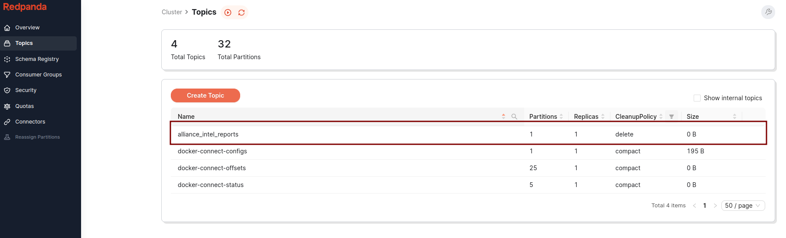
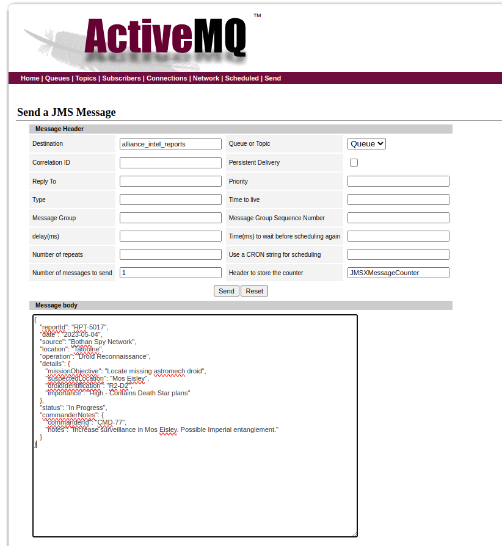
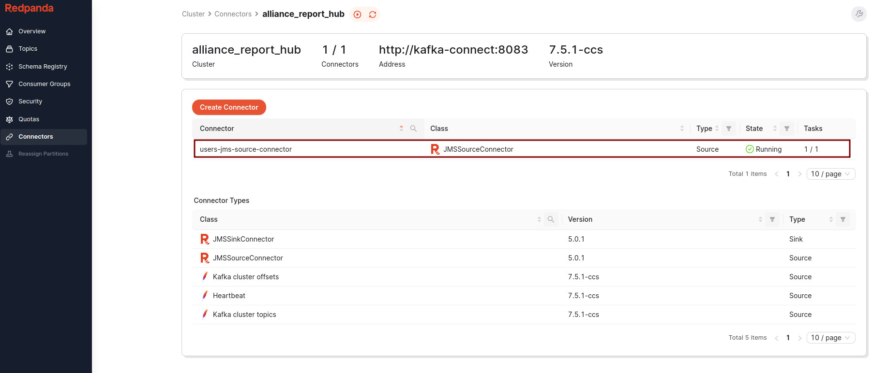
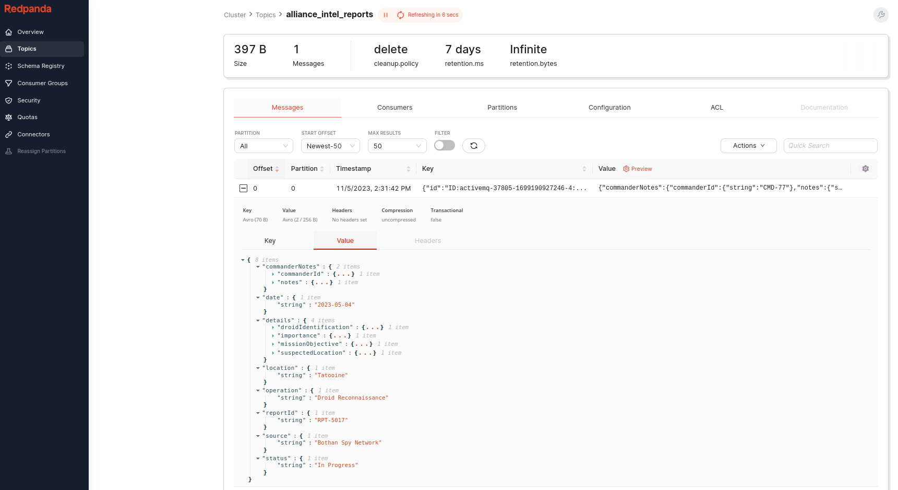

## Vor langer Zeit in einer weit, weit entfernten IT-Galaxis …

In einer Ära tiefgreifenden technologischen Wandels zettelte ein Team von
Jedi-Entwicklerinnen und -Entwicklern, einst Hüter der Festungen von
Legacy-Systemen, einen entscheidenden Aufstand an. Ihr Erfindungsreichtum
wendete das Blatt gegen die monolithischen Kommunikations-Frameworks, welche die
Datenströme der Galaxis lange beherrscht hatten.

## Das Erbe von JMS

In der Galaxis der Daten und Nachrichten regierte lange das erste System: JMS
(Jedi Messaging Service). Zuverlässig und beständig wie der Protokolldroide
C-3PO diente JMS pflichtbewusst und sorgte dafür, dass Nachrichten die Weiten
der Netzwerkarchitekturen durchquerten. Doch als die Datenbedürfnisse der
Galaxis exponentiell wuchsen, traten die Grenzen von JMS immer deutlicher hervor
– wie ein uraltes Protokoll, das sich in einer sich rasant entwickelnden Galaxis
abmüht.

## Der Aufstieg von Kafka

Auftritt Kafka: ein flinkes, agiles System, das rasch zur neuen Hoffnung der
Rebellion aufstieg. Weit mehr als ein blosser Bote – fähig, Daten auf bisher
ungekannte Weise zu speichern, zu streamen und zu verarbeiten. Es versprach eine
neue Ära im Datenmanagement, doch der Übergang vom altehrwürdigen JMS zu dieser
bahnbrechenden Technologie war voller potenzieller Herausforderungen und
Konflikte.

## Die Offloading-Strategie

Unsere Reise war gespickt mit Herausforderungen – von durcheinandergeratenen
Nachrichten bis zu Systemausfällen. Doch bewaffnet mit einem strategischen Plan,
dem richtigen technologischen Arsenal und einer Prise Macht machten wir uns auf
unsere Mission, Altes und Neues harmonisch zu verbinden.

## Apache Kafka

Kafkas robuste Architektur und der überlegene Umgang mit Echtzeitdaten machen es
zur idealen Wahl für Unternehmen, die ihre Datenverarbeitungssysteme verbessern
wollen.

Aber wie wechseln wir von JMS zu Kafka, ohne bestehende Systeme zu stören? Die
Antwort liegt im Einsatz von Kafka Connect.

In diesem Beitrag erkunden wir, wie sich Nachrichten mit Kafka Connect von
JMS-Queues nach Kafka auslagern lassen.

Wir starten mit einem Überblick über JMS und Kafka und den Bedarf für
Offloading.

Danach tauchen wir in eine Schritt-für-Schritt-Anleitung ein, wie der
Offloading-Prozess gelingt.

Ob du eine erfahrene Softwarearchitektin oder Einsteiger bist – dieser Artikel
will dir praktisches Wissen mitgeben, das deine Reise vom JMS- zum
Kafka-Offloading erleichtert.

Begleite uns in die Welt von Kafka: Wir entmystifizieren den Offloading-Prozess
und helfen dir, die Kraft von Echtzeitdaten für dein Unternehmen zu nutzen.

## JMS und seine Grenzen verstehen

JMS, kurz für Java Message Service, ist eine Spezifikation, die innerhalb der
Java Virtual Machine (JVM) arbeitet.

Obwohl es ein Java-zentrierter Service ist, können Sprachen wie Kotlin und Scala
dank ihrer Java-Kompatibilität damit interagieren.

JMS erlaubt Java-Komponenten, Nachrichten zu erzeugen, zu lesen, zu senden und
zu empfangen, und gestaltet die Kommunikation zwischen verschiedenen Komponenten
einer verteilten Applikation lose gekoppelt, asynchron und zuverlässig.

In der modernen Softwarelandschaft – besonders in komplexen, mehrschichtigen
Applikationen mit Microservices – kommt oft eine Vielzahl von
Programmiersprachen und Frameworks zum Einsatz.

Diese Vielfalt erlaubt es verschiedenen Komponenten der Applikation, die Stärken
unterschiedlicher Sprachen und Frameworks zu nutzen.

Die Java-Abhängigkeit von JMS kann in solch heterogenen Umgebungen jedoch eine
erhebliche Einschränkung sein und die Interoperabilität mit Systemteilen
begrenzen, die nicht auf Java basieren.

## Was Kafka auszeichnet

Apache Kafka ist eine verteilte Streaming-Plattform. Was unterscheidet Kafka von
anderen Messaging-Systemen?

### Mehrere Producer

Apache Kafka ist darauf ausgelegt, mehrere Producer zu verarbeiten, und
erleichtert so die Datenaggregation aus verschiedenen Frontend-Systemen. Das
vereinfacht den Datenstrom und macht ihn handhabbarer – besonders bei mehreren
Microservices.

### Mehrere Consumer

Kafka unterstützt mehrere Consumer, die denselben Nachrichtenstrom ohne
gegenseitige Störung lesen. Anders als in vielen Systemen, in denen eine
konsumierte Nachricht nicht mehr verfügbar ist, erlaubt Kafka mehreren
Consumern, sich eine Nachricht zu teilen und sie genau einmal zu verarbeiten,
wenn sie als Teil einer Gruppe arbeiten.

### Festplattenbasierte Aufbewahrung

Apache Kafka bietet dauerhafte Nachrichtenaufbewahrung: Nachrichten werden nach
konfigurierbaren Retention-Regeln auf die Festplatte geschrieben. Das erlaubt
Consumern den Betrieb ausserhalb der Echtzeit, schützt Daten bei Traffic-Spitzen
oder langsamer Verarbeitung und ermöglicht Wartung an Consumern ohne Risiko von
Datenverlust.

### Skalierbarkeit

Kafka bietet flexible Skalierbarkeit: Du startest mit einem einzelnen Broker und
erweiterst bei Bedarf auf grössere Cluster. So läuft das System durchgehend
weiter – auch während Erweiterungen oder beim Ausfall eines einzelnen Brokers.

### Hohe Performance

Apache Kafka zeichnet sich durch hohe Performance unter starker Last aus. Es
unterstützt das Skalieren von Producern, Consumern und Brokern, um grosse
Nachrichtenströme zu bewältigen und dabei Latenzen im Subsekundenbereich zu
halten.

### Plattform-Features

Das Apache-Kafka-Projekt enthält APIs und Bibliotheken für Stream Processing und
Datenmigration. Kafka Connect hilft dabei, Daten von einem Quellsystem nach
Kafka zu bewegen oder umgekehrt, während Kafka Streams eine Bibliothek für den
Bau skalierbarer, fehlertoleranter Stream-Processing-Applikationen bietet.

## Flexibilität und Resilienz von Kafka Connect

### Deployment-Optionen und Skalierbarkeit von Kafka Connect

Kafka Connect bietet als clientseitige Applikation zwei verschiedene
Deployment-Methoden:

- als einzelne, eigenständige Applikation auf einem einzigen Host oder
- als verteiltes System über mehrere Hosts hinweg.

Jeder Host, auf dem Kafka Connect läuft, wird als «Worker» bezeichnet.

### Unterschiedliche Workloads bewältigen

Diese duale Deployment-Strategie gibt Kafka Connect die Vielseitigkeit, ein
breites Spektrum an Workloads abzudecken.

Es bewältigt problemlos alles von einer einzelnen Datenpipeline mit wenigen
Events bis zu einem Netz aus Dutzenden Workern, die Millionen Events pro Sekunde
verarbeiten.

Dank seiner dynamischen Natur kannst du bei Kafka Connect Worker zur Laufzeit
hinzufügen oder entfernen und die Kapazität so an die Nachfrage anpassen.

### Kafka Connect im Cluster-Setup

Wird Kafka Connect als verteiltes Cluster deployt, arbeiten die Worker zusammen
und übernehmen je einen Teil der Last.

Dieser verteilte Ansatz erhöht Zuverlässigkeit und Resilienz von Kafka Connect.

Fällt ein Worker aus, verteilen die übrigen Worker die unterbrochene Last sofort
neu und übernehmen sie – das minimiert Downtime und hält die Produktivität
aufrecht.

## Weitere Komponenten in diesem Beispiel

### [karapace](https://www.karapace.io/)

Karapace ist ein kostenloses Open-Source-Tool, das eine API-kompatible
Alternative zur Confluent Schema Registry für Apache Kafka bietet. Beim Arbeiten
mit Kafka – besonders mit Avro-serialisierten Daten – wird die Schema Registry
zur essenziellen Komponente. Sie speichert Avro-Schemas für Kafka-Producer und
-Consumer und stellt sicher, dass geschriebene und gelesene Daten immer zum
Schema kompatibel sind.

### [redpanda console](https://redpanda.com/redpanda-console-kafka-ui)

Die Redpanda Console bietet dir einen einfachen, interaktiven Weg, Einblick in
deine Topics zu gewinnen, Daten zu maskieren, Consumer Groups zu verwalten und
Echtzeitdaten mit Time-Travel-Debugging zu erkunden.

### [activemq](https://activemq.apache.org/)

Apache ActiveMQ ist ein quelloffener Message Broker in Java. Er ist bekannt für
seine Robustheit, Flexibilität und seinen breiten Funktionsumfang. ActiveMQ ist
ein vollständig JMS-konformes (Java Message Service) Messaging-System und
unterstützt viele sprachübergreifende Clients und Protokolle.

### [JMS Source Connector](https://docs.lenses.io/5.3/connectors/sources/jmssourceconnector/)

Ein Kafka-Connect-JMS-Source-Connector, der Nachrichten auf JMS-Queues und
-Topics abonniert und sie in ein Kafka-Topic schreibt.  
Er nutzt KCQL (Kafka Connect Query Language), eine SQL-ähnliche Syntax, die eine
schlanke Konfiguration von Kafka-Connect-Sinks und -Sources erlaubt.

## Offloading von JMS nach Kafka: eine Star-Wars-Saga

### Kafka errichten: die Sternenlicht-Festung der Jedi

Die erste Phase unserer Mission bestand darin, Kafka als Sternenlicht-Station
der Rebellion zu errichten. Mit dem Konsensprotokoll KRaft wollten wir ein
Leuchtfeuer schaffen, das frei von den Zwängen des alten ZooKeeper-Systems ist –
ein neuer Ansatz zur Verwaltung von Metadaten.

- Nutze die Macht (von Docker Compose)

Wir nutzen die Kraft von Docker Compose, um unsere Kafka-Sternenlicht-Station zu
bauen:

```yaml
kafka:
  image: confluentinc/cp-kafka:7.5.0
  hostname: kafka
  container_name: kafka
  ports:
    - "9092:9092"
  environment:
    KAFKA_NODE_ID: 1
    KAFKA_LISTENER_SECURITY_PROTOCOL_MAP: "CONTROLLER:PLAINTEXT,PLAINTEXT:PLAINTEXT,PLAINTEXT_HOST:PLAINTEXT"
    KAFKA_ADVERTISED_LISTENERS: "PLAINTEXT://kafka:29092,PLAINTEXT_HOST://localhost:9092"
    KAFKA_OFFSETS_TOPIC_REPLICATION_FACTOR: 1
    KAFKA_GROUP_INITIAL_REBALANCE_DELAY_MS: 0
    KAFKA_TRANSACTION_STATE_LOG_MIN_ISR: 1
    KAFKA_TRANSACTION_STATE_LOG_REPLICATION_FACTOR: 1
    KAFKA_PROCESS_ROLES: "broker,controller"
    KAFKA_CONTROLLER_QUORUM_VOTERS: "1@kafka:29093"
    KAFKA_LISTENERS: "PLAINTEXT://kafka:29092,CONTROLLER://kafka:29093,PLAINTEXT_HOST://0.0.0.0:9092"
    KAFKA_INTER_BROKER_LISTENER_NAME: "PLAINTEXT"
    KAFKA_CONTROLLER_LISTENER_NAMES: "CONTROLLER"
    KAFKA_LOG_DIRS: "/tmp/kraft-combined-logs"
    # CLUSTER_ID durch eine eindeutige Base64-UUID ersetzen: "bin/kafka-storage.sh random-uuid"
    # Siehe https://docs.confluent.io/kafka/operations-tools/kafka-tools.html#kafka-storage-sh
    CLUSTER_ID: "MkU3OEVBNTcwNTJENDM2Qk"
```

Diese Konfiguration erlaubt unserer Kafka-Sternenlicht-Station, autonom zu
arbeiten – ohne die Unterstützung des alten Wächters ZooKeeper.

### Die Kafka-Sternenlicht-Station mit dem Redpanda-Kommandozentrum meistern

Die Redpanda Console tritt als fortschrittliches Kommandozentrum der Rebellion
auf und ist zentral für die Steuerung der Kafka-Sternenlicht-Station.

```yaml
redpanda-console:
  container_name: redpanda-console
  image: docker.redpanda.com/vectorized/console:latest
  entrypoint: /bin/sh
  command: -c 'echo "$$CONSOLE_CONFIG_FILE" > /tmp/config.yml; /app/console'
  environment:
    CONFIG_FILEPATH: /tmp/config.yml
    CONSOLE_CONFIG_FILE: |
      kafka:
        brokers: ["kafka:29092"]
        schemaRegistry:
          enabled: false
  ports:
    - "8080:8080"
  depends_on:
    kafka:
      condition: service_healthy
```

Das Kommandozentrum starten:

```shell
docker compose up -d
```

#### Missionskontrolle:

Navigiere zum [Redpanda-Kommandozentrum](http://localhost:8080). Dort empfängt
dich die Redpanda Console.

Zeit, unsere Geheimdienstberichte zu definieren. Lege ein neues Kafka-Topic an:
`alliance_intel_reports`. Dieses Topic dient als Ablage für lebenswichtige
Geheimdienstberichte und sammelt entscheidende Informationen, die der
Rebellenallianz helfen, fundierte Entscheidungen zu treffen und strategische
Operationen in der ganzen Galaxis zu planen.



### Die Karapace Schema Registry

Die Karapace Registry unterstützt die Speicherung von Schemas und dient als
zentraler Knotenpunkt für die Serialisierung und Deserialisierung von
Nachrichten im Kafka-Ökosystem.

#### Die Karapace Registry aufsetzen

Um diese kritische Komponente in unsere Kafka-Sternenlicht-Station zu
integrieren, konfigurieren wir die Karapace Registry wie folgt:

```yaml
karapace-registry:
  container_name: karapace-registry
  image: ghcr.io/aiven-open/karapace:latest
  entrypoint:
    - /bin/bash
    - /opt/karapace/start.sh
    - registry
  depends_on:
    kafka:
      condition: service_healthy
  ports:
    - "8081:8081"
  environment:
    KARAPACE_ADVERTISED_HOSTNAME: karapace-registry
    KARAPACE_BOOTSTRAP_URI: kafka:29092
    KARAPACE_PORT: 8081
    KARAPACE_HOST: 0.0.0.0
    KARAPACE_CLIENT_ID: karapace
    KARAPACE_GROUP_ID: karapace-registry
    KARAPACE_MASTER_ELIGIBILITY: "true"
    KARAPACE_TOPIC_NAME: _schemas
    KARAPACE_LOG_LEVEL: WARNING
    KARAPACE_COMPATIBILITY: FULL
```

```shell
docker compose up -d karapace-registry
```

Passe die Konfiguration der Redpanda Console an, damit sie sich mit der Karapace
Registry verbindet:

```text
  redpanda-console:
    ... [bestehende Konfiguration]
      CONSOLE_CONFIG_FILE: |
        kafka:
          brokers: ["kafka:29092"]
          schemaRegistry:
            enabled: true
            urls: ["http://karapace-registry:8081"]
    ... [restliche Konfiguration]
```

Damit die Änderungen in der Redpanda Console wirksam werden, startest du eine
Rebuild-Sequenz:

```shell
docker compose up -d --build redpanda-console
```

Die Anzeigen des Redpanda-Kommandozentrums leuchten auf – ein Zeichen dafür,
dass die Station bereit ist, sich mit den fortgeschrittenen Funktionen der
Karapace Schema Registry zu synchronisieren.

### Das altehrwürdige ActiveMQ – die galaktische Nachrichtenrelaisstation

Im Reich der Datenstrategien der Rebellenallianz steht neben der
Kafka-Sternenlicht-Station ActiveMQ – ein altes und ausgeklügeltes
Nachrichtenrelaissystem.

#### Die ActiveMQ-Relaisstation aufsetzen

```yaml
activemq:
  image: symptoma/activemq:5.17.3
  hostname: activemq
  container_name: activemq
  ports:
    - "61616:61616"
    - "8161:8161"
```

Um den Betrieb aufzunehmen:

```shell
docker compose up -d activemq
```

### Die Übertragungs-Queue `alliance_intel_reports` konfigurieren

Das Control Panel von ActiveMQ ist ein Portal zu zahlreichen
Nachrichtenrelais-Funktionen:

1. Zum Control Panel: Navigiere zum
   [galaktischen Interface von ActiveMQ](http://localhost:8161).
   - Benutzername: `admin`
   - Passwort: `admin`
2. Die Relais-Queue konfigurieren:
   - Klicke auf «Manage ActiveMQ broker».
   - Gehe weiter zu «Queues».
   - Gib `alliance_intel_reports` als Queue-Namen ein und erstelle sie.
3. Eine Nachricht an die Allianz senden:
   - Suche die Queue `alliance_intel_reports` und klicke auf «send to».

```json
{
  "reportId": "RPT-5017",
  "date": "2023-05-04",
  "source": "Bothan Spy Network",
  "location": "Tatooine",
  "operation": "Droid Reconnaissance",
  "details": {
    "missionObjective": "Locate missing astromech droid",
    "suspectedLocation": "Mos Eisley",
    "droidIdentification": "R2-D2",
    "importance": "High - Contains Death Star plans"
  },
  "status": "In Progress",
  "commanderNotes": {
    "commanderId": "CMD-77",
    "notes": "Increase surveillance in Mos Eisley. Possible Imperial entanglement."
  }
}
```



### Die galaktische Integration – Kafka Connect: Meister Yodas Geschenk

Im interstellaren Kommunikationsnetz steht Kafka Connect als Knotenpunkt, der
zwischen verschiedenen Datenwelten vermittelt.

Unsere Integration basiert auf einem Open-Source-Connector von
[Lenses.io](https://docs.lenses.io/5.0/integrations/connectors/stream-reactor/sources/jmssourceconnector/)
und dem grundlegenden Base Image für Kafka Connect von
[Confluent](https://docs.confluent.io/platform/current/connect/index.html).

#### Den JMS Source Connector von Lenses.io installieren

Die Symbiose des JMS Source Connector mit Confluents Kafka Connect ist selbst
eine Odyssee. Hier das heilige Skript, das ihr Bündnis schmiedet:

```dockerfile
FROM confluentinc/cp-kafka-connect:7.5.1

USER root

RUN yum update -y && yum install -y unzip

RUN mkdir -p /usr/local/share/kafka/plugins/kafka-connect-jms

# Das ZIP von kafka-connect-jms holen und entpacken
RUN wget -O /tmp/kafka-connect-jms-5.0.1.zip https://github.com/lensesio/stream-reactor/releases/download/5.0.1/kafka-connect-jms-5.0.1.zip && \
    unzip /tmp/kafka-connect-jms-5.0.1.zip -d /usr/local/share/kafka/plugins/kafka-connect-jms && \
    rm /tmp/kafka-connect-jms-5.0.1.zip

# Die JARs activemq-client und activemq-all holen und ins gleiche Verzeichnis legen
RUN wget -O /usr/local/share/kafka/plugins/kafka-connect-jms/activemq-client-5.12.3.jar https://repo1.maven.org/maven2/org/apache/activemq/activemq-client/5.12.3/activemq-client-5.12.3.jar && \
    wget -O /usr/local/share/kafka/plugins/kafka-connect-jms/activemq-all-5.12.3.jar https://repo1.maven.org/maven2/org/apache/activemq/activemq-all/5.12.3/activemq-all-5.12.3.jar

# Aufräumen
RUN yum remove -y wget unzip && yum clean all

USER appuser
```

```yaml
kafka-connect:
  build:
    context: kafka-connect
    dockerfile: Dockerfile
  hostname: kafka-connect
  container_name: kafka-connect
  ports:
    - "8083:8083"
  environment:
    CONNECT_BOOTSTRAP_SERVERS: "kafka:29092"
    CONNECT_REST_PORT: 8083
    CONNECT_GROUP_ID: compose-connect-group
    CONNECT_CONFIG_STORAGE_TOPIC: docker-connect-configs
    CONNECT_OFFSET_STORAGE_TOPIC: docker-connect-offsets
    CONNECT_STATUS_STORAGE_TOPIC: docker-connect-status
    CONNECT_KEY_CONVERTER: io.confluent.connect.avro.AvroConverter
    CONNECT_KEY_CONVERTER_SCHEMA_REGISTRY_URL: "http://karapace-registry:8081"
    CONNECT_VALUE_CONVERTER: io.confluent.connect.avro.AvroConverter
    CONNECT_VALUE_CONVERTER_SCHEMA_REGISTRY_URL: "http://karapace-registry:8081"
    CONNECT_INTERNAL_KEY_CONVERTER: "org.apache.kafka.connect.json.JsonConverter"
    CONNECT_INTERNAL_VALUE_CONVERTER: "org.apache.kafka.connect.json.JsonConverter"
    CONNECT_REST_ADVERTISED_HOST_NAME: "kafka-connect"
    CONNECT_LOG4J_ROOT_LOGLEVEL: "INFO"
    CONNECT_LOG4J_LOGGERS: "org.apache.kafka.connect.runtime.rest=WARN,org.reflections=ERROR"
    CONNECT_CONFIG_STORAGE_REPLICATION_FACTOR: "1"
    CONNECT_OFFSET_STORAGE_REPLICATION_FACTOR: "1"
    CONNECT_STATUS_STORAGE_REPLICATION_FACTOR: "1"
    CONNECT_PLUGIN_PATH: "/usr/share/java,/etc/kafka-connect/jars,/usr/share/confluent-hub-components,/usr/local/share/kafka/plugins"
    CLASSPATH: "/usr/local/share/kafka/plugins/*"
  depends_on:
    kafka:
      condition: service_healthy
    karapace-registry:
      condition: service_healthy
```

```shell
docker compose up -d kafka-connect
```

Redpanda Console aktualisieren

```text
  redpanda-console:
    ... [bestehende Konfiguration]
      CONSOLE_CONFIG_FILE: |
        kafka:
          brokers: ["kafka:29092"]
          schemaRegistry:
            enabled: true
            urls: ["http://karapace-registry:8081"]
        connect:
          enabled: true
          clusters:
            - name: alliance_report_hub
              url: http://kafka-connect:8083
    ... [restliche Konfiguration]
```

Damit die Änderungen in der Redpanda Console wirksam werden, startest du eine
Rebuild-Sequenz:

```shell
docker compose up -d --build redpanda-console
```

#### Zugriff auf den Kafka-Connect-Container

Um unsere missionskritische Operation zu starten, müssen wir auf den
Kafka-Connect-Container zugreifen:

```shell
docker exec -it kafka-connect bash
```

Dieser Befehl teleportiert uns ins Kommandozentrum von Kafka Connect, wo wir die
Erstellung des Connectors orchestrieren.

#### Den intergalaktischen Connector schmieden

Im Kontrollraum führen wir das heilige Skript aus, das den Connector beschwört:

```shell
curl --location 'http://localhost:8083/connectors' \
--header 'Content-Type: application/json' \
--data '{
         "name": "users-jms-source-connector",
         "config": {
            "connector.class": "com.datamountaineer.streamreactor.connect.jms.source.JMSSourceConnector",
            "task.max": 1,
            "key.converter": "io.confluent.connect.avro.AvroConverter",
            "value.converter": "io.confluent.connect.avro.AvroConverter",
            "key.converter.schema.registry.url": "http://karapace-registry:8081",
            "value.converter.schema.registry.url": "http://karapace-registry:8081",
            "connect.jms.kcql": "INSERT INTO alliance_intel_reports SELECT * FROM alliance_intel_reports WITHTYPE QUEUE",
            "connect.jms.initial.context.factory":"org.apache.activemq.jndi.ActiveMQInitialContextFactory",
            "connect.jms.url":"tcp://activemq:61616",
            "connect.jms.connection.factory":"ConnectionFactory",
            "connect.jms.source.default.converter":"com.datamountaineer.streamreactor.connect.converters.source.JsonSimpleConverter"
         }
}'
```

Diese Beschwörung richtet einen JMS Source Connector ein, betraut mit einer
entscheidenden Mission: Nachrichten von der JMS-Queue `alliance_intel_reports`
in das Topic `alliance_intel_reports` auszulagern.

#### Der Connector ist jetzt in der Redpanda Console sichtbar



#### Zeugen des Offloading-Wunders

Mit dem laufenden Connector beobachten wir, wie die ersten Nachrichten von JMS
nach Kafka ausgelagert werden – der Beginn einer neuen Ära intergalaktischer
Kommunikation.



Dieser Schlüsselmoment unserer Erzählung zeigt die nahtlose Verschmelzung zweier
mächtiger Kommunikationswelten.

## Archive der Weisheit

Der vollständige Kodex unserer Reise mit allen Manövern und Strategien dieser
grossen Mission ist im
[galaktischen Code-Repository](https://github.com/bespinian/jms-to-kafka-offloading)
zugänglich.

## Holocron-Archive

- [Kafka: The Definitive Guide](https://www.oreilly.com/library/view/kafka-the-definitive/9781491936153/)  
  von
  Gwen Shapira, Todd Palino, Rajini Sivaram, Krit Petty
- [Kafka Connect](https://www.oreilly.com/library/view/kafka-connect/9781098126520/)  
  von
  Mickael Maison, Kate Stanley
- [Kafka Connect – Udemy](https://www.udemy.com/course/kafka-connect/) von
  Stephane Maarek

## Epilog

So wurde ein neues Kapitel unserer galaktischen Saga geschrieben. Die einst
fernen Welten von JMS und Kafka sind nun vereint und sorgen dafür, dass der
Informationsfluss durch den Kosmos nahtloser und effizienter ist als je zuvor.
Die Galaxis staunt, wie diese beiden mächtigen Kräfte zusammenfinden und in den
Annalen des Data Streamings ein neues Schicksal schmieden.
