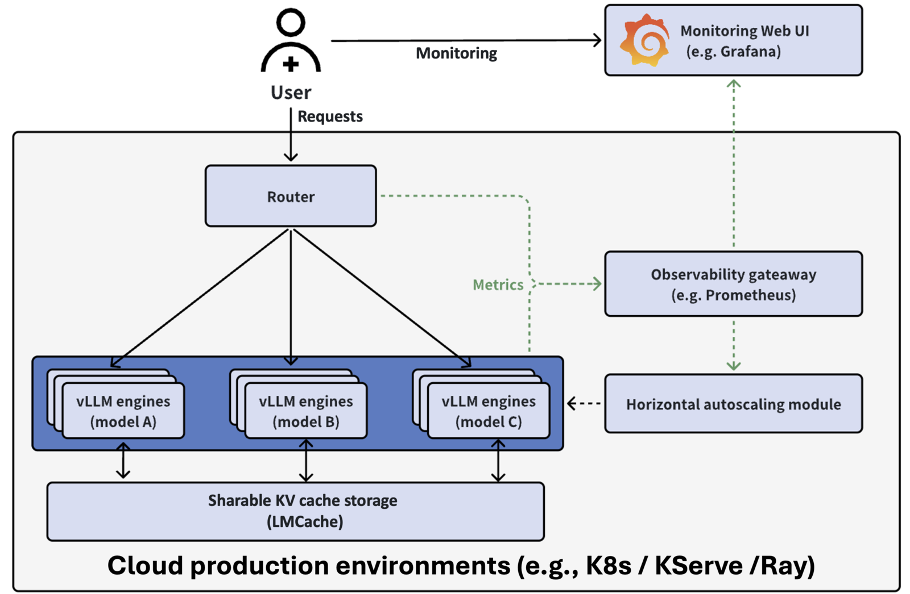

Large Language Models (LLMs) treiben viele moderne Apps an. Chatbots,
Coding-Assistenten und Dokumenten-Tools nutzen sie alle. Die Frage ist nicht, ob
du LLMs brauchst, sondern wie du sie gut betreibst. Kubernetes hilft dir, diese
schweren Workloads neben deinen anderen Services zu deployen und zu verwalten.

LLMs auf Kubernetes zu betreiben, bringt einige Vorteile. Du erhältst einen
standardisierten Weg, sie zu deployen. Du kannst GPU-Ressourcen einfach
verwalten. Ausserdem kannst du hochskalieren, wenn die Nachfrage wächst. Am
wichtigsten aber: Du behältst deine Daten für dich, indem du Modelle selbst
hostest, statt externe APIs aufzurufen.

Hier schauen wir uns zwei Wege an, LLMs auf Kubernetes zu deployen. Zuerst
behandeln wir **Ollama** für einfache Setups. Danach erkunden wir den **vLLM**
Production Stack für Szenarien mit viel Traffic.

## Ollama

[Ollama](https://ollama.ai/) ist beliebt, weil es einfach zu benutzen ist. Du
lädst ein Modell herunter, und es läuft einfach. Das
[Ollama Helm Chart](https://github.com/otwld/ollama-helm) bringt dieselbe
Einfachheit nach Kubernetes.

### Was du brauchst

Für den reinen CPU-Betrieb brauchst du Kubernetes 1.16.0 oder neuer. Für
GPU-Unterstützung mit NVIDIA- oder AMD-Karten brauchst du Kubernetes 1.26.0 oder
neuer.

### Installation

Füge das Helm-Repository hinzu und installiere:

```bash
helm repo add otwld https://helm.otwld.com/
helm repo update
helm install ollama otwld/ollama --namespace ollama --create-namespace
```

Das richtet Ollama mit guten Standardwerten ein. Der Service läuft auf Port
`11434`. Du kannst die gewohnten Ollama-Tools verwenden, um damit zu
kommunizieren.

Um dein Deployment zu testen, leitest du den Port auf deine lokale Maschine
weiter und lässt ein Modell laufen:

```bash
kubectl port-forward -n ollama svc/ollama 11434:11434
```

In einem zweiten Terminal kannst du dann mit Ollama interagieren:

```bash
curl http://localhost:11434/api/generate -d '{
  "model": "llama3.2:1b",
  "prompt": "Why is the sky blue?",
  "stream": false
}'
```

### GPU-Unterstützung ergänzen

Um eine GPU zu nutzen, erstellst du eine Datei namens `values.yaml`:

```yaml
ollama:
  gpu:
    enabled: true
    type: "nvidia"
    number: 1
```

Aktualisiere dann die Installation:

```bash
helm upgrade ollama otwld/ollama --namespace ollama --values values.yaml
```

### Modelle vorab herunterladen

Ollama lädt Modelle herunter, wenn du sie zum ersten Mal anforderst. Das kann
langsam sein. Du kannst es anweisen, Modelle beim Start des Pods
herunterzuladen:

```yaml
ollama:
  gpu:
    enabled: true
    type: "nvidia"
    number: 1
  models:
    pull:
      - llama3.2:1b
```

### Eigene Modelle erstellen

Du kannst auch eigene Varianten von Modellen mit anderen Einstellungen
erstellen:

```yaml
ollama:
  models:
    create:
      - name: llama3.2-1b-large-context
        template: |
          FROM llama3.2:1b
          PARAMETER num_ctx 32768
    run:
      - llama3.2-1b-large-context
```

Das erstellt eine Version von Llama 3.2, die längere Texte verarbeiten kann.

### Zugriff von aussen öffnen

Damit die API von ausserhalb des Clusters erreichbar ist, fügst du einen Ingress
hinzu:

```yaml
ollama:
  models:
    pull:
      - llama3.2:1b
ingress:
  enabled: true
  hosts:
    - host: ollama.example.com
      paths:
        - path: /
          pathType: Prefix
```

Jetzt erreichst du die API unter `ollama.example.com`.

### Wann du Ollama einsetzen solltest

Ollama ist grossartig, wenn du es einfach haben willst. Es eignet sich gut für
einen schnellen Einstieg, um verschiedene Modelle ohne viel Setup laufen zu
lassen, oder wenn du nicht viel Traffic bewältigen musst. Wenn du Ollama auf
deinem Laptop benutzt hast, wird es sich auf Kubernetes vertraut anfühlen.

## vLLM

[vLLM](https://github.com/vllm-project/vllm) ist auf Geschwindigkeit ausgelegt.
Es nutzt Performance-Optimierungen wie
[Paged Attention](https://huggingface.co/docs/text-generation-inference/en/conceptual/paged_attention),
[Continuous Batching](https://huggingface.co/docs/transformers/main/en/continuous_batching)
und
[Prefix Caching](https://bentoml.com/llm/inference-optimization/prefix-caching),
um viele Requests gleichzeitig zu bedienen. Der
[vLLM Production Stack](https://github.com/vllm-project/production-stack) packt
vLLM in ein Kubernetes-freundliches Paket mit Routing, Monitoring und Caching.

### Wie es funktioniert

Der Stack besteht aus drei Hauptteilen. Erstens: Serving Engines, welche die
LLMs ausführen. Zweitens: ein Router, der Requests an die richtige Stelle
schickt. Drittens: Monitoring-Tools (Prometheus und Grafana), die dir zeigen,
was passiert.

Mit diesem Setup wächst du von einer auf viele Instanzen, ohne deinen App-Code
zu ändern. Der Router nutzt eine API, die wie jene von OpenAI funktioniert, du
kannst ihn also einfach einsetzen.



### Installation

Füge das Helm-Repository hinzu und installiere mit einer Konfigurationsdatei:

```bash
helm repo add vllm https://vllm-project.github.io/production-stack
helm install vllm vllm/vllm-stack -f values.yaml
```

Eine einfache `values.yaml` sieht so aus:

```yaml
servingEngineSpec:
  runtimeClassName: ""
  modelSpec:
    - name: "llama3"
      repository: "vllm/vllm-openai"
      tag: "latest"
      modelURL: "meta-llama/Llama-3.2-3B-Instruct"
      replicaCount: 1
      requestCPU: 6
      requestMemory: "16Gi"
      requestGPU: 1
```

Wenn alles bereit ist, siehst du zwei Pods. Einer ist der Router, einer führt
das Modell aus:

```
NAME                                          READY   STATUS    AGE
vllm-deployment-router-859d8fb668-2x2b7       1/1     Running   2m
vllm-llama3-deployment-vllm-84dfc9bd7-vb9bs   1/1     Running   2m
```

### Die API nutzen

Leite den Router auf deine Maschine weiter:

```bash
kubectl port-forward svc/vllm-router-service 30080:80
```

Prüfe, welche Modelle verfügbar sind:

```bash
curl http://localhost:30080/v1/models
```

Sende eine Chat-Nachricht:

```bash
curl -X POST http://localhost:30080/v1/chat/completions \
  -H "Content-Type: application/json" \
  -d '{
    "model": "meta-llama/Llama-3.2-3B-Instruct",
    "messages": [{"role": "user", "content": "Why is the sky blue?"}]
  }'
```

### Mehr als ein Modell betreiben

Du kannst verschiedene Modelle gleichzeitig betreiben. Der Router schickt jeden
Request an das richtige:

```yaml
servingEngineSpec:
  modelSpec:
    - name: "llama3"
      repository: "vllm/vllm-openai"
      tag: "latest"
      modelURL: "meta-llama/Llama-3.2-3B-Instruct"
      replicaCount: 1
      requestCPU: 6
      requestMemory: "16Gi"
      requestGPU: 1
    - name: "mistral"
      repository: "vllm/vllm-openai"
      tag: "latest"
      modelURL: "mistralai/Mistral-7B-Instruct-v0.3"
      replicaCount: 1
      requestCPU: 6
      requestMemory: "24Gi"
      requestGPU: 1
```

### Bei Hugging Face anmelden

Einige Modelle brauchen ein Hugging-Face-Konto. Deinen Token fügst du so hinzu:

```yaml
servingEngineSpec:
  modelSpec:
    - name: "llama3"
      repository: "vllm/vllm-openai"
      tag: "latest"
      modelURL: "meta-llama/Llama-3.2-3B-Instruct"
      replicaCount: 1
      requestCPU: 6
      requestMemory: "16Gi"
      requestGPU: 1
      env:
        - name: HF_TOKEN
          value: "your-huggingface-token"
```

Für echte Deployments legst du den Token stattdessen in einem Kubernetes-Secret
ab.

### Den Betrieb beobachten

Der Stack bringt ein Grafana-Dashboard mit. Es zeigt dir, wie viele Instanzen
gesund sind, wie schnell Requests abschliessen, wie lange Nutzende auf die erste
Antwort warten, wie viele Requests laufen oder warten und wie viel GPU-Speicher
der Cache belegt. Das hilft dir, Probleme zu erkennen und Wachstum zu planen.

### Wann du vLLM einsetzen solltest

Setze vLLM und seinen Production Stack ein, wenn du viele Requests schnell
bedienen musst. Sein Router geht klug mit der Wiederverwendung gecachter Arbeit
um, was Zeit und Geld spart. Die API im OpenAI-Stil lässt sich leicht in
bestehende Apps einbinden. Die Monitoring-Tools helfen dir, ihn in Produktion
sauber zu betreiben.

## Fazit

Ollama und vLLM bedienen unterschiedliche Bedürfnisse.

Ollama mit seinem Helm Chart bringt dich mit wenig Setup schnell zum Laufen. Es
eignet sich für die Entwicklung, leichtere Workloads und Teams, die es einfach
haben wollen.

Der vLLM Production Stack gibt dir die Werkzeuge für viel Traffic. Der Router,
die Multi-Modell-Unterstützung und das Monitoring machen ihn
produktionstauglich, wo Geschwindigkeit und Verfügbarkeit zählen.

Beide nutzen Standard-Kubernetes und Helm, sie fühlen sich also vertraut an,
wenn du Container kennst. Entscheide danach, wie viel Traffic du erwartest und
wie viel Komplexität du verwalten willst.

> «Ollama nimmt eins, vLLM den Schwarm – wähl mit Bedacht, dann läuft es warm»
>
> Lena F.

Willst du deine eigenen LLMs auf Kubernetes betreiben? Schau dir unseren Service
[Pragmatic AI Adoption](/de/services/pragmatic-ai-adoption?utm_source=bespinian_blog&utm_medium=blog&utm_campaign=llms_on_kubernetes)
an und buche deinen kostenlosen Workshop.
