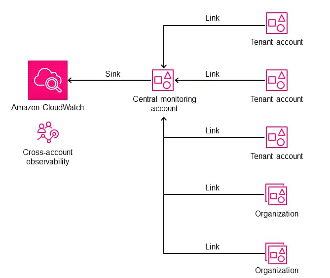
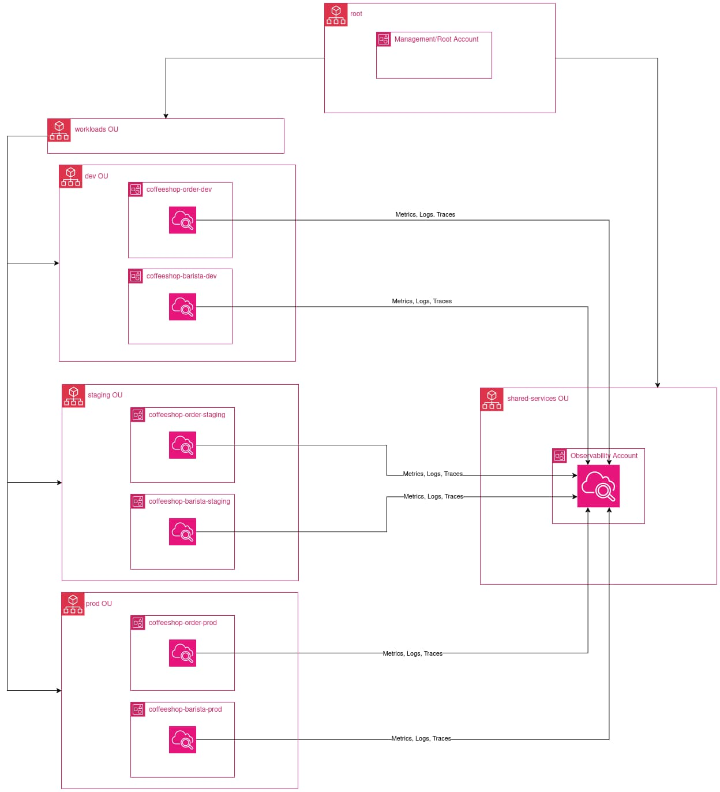
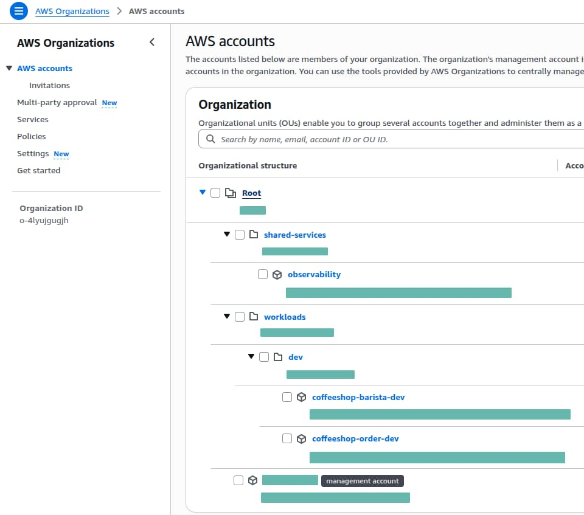
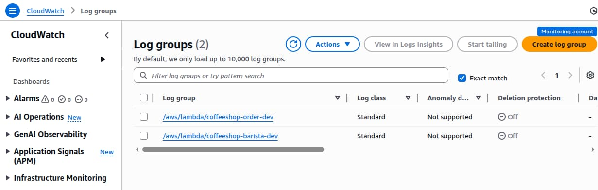
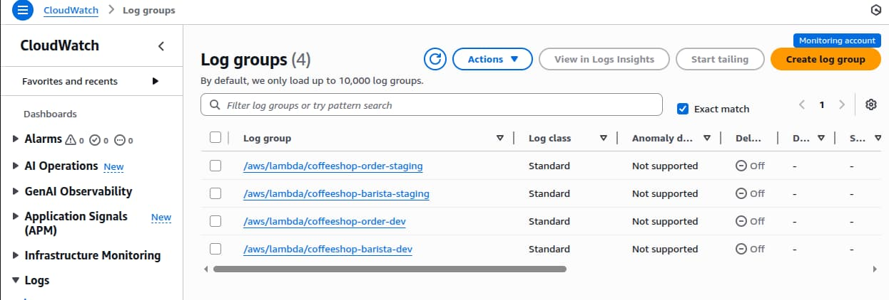

---
title:
  "No Account Left Behind: Cross-Account-Observability in AWS automatisieren"
author: Denis Kovachevich
pubDate: 2025-12-15
tags:
  [
    "aws-organizations",
    "aws-cloudwatch",
    "aws-oam",
    "aws-stacksets",
    "aws-multiaccount",
    "terraform",
  ]
description:
  "Lerne, wie AWS OAM, StackSets und Delegated Administration eine vollständig
  automatisierte Cross-Account-Observability über all deine
  AWS-Workload-Accounts hinweg ermöglichen."
image: ../../../assets/blog/lighthouse.jpg
---

Wenn du eine Multi-Account-AWS-Architektur betreibst, ist nicht die Frage, ob du
zentralisierte Observability brauchst – sondern wie du sie erreichst, ohne in
manueller Konfiguration zu versinken.

## Herausforderung

Eine Multi-Account-Strategie (wie das AWS-Landing-Zone-Pattern) bietet
hervorragende Isolation und Sicherheit, bringt aber erhebliche betriebliche
Reibung mit sich:

- **Datenfragmentierung:** Telemetrie liegt verstreut über Dutzende von
  Accounts, sodass Engineers zwischen Konsolen wechseln müssen, um eine einzige
  Transaktion zu debuggen.
- **Manueller Aufwand:** Jedes Mal, wenn ein neuer Workload-Account entsteht,
  muss jemand von Hand Log-Subscriptions und Berechtigungen konfigurieren.
- **Skalierung und Wartung:** Wenn Unternehmen auf Hunderte von Accounts
  wachsen, wird es zum Governance-Albtraum, sicherzustellen, dass wirklich jeder
  einzelne korrekt ans Monitoring-System angebunden ist.

## Lösung



Ein einheitliches «Single Pane of Glass», mit dem wir Logs, Metriken und Traces
über die gesamte Organisation hinweg an einem Ort einsehen können.

Es verursacht keine zusätzlichen Infrastrukturkosten und erfordert null
manuelles Setup für neue Accounts.

In diesem Beitrag bauen wir eine vollständig automatisierte Lösung mit:

- AWS Organizations für die Organisationsstruktur.
- CloudWatch Observability Access Manager (OAM) für die
  Cross-Account-Datenverbindung.
- CloudFormation StackSets (über Terraform verwaltet), um den Link automatisch
  in jeden neuen Account auszurollen.
- Einem Lambda-Beispiel-Workload, der strukturierte Logs erzeugt. Damit können
  wir den End-to-End-Fluss verifizieren und unmittelbar nach dem Erstellen eines
  neuen Accounts Daten im zentralen Account abfragen.

> Wir setzen das mit **Delegated Administration** um und stellen so sicher, dass
> wir den Management-Account nicht für den Tagesbetrieb brauchen.

## Die «Coffee Shop»-Architektur

Wir verfolgen den Weg einer fiktiven «Coffee Shop»-Applikation mit mehreren
Workloads, die über separate AWS-Accounts verteilt sind.

Unser Ziel: Logs, Traces und Metriken automatisch in einem dedizierten
Observability-Account zusammenzuführen.



Die Applikation besteht aus zwei zentralen Microservices:

- **Order Workload**: Verarbeitet Kundenbestellungen
- **Barista Workload**: Kümmert sich um die Kaffeezubereitung

Jeder Microservice läuft in seinem eigenen dedizierten Account, um ein
realitätsnahes Szenario zu simulieren.

Unsere Organizational-Unit-Struktur (OU) sieht so aus:

```txt
AWS Organization (r-coffee)
│
├── workloads OU
│   ├── dev OU
│   │   ├── coffeeshop-order-dev
│   │   └── coffeeshop-barista-dev
│   ├── staging OU
│   │   ├── coffeeshop-order-staging    <-- (später ergänzt, als Beweis für die Automatisierung)
│   │   └── coffeeshop-barista-staging  <-- (später ergänzt, als Beweis für die Automatisierung)
│   └── prod OU
│       └── ...
│
└── shared-services OU
    └── observability (Delegated Admin) <-- The Central Monitoring Hub
```

Wir beginnen damit, die Infrastruktur für die Dev-Workloads zu deployen.

Sobald das läuft, fügen wir die Staging-Accounts hinzu, um zu zeigen, wie das
System neue Accounts automatisch erkennt, verbindet und deren Telemetrie
aufnimmt.

## Die AWS Organization bootstrappen

### Voraussetzungen

#### 1. Eine AWS Organization muss existieren

Bevor du diese Terraform-Konfiguration ausführst, musst du eine AWS Organization
erstellen:

Folge der AWS-Dokumentation, um eine Organization zu erstellen:
https://docs.aws.amazon.com/organizations/latest/userguide/orgs_manage_org_create.html

#### 2. Zugriff für CloudFormation StackSets aktivieren

> Verwende die Administrator-Credentials des Management-/Root-Accounts

Erlaube dem Delegated Administrator (Observability-Account), StackSets
automatisch in Member Accounts zu deployen.

```shell
aws organizations enable-aws-service-access \
    --service-principal member.org.stacksets.cloudformation.amazonaws.com
```

Aktiviere den Trusted Access von CloudFormation mit Organizations.

```shell
aws cloudformation activate-organizations-access
```

#### 3. Die Archive-OU muss existieren (nötig für einen sicheren Rückbau)

Terraform erstellt und verwaltet die Archive-OU nicht.

Du musst sie einmalig manuell unter der Root-OU anlegen.

Die Archive-OU dient dazu, alle Workload-Accounts zu verschieben, bevor die
Organisationsstruktur zerstört wird.

> Verwende die Administrator-Credentials des Management-/Root-Accounts

```shell
# Root-OU-ID ermitteln:
aws organizations list-roots
# Die Archive-OU erstellen:
aws organizations create-organizational-unit \
    --parent-id <root_id> \
    --name archive
```

#### 3. Service Control Policies (SCPs) aktivieren

Da unser Terraform-Code die Organization über eine Data Source liest (statt die
Ressource direkt zu importieren und zu verwalten), kann Terraform die
Policy-Features nicht für uns aktivieren. Wir müssen sie manuell aktivieren, um
unsere Security Guardrails anzuhängen.

Finde zuerst die Root-ID deiner Organization (sie beginnt mit r-):

```shell
aws organizations list-roots
# Beispiel-Ausgabe: "Id": "r-1234"
```

Aktiviere mit dieser ID anschliessend die Service Control Policies:

```shell
aws organizations enable-policy-type \
    --root-id ORG_ROOT_ID \
    --policy-type SERVICE_CONTROL_POLICY
```

### Terraform: Henne-Ei-Problem

Bevor wir unsere AWS Organization mit Terraform verwalten können, stehen wir vor
einem klassischen Henne-Ei-Problem:

- Wir brauchen einen S3-Bucket, um unseren Terraform-State sicher abzulegen –
  aber wir wollen diesen S3-Bucket mit Terraform erstellen.

1. Lass den Block `backend "s3"` zunächst auskommentiert.

   Damit legt Terraform den State beim ersten Durchlauf lokal auf unserer
   Maschine ab.

   ```hcl
   backend "s3" {
     bucket       = "org-state-REPLACE_ME_WITH_ACCOUNT_ID"
     key          = "01-org-bootstrap/terraform.tfstate"
     region       = "us-east-1"
     encrypt      = true

     # Natives Locking (kein DynamoDB nötig)
     use_lockfile = true
   }
   ```

2. Führe das initiale Deployment aus:

   ```shell
   cd 01-org-bootstrap
   cp terraform.tfvars.example terraform.tfvars
   # terraform.tfvars anpassen
   terraform init
   terraform plan
   terraform apply
   ```

   Terraform erstellt:
   - **Organizational Units (OUs)**: Separate OUs für Workloads und Shared
     Services
   - **3 AWS-Accounts**: Einen Observability-Account + zwei Workload-Accounts
     (Order, Barista) in der Dev-Umgebung
   - **Delegated Administration**: Gibt dem Observability-Account die
     Berechtigung, StackSets über alle Workload-Accounts hinweg zu deployen
   - **Service Control Policy (SCP)**: Beschränkt StackSet-Execution-Rollen
     ausschliesslich auf die Workloads-OU
   - **S3-Bucket**: Für die Ablage des Terraform-State

3. Kopiere den Output `tf_state_bucket_name` (z.B. org-state-123456789012) in
   `versions.tf` -> Block `backend.s3.bucket`, kommentiere ihn ein und führe
   aus:

   ```shell
   terraform init
   ```

4. Terraform erkennt die Änderung und fragt:
   `"Do you want to copy existing state to the new backend?"` Wir tippen `yes`.

> Ergebnis: Unser State liegt jetzt sicher in S3, mit aktiviertem Locking.

### Überblick über die AWS Organization Units

Im vorherigen Terraform-Durchlauf haben wir eine saubere, skalierbare Hierarchie
erstellt.

Statt alle Accounts im Root zu halten, haben wir eine Struktur geschaffen, die
auf Sicherheitsisolation und automatisiertes Targeting ausgelegt ist.



### Delegated Administration

Delegated Administration erlaubt dir, bestimmte organisationsweite
Verantwortlichkeiten an einen vertrauenswürdigen Member Account zu übertragen,
statt auf den Management- bzw. Root-Account angewiesen zu sein.

Das senkt Risiko und Betriebsaufwand, weil es dem Prinzip der geringsten Rechte
folgt: Nur der delegierte Account erhält die für seine Funktion nötigen
Berechtigungen.

In dieser Architektur ist der `Observability`-Account der Delegated
Administrator für CloudFormation StackSets.

Er kann StackSet-Deployments in `workload`-Accounts verwalten, hat aber keine
Möglichkeit, in andere `shared-services`- oder `security`-Accounts zu deployen.

Das sorgt für kontrollierte, auditierbare Automatisierung, ohne
Hochrisiko-Privilegien im Management-Account offenzulegen.

```hcl
resource "aws_organizations_delegated_administrator" "stacksets" {
  account_id        = aws_organizations_account.observability.id
  service_principal = "member.org.stacksets.cloudformation.amazonaws.com"
}
```

### Security-Hardening mit SCPs

Delegated Administration befähigt den Observability-Account, CloudFormation
StackSets organisationsweit zu verwalten – wir müssen aber sicherstellen, dass
diese Macht auf die richtige OU beschränkt bleibt.

Eine Service Control Policy (SCP) wirkt als organisatorische Leitplanke, die
verhindert, dass StackSet-Execution-Rollen in sensiblen `shared-services`- oder
`security`-Accounts verwendet werden.

Diese SCP verweigert sämtliche CloudFormation-Aktionen der service-managed
StackSets-Execution-Rolle, sofern der Ziel-Account nicht innerhalb der
Workloads-OU liegt. So kann delegierte Automatisierung nicht versehentlich
Shared Services, Identity oder Security-Infrastruktur verändern.

```hcl
  # Verhindert, dass Service-Managed StackSets (die Automatisierungsrolle) ausserhalb der Workloads-OU laufen.
  statement {
    sid       = "DenyStackSetExecOutsideWorkloads"
    effect    = "Deny"
    actions   = ["cloudformation:*"]
    resources = ["*"]

    # Zielt auf die automatisch erzeugten StackSet-Rollen
    condition {
      test     = "StringLike"
      variable = "aws:PrincipalArn"
      values   = ["arn:aws:iam::*:role/stacksets-exec-*"]
    }

    # Ausnahme: Erlaubt, wenn der Account im Pfad der Workloads-OU liegt
    condition {
      test     = "ForAnyValue:StringNotLike"
      variable = "aws:PrincipalOrgPaths"
      values = [
        "${data.aws_organizations_organization.main.id}/${data.aws_organizations_organization.main.roots[0].id}/${aws_organizations_organizational_unit.workloads.id}/*"
      ]
    }
  }
```

## Zentralen Observability-Account aufsetzen

Als Nächstes richten wir den CloudWatch Observability Access Manager (OAM) im
zentralen Observability-Account ein und rollen OAM-Links über CloudFormation
StackSets automatisch in alle Workload-Accounts aus.

### Voraussetzungen

- Das Organization-Bootstrap `01-org-bootstrap` muss deployt sein
- Hole die benötigten Werte aus dem Bootstrap; sie werden in
  `02-observability/terraform.tfvars` verwendet
  ```shell
  cd 01-org-bootstrap
  terraform output workloads_ou_id
  terraform output observability_account_id
  ```

### Initialisieren und anwenden

Diese Konfiguration muss mit den Credentials des `Observability-Accounts`
angewendet werden, nicht mit jenen des `Management-/Root`-Accounts.

```shell
cd 02-observability
cp terraform.tfvars.example terraform.tfvars
terraform init
terraform plan
terraform apply
```

Das wird:

- Den OAM Sink im Observability-Account erstellen
- Eine Sink Policy anhängen, die:
  - `oam:CreateLink` und `oam:UpdateLink` erlaubt
  - Principals auf Accounts beschränkt, deren `aws:PrincipalOrgPaths` zum Pfad
    der Workloads-OU passen
  - Die erlaubten Resource Types auf Metrics, Logs und Traces begrenzt
- Ein CloudFormation StackSet erstellen, das:
  - `permission_model = "SERVICE_MANAGED"` verwendet
  - `call_as = "DELEGATED_ADMIN"` verwendet
  - Eine `AWS::Oam::Link`-Ressource in jedem Workload-Account deployt
- StackSet-Instanzen erstellen, die auf die Workloads-OU zielen, mit aktiviertem
  Auto-Deployment

### Deployment verifizieren

Nutze nach dem Deployment die Verifizierungsbefehle aus den Terraform-Outputs:

```shell
terraform output verification_commands
```

- Der Befehl `list_attached_links` sollte `coffeeshop-order-dev` und
  `coffeeshop-barista-dev` zurückgeben
- Der Befehl `list_sinks` sollte `central-observability-sink` zurückgeben

### Terraform-State nach S3 migrieren

Siehe [Terraform: Henne-Ei-Problem](#terraform-henne-ei-problem)

## Die Coffee-Shop-Microservices deployen

Da die Organisations-Infrastruktur initialisiert ist und unsere
Cross-Account-Observability-Automatisierung auf neue Accounts lauscht, ist es
Zeit, die eigentlichen «Coffee Shop»-Microservices zu deployen.

### Verzeichnisstruktur der Workloads

```
03-workloads/
├── coffeeshop-order/
│   ├── dev/
│   ├── staging/
├── coffeeshop-barista/
│   ├── dev/
│   ├── staging/
└── modules/
    └── serverless-app/
```

### Deployment der Dev-Workloads

- coffeeshop-order-dev

  > Verwende die Administrator-Credentials von coffeeshop-order-dev

  ```shell
  cd coffeeshop-order/dev
  terraform init
  terraform plan
  terraform apply
  ```

- coffeeshop-barista-dev
  > Verwende die Administrator-Credentials von coffeeshop-barista-dev
  ```shell
  cd coffeeshop-barista/dev
  terraform init
  terraform plan
  terraform apply
  ```

#### Terraform-State nach S3 migrieren

Siehe [Terraform: Henne-Ei-Problem](#terraform-henne-ei-problem)

### Lambda-Funktionen testen

Nach dem Deployment kannst du die Lambda-Funktionen aufrufen, um Logs zu
erzeugen:

#### Lambda coffeeshop-order-dev testen

```shell
aws lambda invoke \
    --function-name coffeeshop-order-dev \
    /dev/stdout
```

#### Lambda coffeeshop-barista-dev testen

```shell
aws lambda invoke \
    --function-name coffeeshop-barista-dev \
    /dev/stdout
```

### Logs im Observability-Account prüfen

Nach dem Aufruf der Lambda-Funktionen sind die Logs im Observability-Account
verfügbar.



## Neue Accounts in der Workload-OU automatisch überwachen

### Staging-Organization-Unit und AWS-Accounts hinzufügen

Passe `01-org-bootstrap/terraform.tfvars` an

`environments = ["dev"]` -> `environments = ["dev", "staging"]`

> Verwende die Administrator-Credentials des Management-/Root-Accounts

```shell
cd 01-org-bootstrap
terraform init
terraform plan
terraform apply
```

Damit entstehen die Staging-OU und die AWS-Accounts wie folgt:

```
AWS Organization (r-coffee)
│
├── workloads OU
│   ├── dev OU
│   │   ├── coffeeshop-order-dev
│   │   └── coffeeshop-barista-dev
│   ├── staging OU
│   │   ├── coffeeshop-order-staging
│   │   └── coffeeshop-barista-staging
│   └── prod OU
│       └── ...
│
└── shared-services OU
    └── observability (Delegated Admin) <-- The Central Monitoring Hub
```

### Deployment der Staging-Workloads

- coffeeshop-order-staging

  > Verwende die Administrator-Credentials von coffeeshop-order-staging

  ```shell
  cd coffeeshop-order/staging
  terraform init
  terraform plan
  terraform apply
  ```

- coffeeshop-barista-staging
  > Verwende die Administrator-Credentials von coffeeshop-barista-staging
  ```shell
  cd coffeeshop-barista/staging
  terraform init
  terraform plan
  terraform apply
  ```

#### Terraform-State nach S3 migrieren

Siehe [Terraform: Henne-Ei-Problem](#terraform-henne-ei-problem)

#### Lambda-Funktionen testen

Nach dem Deployment kannst du die Lambda-Funktionen aufrufen, um Logs zu
erzeugen:

#### Lambda coffeeshop-order-staging testen

```shell
aws lambda invoke \
    --function-name coffeeshop-order-staging \
    /dev/stdout
```

#### Lambda coffeeshop-barista-staging testen

```shell
aws lambda invoke \
    --function-name coffeeshop-barista-staging \
    /dev/stdout
```

### Dev- und Staging-Logs im zentralen Observability-Account prüfen



# Aufräumen

- Ressourcen von coffeeshop-order-dev löschen:

  > Verwende die Administrator-Credentials von coffeeshop-order-dev

  ```shell
  cd 03-workloads/coffeeshop-order/dev/

  # Terraform-State nach lokal migrieren
  # backend "s3" auskommentieren oder entfernen
  terraform init -migrate-state

  # ausführen
  terraform destroy
  ```

- Wiederhole dieselben Befehle für
  - `03-workloads/coffeeshop-order/staging/`
  - `03-workloads/coffeeshop-barista/dev/`
  - `03-workloads/coffeeshop-barista/staging/`
- Observability-Ressourcen löschen:

  > Verwende die Administrator-Credentials des Observability-Accounts

  ```shell
  cd 02-observability

  # Terraform-State nach lokal migrieren
  # backend "s3" auskommentieren oder entfernen
  terraform init -migrate-state

  # ausführen
  terraform destroy
  ```

- AWS-Accounts schliessen und Organization Units löschen:

  > Verwende die Administrator-Credentials des Management-/Root-Accounts

  > < 100 Accounts – du kannst bis zu 10 Member Accounts schliessen

  ```shell
  cd 01-org-bootstrap

  # Alle Workload- und Observability-Accounts in die Archive-OU verschieben
  terraform apply -var archive_accounts=true

  # Terraform-State nach lokal migrieren
  # backend "s3" auskommentieren oder entfernen
  terraform init -migrate-state

  # ausführen
  terraform destroy
  ```

## Die wichtigsten Erkenntnisse

- **Delegated Administration** lässt dich Observability ohne Root-Credentials
  verwalten
- **Service-managed StackSets** machen IAM-Rollen-Boilerplate überflüssig
- **SCPs** liefern Leitplanken gegen Fehlkonfigurationen
- **OAM** zentralisiert Logs und Metriken mit minimalem Performance-Overhead
- **Infrastructure as Code** macht dieses Pattern wiederholbar und testbar

## Git-Repository

[aws-terraform-observability-bootstrap](https://github.com/bespinian/aws-terraform-observability-bootstrap)

Interessiert an einem ähnlichen Setup? Schau dir unseren Service
[Serverless Application Acceleration](/de/services/serverless-application-acceleration?utm_source=bespinian_blog&utm_medium=blog&utm_campaign=no_account_left_behind)
an.
