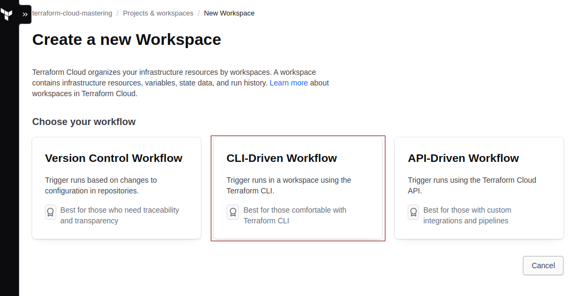
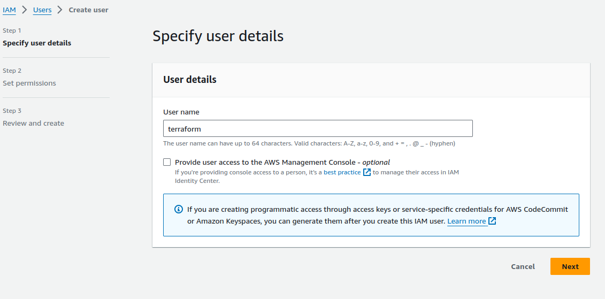
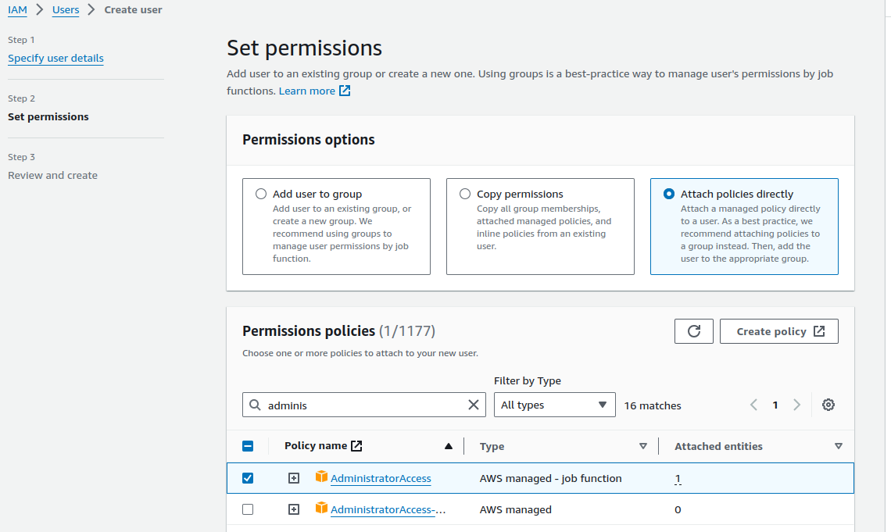
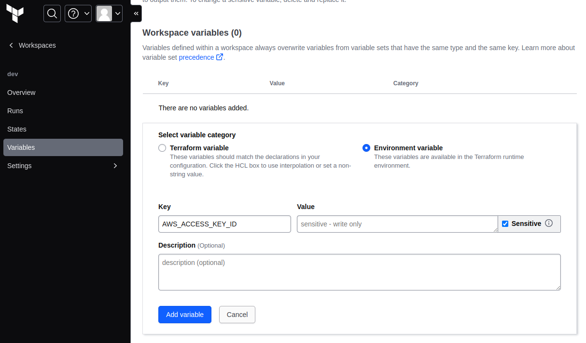
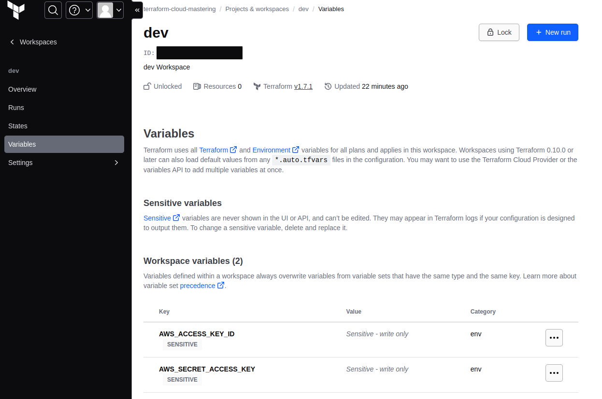
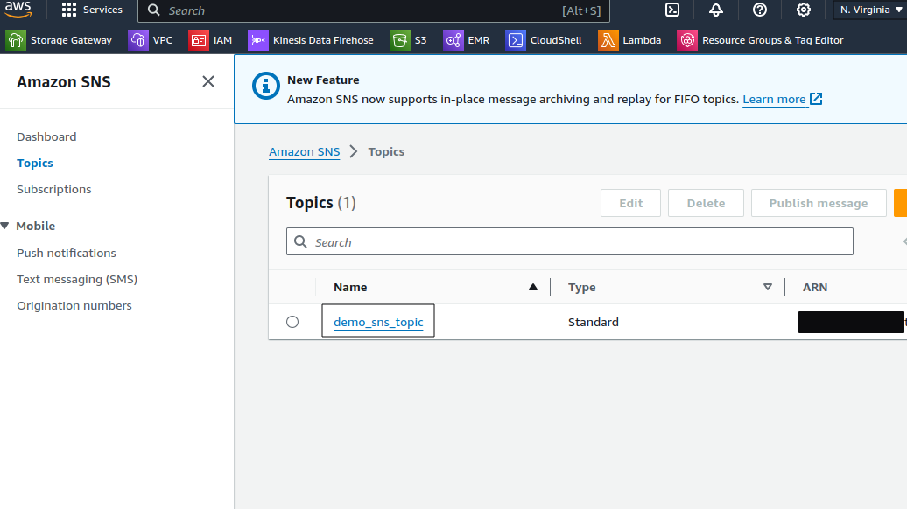
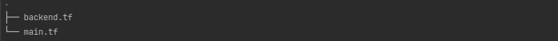
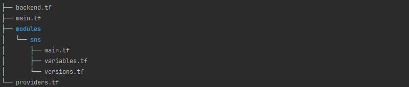

---
title:
  Terraform- und Terraform-Cloud-Module für Multi-Region-Deployments auf AWS
  nutzen
author: Denis Kovachevich
pubDate: 2024-02-22
tags: ["terraform", "aws", "infrastructure", "cloud", "multi-region"]
description:
  "Meistere Multi-Region-Deployments auf AWS mit Terraform und Terraform Cloud.
  Lerne, wie du deine Infrastruktur mit Modulen strukturierst, mehrere Provider
  verwaltest und Ressourcen über verschiedene AWS-Regionen hinweg deployst – für
  bessere Verfügbarkeit und Disaster Recovery."
image: ../../../assets/blog/regions.jpg
---

> Den Code zu diesem Beispiel findest du auf
> [bespinians GitHub](https://github.com/bespinian/terraform-aws-multi-region)

## Einleitung

Wenn du deine Reise mit Terraform beginnst, ist es üblich, klein anzufangen und
sich auf das Erstellen und Verwalten von Ressourcen innerhalb einer einzelnen
AWS-Region zu konzentrieren.

So bekommst du ein erstes Verständnis für Terraform, seine Syntax, den
Plan-=>-Apply-Zyklus, das State Management und generell die Grundlagen von
Infrastructure as Code (IaC).

Wenn Komplexität und Anforderungen an deine Infrastruktur wachsen, wirst du
merken, dass Multi-Region-Deployments in AWS aus verschiedenen Gründen
unverzichtbar sind.

Dazu gehören bessere Verfügbarkeit der Applikation, geringere Latenz für
Nutzende weltweit, robuste Disaster-Recovery-Strategien und viele weitere
Anwendungsfälle.

Deine Infrastruktur über mehrere Regionen hinweg zu replizieren, bringt
allerdings zusätzliche Komplexität mit sich.

Ohne die richtigen Tools und Praktiken machst du dieselbe Arbeit womöglich
doppelt, verwaltest umfangreiche Konfigurationen und kämpfst damit, deine
Infrastruktur über Regionen hinweg konsistent zu halten.

Genau hier kann Terraform in Kombination mit strategischer Planung und
Organisation den Prozess erheblich vereinfachen.

Im folgenden Tutorial möchte ich dich durch einen möglichen Weg führen, deine
Konfiguration mit Terraform-Cloud-Workspaces aufzusetzen. Das hilft dir, die
Fallstricke von Multi-Region-Deployments zu vermeiden und trotzdem die Vorteile
zu nutzen.

Das ist nicht der einzige Weg, aber einer, der für mich sehr gut funktioniert
hat und der hoffentlich für alle interessant ist, die vor dieser Herausforderung
stehen.

## Voraussetzungen

- Bestehende Accounts bei AWS und Terraform Cloud
- AWS CLI und Terraform CLI auf der lokalen Maschine installiert und
  konfiguriert

## Deinen Terraform-Cloud-Workspace erstellen

Einen Terraform-Cloud-Workspace zu erstellen, ist ein Schritt hin zu
strukturierteren, sichereren und kollaborativeren Infrastrukturprojekten.

Für unser Setup erstellen wir einen neuen CLI-Driven Workspace:



## Access Keys in AWS erzeugen

Wenn wir unseren Terraform-Cloud-Workspace mit AWS verbinden wollen, müssen wir
Access und Secret Keys erstellen. Folge dazu diesen Schritten:

### 1. IAM -> Users -> Create user



### 2. Berechtigungen setzen



### 3. Access Key und Secret Key erstellen

#### 3.1 IAM -> Users -> den Terraform-User auswählen

#### 3.2 Unter `Security credentials` auf `Create access key` klicken

#### 3.3 Die Option `CLI` wählen und `Create access key` klicken

Im nächsten Kapitel fügen wir `Access key` und `Secret access key` in den
Terraform-Cloud-Workspace ein.

## Terraform Cloud mit AWS integrieren

Füge im neu erstellten Dev-Workspace in Terraform Cloud neue Variablen hinzu:

- `AWS_ACCESS_KEY_ID`



- `AWS_SECRET_ACCESS_KEY`



## Ressource mit Terraform in eine einzelne Region deployen

Wir starten mit dem Deployment in eine einzelne Region und refactoren unseren
Code danach so, dass er Multi-Region-Deployments unterstützt.

- Melde dich über die Terraform CLI bei Terraform Cloud an: `terraform login`

- Erstelle `backend.tf` mit dem Terraform-Cloud- und dem AWS-Provider

```shell
terraform {
  cloud {
    organization = "terraform-cloud-mastering"

    workspaces {
      name = "dev"
    }
  }

  required_providers {
    aws = {
      source = "hashicorp/aws"
      version = "5.34.0"
    }
  }
}

provider "aws" {
  region = "us-east-1"
}
```

- Initialisiert ein Arbeitsverzeichnis mit Terraform-Konfigurationsdateien

```shell
tf init
```

- Wenn alles in Ordnung ist, solltest du folgende Meldung sehen

```shell
Terraform Cloud has been successfully initialized!
```

### Unsere erste Ressource erstellen

In diesem Beispiel erstellen wir die SNS-Ressource in der Standardregion
`us-east-1`, jener, die wir in `backend.tf` definiert haben.

- Erstelle im selben Arbeitsverzeichnis eine Datei `main.tf`

```shell
resource "aws_sns_topic" "sns_example" {
  name           = "demo_sns_topic"
  display_name   = "Demo SNS Topic"
}
```

- Führe `terraform plan` aus
- Die Ausgabe sollte dir zeigen, welche Ressourcen erstellt werden

```shell
Terraform will perform the following actions:

  # aws_sns_topic.sns_example will be created
  + resource "aws_sns_topic" "sns_example" {
      + arn                         = (known after apply)
      + beginning_archive_time      = (known after apply)
      + content_based_deduplication = false
      + display_name                = "Demo SNS Topic"
      + fifo_topic                  = false
      + id                          = (known after apply)
      + name                        = "demo_sns_topic"
      + name_prefix                 = (known after apply)
      + owner                       = (known after apply)
      + policy                      = (known after apply)
      + signature_version           = (known after apply)
      + tags_all                    = (known after apply)
      + tracing_config              = (known after apply)
    }
```

- Führe `terraform apply` aus
- Die neue Ressource sollte in AWS erstellt werden
  

- Unsere Dateien für das Single-Region-Deployment



## Modulbasiertes Deployment: Erweiterung zur Multi-Region-Architektur

### Refactoren wir unsere `main.tf` und erstellen unser erstes Terraform-Modul

- Erstelle ein Verzeichnis `modules/sns`

- Verschiebe `main.tf` in dieses Verzeichnis

- Erstelle eine neue Datei `variables.tf`, damit Topic-Name und Anzeigename
  konfigurierbar werden

```shell
variable "topic_name" {
  type = string
}

variable "topic_display_name" {
  type = string
}
```

- Passe die Datei `main.tf` so an, dass sie die Variable für den Namen des
  SNS-Topics verwendet, sodass die SNS-Topic-Ressource für ihre Benennung nun
  auf diese Variable verweist

```shell
resource "aws_sns_topic" "sns_example" {
  name           = var.topic_name
  display_name   = var.topic_display_name
}
```

- Um Konsistenz herzustellen und Abhängigkeiten in unserem Terraform-Projekt zu
  verwalten, erstellen wir eine Datei `versions.tf`

- Diese Datei beschreibt die benötigten Provider samt ihrer jeweiligen
  Versionen, um Kompatibilität und stabile Funktionsweise in unseren
  Infrastrukturkonfigurationen sicherzustellen

```shell
terraform {
  required_providers {
    aws = {
      source = "hashicorp/aws"
      version = "5.34.0"
    }
  }
}
```

### Das Root-Projektverzeichnis refactoren

- Erstelle `providers.tf`. In dieser neuen Datei führen wir eine zusätzliche
  AWS-Regionskonfiguration mit einem Alias ein, damit sich die Provider anhand
  ihrer Aliase unterscheiden lassen

```shell
provider "aws" {
  region = "us-east-1"
  alias   = "us-east-1"
}

provider "aws" {
  region = "us-east-2"
  alias   = "us-east-2"
}
```

- Erstellen wir jetzt in der Datei `main.tf` im Root unseres
  Projektverzeichnisses ein Modul pro Region

```shell
module "us-east-1" {
  source = "./modules/sns"
  providers = { aws = aws.us-east-1}

  topic_name = "demo-sns-us-east-1"
  topic_display_name = "Demos SNS"
}

module "us-east-2" {
  source = "./modules/sns"
  providers = { aws = aws.us-east-2}

  topic_name = "demo-sns-us-east-2"
  topic_display_name = "Demos SNS"
}
```

Ordnerstruktur für mehrere Regionen


Dieser Ansatz erstellt in jeder Region ein SNS-Topic.

Das ist eine Strategie, um Multi-Region-Infrastruktur-Deployments mithilfe
mehrerer Provider umzusetzen.

Halte Ausschau nach unseren kommenden Blogbeiträgen, in denen wir untersuchen,
wie sich nahezu identische Ergebnisse mit mehreren Terraform-Cloud-Workspaces
erreichen lassen, und darüber sprechen, wann du den einen oder den anderen
Ansatz wählen solltest.
