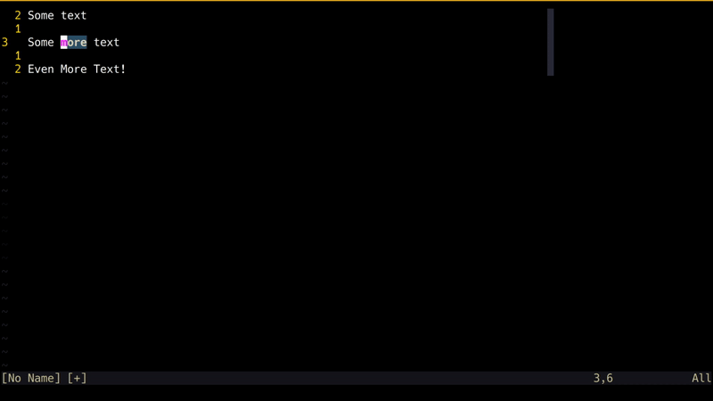
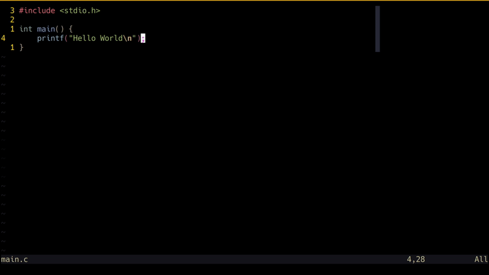
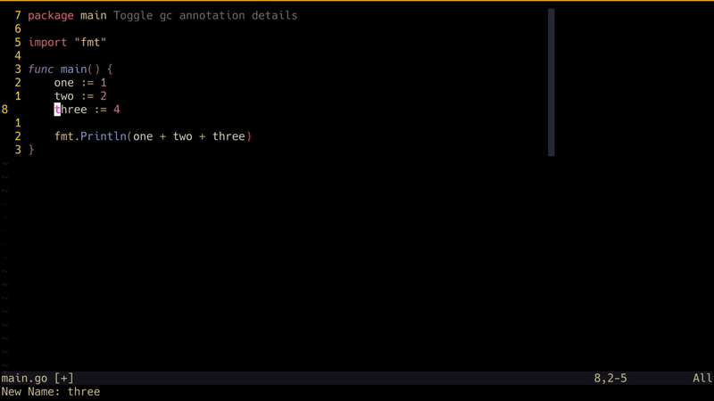
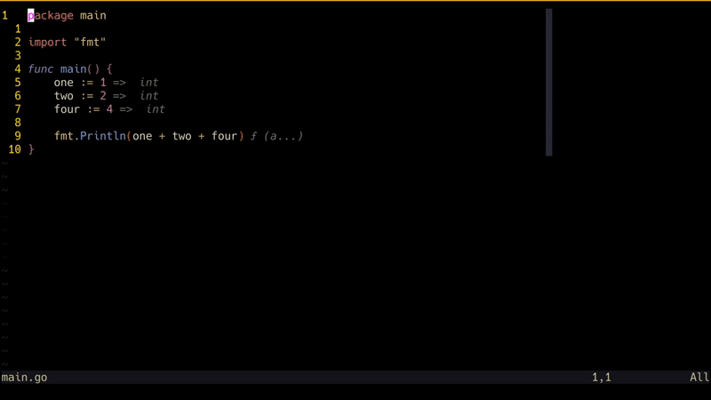

Da sich 2023 dem Ende zuneigt, sind sicher alle ziemlich beschäftigt mit Familie
und anderen festlichen Verpflichtungen. Ich halte diesen Beitrag deshalb kurz
und stelle dir ein Vim-Feature vor, das dich – falls du es noch nicht nutzt –
2024 mit Vorfreude an deinen geliebten Editor zurückbringen wird.

## Eine Sucht

Wenn es dir geht wie mir, dann sitzt Vim so tief in dir drin, dass du dich dabei
ertappst, wie du in allen möglichen Texteingaben versehentlich `:w` oder
Ähnliches tippst. Vim-Motions haben dein Hirn so weit übernommen, dass dir das
Tippen in «traditionellen» Texteingaben schwerfällt. Vielleicht ist deine
Vim-Sucht so schlimm, dass du den Vi-Modus überall konfiguriert hast, wo es
geht.

Du fühlst dich wie eine gut geölte Maschine, navigierst mit Vim-Motions durch
deinen Browser, dein Dateisystem und editierst sogar Befehle in deiner Shell.
Sobald du aber `:` drückst, um in den geliebten
[Command-line-Mode](https://neovim.io/doc/user/cmdline.html) von Vim zu wechseln
und dort mehr als nur `w` oder `q` eingeben willst, fühlt sich etwas falsch an.
Du vertippst dich oder vergisst ein Flag – und schon ist es passiert. Deine
Finger tasten unbeholfen nach den Pfeiltasten, du greifst nach der
Backspace-Taste, und jedes Mal, wenn du versehentlich Escape drückst, ist Game
over.

## Das Command-line-Window

Das sogenannte
[Command-line-window](https://neovim.io/doc/user/cmdline.html#cmdline-window)
(`:h command-line-window`) gehört zu den weniger besprochenen Vim-Features –
eines, das ich persönlich vor einiger Zeit rein zufällig entdeckt habe.

Es ist ein spezielles Fenster in Vim, in dem du Text für
`command-line`-Operationen genau so bearbeiten kannst, wie du sonst in Vim Text
bearbeitest. Damit umgehst du das umständliche Suchen nach den Pfeiltasten oder
das Drücken von Backspace und kannst die Vim-Motions, die dir so vertraut sind,
in noch mehr Kontexten nutzen. Zusätzlich ist das `command-line-window` auch mit
deiner Befehls- bzw. Suchhistorie früherer Operationen befüllt, sodass du einen
kürzlich ausgeführten Befehl oder eine Suche mit Vim-Motions anpassen kannst.
Ein weiterer Vorteil: Du kannst dich auch in deine nicht-nativen
Autovervollständigungs-Vorschläge für `command-line`-Operationen einklinken.

Das Command-line-window lässt sich auf mehrere Arten öffnen:

- `q:` : Öffnet das `command-line-window` befüllt mit deinen letzten
  `Ex`-Befehlen
- `q/` oder `q?` : Öffnet das `command-line-window` befüllt mit deinen letzten
  Suchen. Enter führt eine Suche mit dem Verhalten von `/` bzw. `?` aus.
- `CTRL+f` : Ruft das `command-line-window` auf, wenn du bereits im
  `command-line-mode` bist.

## In Aktion

Hier ein paar interessante Möglichkeiten, wie du das `command-line-window` in
deinen Vim-Workflow einbauen kannst. Denk daran: Das sind vereinfachte
Beispiele, die Ideen dafür säen sollen, wie du das `command-line-window` in
komplexeren Situationen einsetzen kannst.

### Befehlshistorie

_Das `Command-line-window` wird mit `q:` geöffnet. Der letzte `:h`-Befehl wird
dann mit Vim-Motions angepasst und mit `Enter` erneut ausgeführt._

### Suchhistorie

_Das `Command-line-window` wird mit `q/` geöffnet. Ein früherer Suchbegriff wird
dann mit Vim-Motions angepasst und mit `Enter` erneut ausgeführt._

### Filter-Befehl

_Das `Command-line-window` wird mit `CTRL+f` geöffnet, während wir bereits im
`Command-line-mode` sind. Damit fügen wir dann mit Vim-Motions ein fehlendes
Flag in unseren `filter`-Befehl ein._

### LSP-Rename

_Das `Command-line-window` wird mit `CTRL+f` geöffnet, nachdem Neovims
`vim.lsp.buf.rename` ausgelöst wurde. Jetzt können wir auf unsere jüngste
Rename-Historie zugreifen und mit Vim-Motions einen neuen Namen für die Variable
wählen._

### Netrw

_Das `Command-line-window` wird mit `CTRL+f` geöffnet, nachdem der Rename-Befehl
auf ein Verzeichnis innerhalb von `netrw` abgesetzt wurde. Die Datei lässt sich
jetzt bequem mit Vim-Motions umbenennen._

## Frohes Vimmen 2024

Die möglichen Anwendungsfälle für das `command-line-window` gehen weit über
diese einfachen Beispiele hinaus. Trotzdem hoffe ich, dass dies eine nützliche
Einführung in ein Feature war, das eine Lücke schliesst, die für mich in Vim
immer gefehlt hat (und ehrlich gesagt nervte).

Dieser Beitrag ist dem im August 2023 verstorbenen Bram Moolenaar gewidmet. Bram
war der Schöpfer und
[BDFL](https://de.wikipedia.org/wiki/Benevolent_Dictator_for_Life) von Vim. Vim
ist als [«Charityware»](https://en.wikipedia.org/wiki/Careware) lizenziert, und
wie der Aufruf «Help poor children in Uganda!» in Vims Willkommensnachricht
zeigt, ermutigte Bram seine Nutzenden, an die von ihm gegründete
Wohltätigkeitsorganisation [ICCF Holland](https://www.iccf-holland.org/) zu
spenden. Falls dich dein Jahresendbonus grosszügig stimmt, möchte ich dich
ermutigen, etwas davon an jene weiterzugeben, die weniger Glück haben als
Menschen wie wir – Menschen, die unverschämt viel Zeit damit verbringen, sich
über Texteditoren den Kopf zu zerbrechen.

Einen guten Rutsch!
