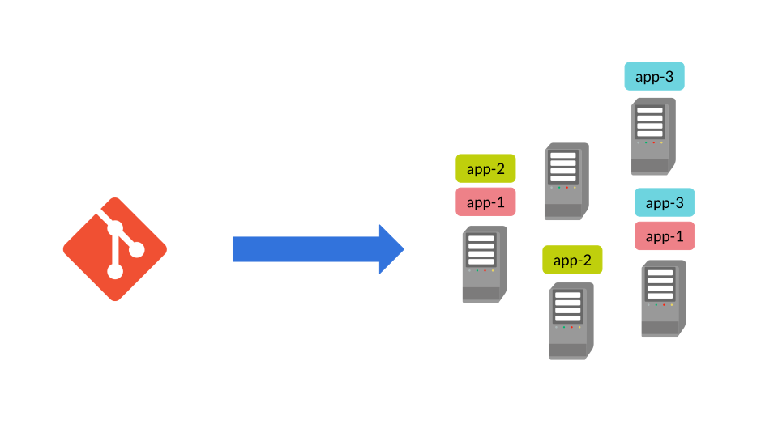
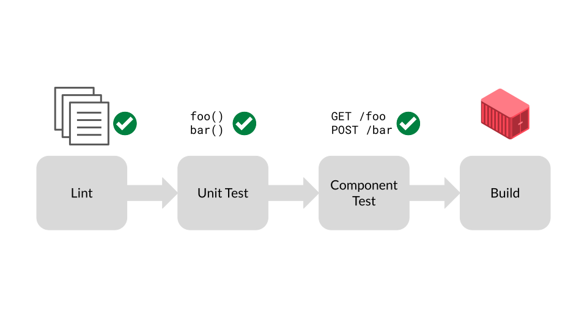
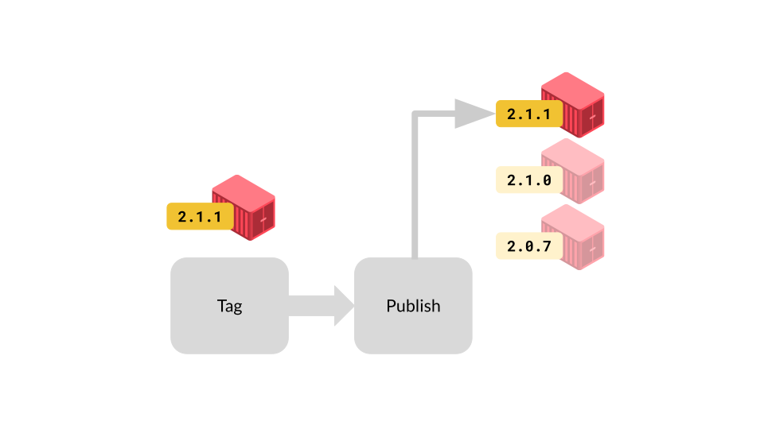
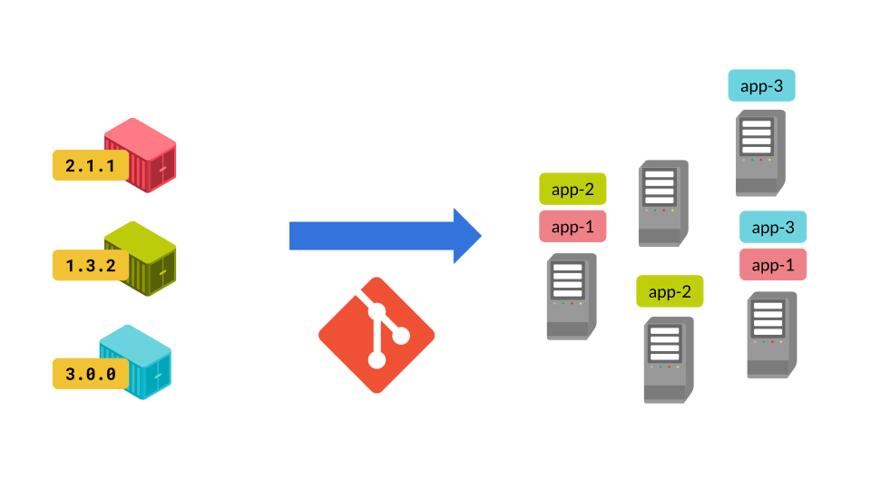
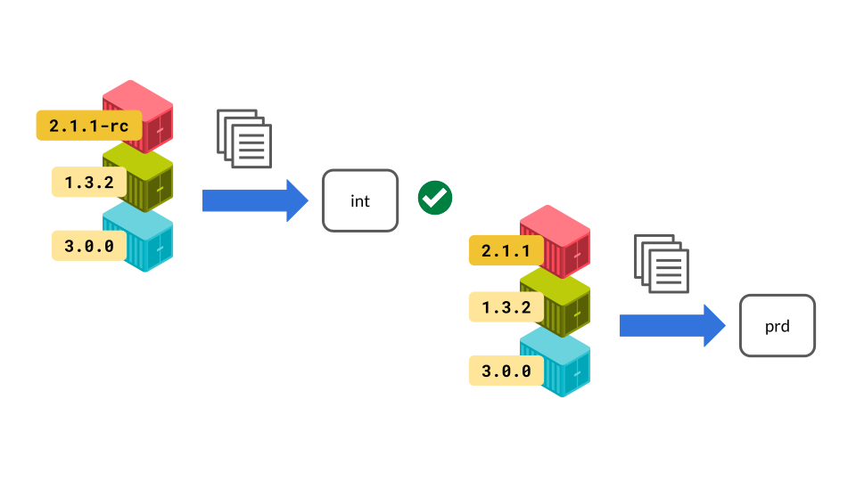
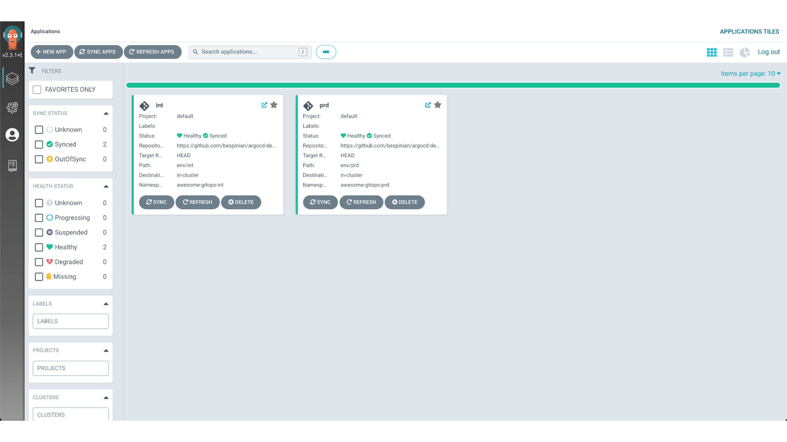
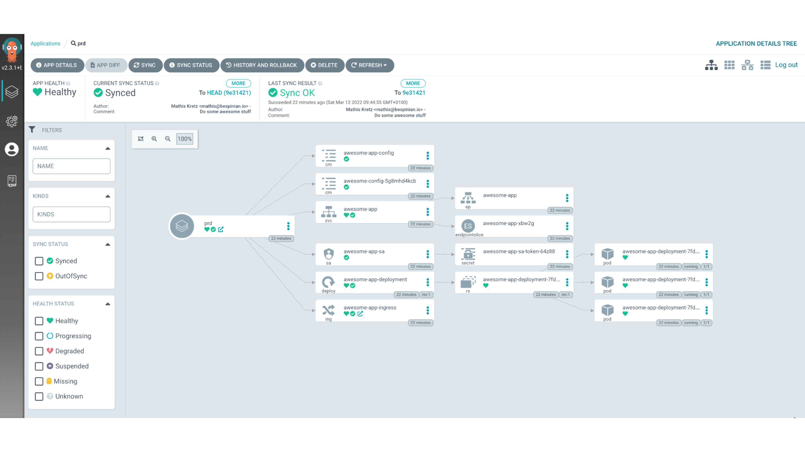
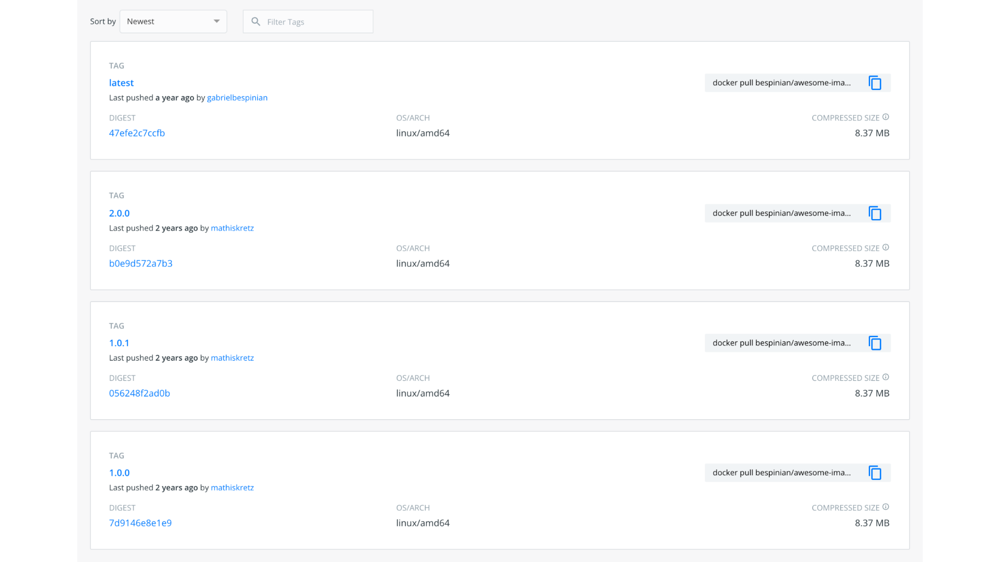
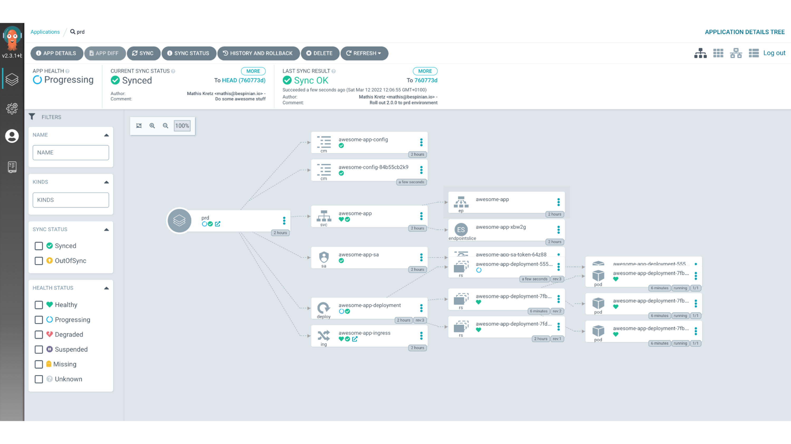
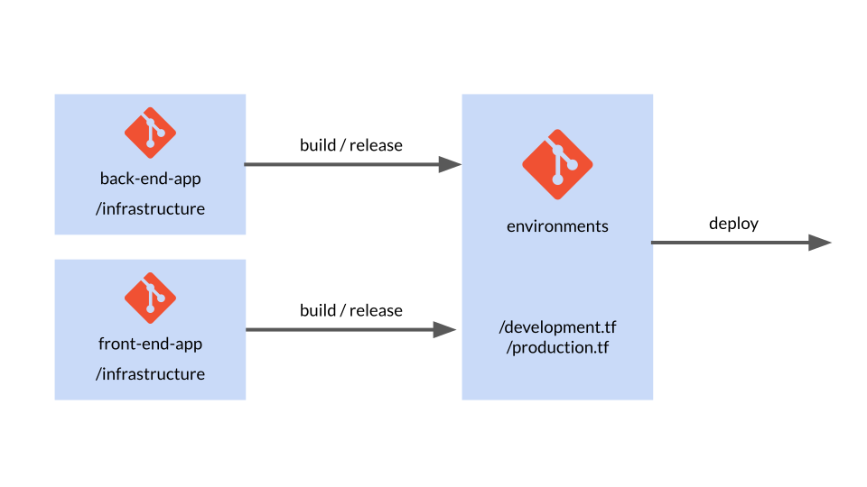

This blog post is the third part of a three-part series adapted from a GitOps
webinar series which we co-produced together with our friends at
[VSHN](https://www.vshn.ch/).

In this third part, we will show you how you can combine Git, which we
introduced in part 1 with Infrastructure as Code, which we introduced in part 2.
The combination of these two worlds will lead us to GitOps, where we will show
you concepts and technologies which enable you to operate your infrastructure
and applications entirely using Git repositories. We will proceed in two steps,
first showing you how to do GitOps with applications and then how to extend the
same principles to your entire infrastructure stack.

If you have questions, feel free to post them as comments on this blog post. If
you would rather sit back and enjoy this part as a webinar, then you may head
over to [the recording on YouTube](https://youtu.be/F4ZgpxBCL7s).

# The Idea

Before we dive into how we perform GitOps for applications and infrastructure,
let’s first consider the general ideas and assumptions behind GitOps.



Let’s first look at what problem GitOps aims to solve. Applications made up of
many microservices are hard to keep track of when deployed in many environments.
Environments can easily start to diverge and become snowflakes. GitOps proposes
the following solution to this problem: we represent the desired state of our
applications and environments declaratively as code, and version this
declarative representation in Git. The declarative representation in Git is read
by an automatic process, which applies it to the target environment based on
certain events. The most important event is when a change happens in the Git
repository holding the desired state. However, depending on how strict we want
our setup to be, the automatic process could also react to manual changes to the
applications or the environment’s infrastructure. In a strict setting, the
manual process would override such changes with the desired state from Git. This
means that changes to your applications and infrastructure are done exclusively
through operations in Git. This in turn means that all the Git goodness that we
showed you in Part 1 of this blog series can now be help you with those changes:
you automatically get a history of all the changes and of who they were done by.
You can pass proposed new changes to team members for a review. You can
implement change approval processes using merge requests. Furthermore, your
environments automatically stay documented without any extra effort.

# Declarative Applications

So, in this first part, we want to focus on how you can do GitOps for your
applications. Maybe you are part of a team which is building a complex
microservice-based application, with another team providing the infrastructure
platform to you. Then this first part will already contain all the concepts you
need. On the other hand, maybe your team also provisions its own infrastructure.
Then the second part on declarative infrastructure will show you how to govern
your entire stack with GitOps.

For this first part, we have decided to use Kubernetes as the example
infrastructure, which we will assume to be provided to us. There are of course
many other examples which we could have used, like AWS Lambda or any other
infrastructure platform given to you by a provider.

## Build



Before we can deploy our microservice to an environment, we obviously need to
build it. This is usually done with a continuous build pipeline, which runs
based on code being pushed to our microservice’s repo. In this pipeline, we
ideally lint our microservice’s code, we run unit tests on the code, and we test
that our microservice behaves as expected in a mocked environment by also
performing some component tests. Strictly speaking, these steps have nothing to
do with GitOps, but they are critical for building our confidence that our
microservice will behave the way we expect when it is deployed automatically
later. So let’s assume that all of these steps have completed successfully in
the pipeline.

At this point, the actual build step is executed. The build step packages our
microservice into an artifact which contains all the things needed for our
microservice to run. In our running example we are obviously thinking of a
container image here, but there are other formats like VMs built with Packer or
JAR-files or tarballs, depending on what your target platform looks like. The
important thing is that the build pipeline produces one artifact which is
independent of the potentially many target environments to which this artifact
will be deployed. We want to build an artifact once and potentially deploy it
many times.

## Release



With our continuous build pipeline happily churning out artifacts based on
commits of the source code, we need a second and separate step for marking
certain instances of those artifacts as releases. This usually happens in a
second pipeline which detects Git-tags being created in our microservice’s
repository and which adds this tag to the metadata of the corresponding
artifact. In our running example, this would mean tagging the container image
with the version in the Git-tag.

The second step of the release pipeline uploads the tagged artifact to a central
store, where this version of the artifact can later be referenced and pulled
during deployment. Obviously again, in our running example we are thinking of an
image registry here which will then be referenced from Kubernetes YAML-files
when deploying our microservice together with other microservices. However,
depending on your target platform you might be using a different type of store
in this case, like an S3-bucket or a Maven repository. In any case, it will be
something that can hold your built artifacts in different versions and serve a
particular version on demand.

## Deploy



So with our built and released artifacts nicely stored by version in a central
store, we are now ready to do actual GitOps. This is where the topics of our
previous two episodes come in handy. Namely, we put a pipeline in place which
applies a declarative representation of our microservice architecture stored in
a Git repository.

Whenever we update our declarative representation, say for example to make a
config change, but also to introduce new versions of some microservices, we do
this via the Git repository and our pipeline takes care of the deployment step.
Because we are using a declarative approach, our pipeline does not need to know
the procedural details of how to deploy our application. It just idempotently
applies the representation and relies on the underlying technology to figure out
the steps needed to reach the desired state.

In our example, the declarative representation are the Kubernetes YAML-files,
containing deployments which reference container images. The pipeline itself is
implemented in Argo CD because Argo is the most straightforward
Kubernetes-native option. But again, depending on your target platform you would
be using different technologies like for example GitLab-CI or Circle CI to run
your pipeline.

## Integration Tests



But what if we need to deploy to several environments? Maybe our team needs to
perform integration tests of new versions of the microservice architecture
before deploying the whole thing to the production environment. This is not a
problem for GitOps. In this case, we would keep a declarative representation of
our microservice architecture per target environment, and create one deployment
pipeline for each target environment which monitors the corresponding
representation. In our Kubernetes example, you will see how we use Kustomize to
manage the differences between two environments without repeating ourselves,
while at the same time staying declarative.

So coming back to the integration test scenario, in this case we would push the
representation of the int environment to our Git repo, pinning the red
microservice to a new release candidate version, say `2.1.1-rc` and thus
triggering its deployment. We would then perform our integration tests. Let’s
assume they succeed. We would then re-tag our red microservice artifact to make
it a proper release `2.1.1`. Finally, we would push the representation of the
`prd` environment to our Git repo, pinning the version of the red microservice
to `2.1.1` and thus triggering its deployment.

## Argo CD

After having discussed all the steps leading up to a deployment in GitOps, we
are now ready to look at an example of how this works in practice. We are going
to use a simple but very awesome application on Kubernetes, and we are going to
see how it is deployed and managed using Argo CD. For the purpose of our
example, we have Argo CD running on our Kubernetes cluster, managing two
environments of the same application. We call them `int` and `prd`.



If we click on the `prd` environment, we can see the details of how our awesome
application is deployed. It consists of one Kubernetes `Deployment` resource,
which runs with multiple replicas to guarantee downtime-free rolling upgrades.
It also defines an `Ingress` to make it reachable from outside the cluster.



So let's look at how this setup is reflected as code in our
[sample repo on GitHub](https://github.com/bespinian/argocd-demo).

```shell
argocd-demo [main] l
.git
LICENSE
README.md
application-int.yml
application-prd.yml
env
ingress
resources
```

In our repo, we have two YAML files called `application-int.yml` and
`application-prd.yml`. These are two custom resources which are applied to our
cluster in the `argocd` namespace and which tell Argo CD that there are two
application environments to manage. So let's consider the resource for the `int`
environment.

```yaml
apiVersion: argoproj.io/v1alpha1
kind: Application
metadata:
  name: int
  namespace: argocd
spec:
  project: default
  source:
    repoURL: https://github.com/bespinian/argocd-demo.git
    targetRevision: HEAD
    path: env/int
  destination:
    server: https://kubernetes.default.svc
    namespace: awesome-gitops-int
  syncPolicy:
    automated:
      prune: true
      selfHeal: true
```

As you can see, this is a resource of kind `Application`, which is a custom
resource definition introduced by Argo CD. Each `Application` has a `source`
which specifies the URL of the Git repo where Argo CD expects to find the setup
of the application. In our case, we have also specified a `path` attribute,
which tells Argo CD which sub-path of the Git repo it needs to monitor for
changes. Here we are pointing to the path `env/int` where Argo CD will find a
Kustomization which defines the `int` environment of our application. We could
also specify a `targetRevision` here, if we wanted to pin our deployment to a
branch, a tag or to a specific commit. On the other hand, Argo CD expects a
`destination` element which tells it where to deploy this particular application
to. In our case, we are deploying to a namespace `awesome-gitops-int` on the
local cluster. Furthermore, we have also specified a `syncPolicy` which
basically defines how strict Argo CD runs its GitOps process. There we have set
the `prune` option, which tells Argo CD to remove any resource which it finds in
the namespace `awesome-gitops-int` but which does not have a representation in
the Git repo. Additionally, we have specified the `selfHeal` option, which makes
Argo CD override any manual changes to resources which have a representation in
the Git repo with the state committed to that repo.

The `prd` environment of our application is defined in its own `Application`
object, where only a few parameters differ:

```yaml
apiVersion: argoproj.io/v1alpha1
kind: Application
metadata:
  name: prd
  # ...
spec:
  source:
    repoURL: https://github.com/bespinian/argocd-demo.git
    # ...
    path: env/prd
  destination:
    # ...
    namespace: awesome-gitops-prd
  syncPolicy:
    # ...
```

Obviously, the `name` of our productive `Application` is different. The Git repo
is the same, but the `path` points to the Kustomization for the productive
environment in this case. Furthermore, the destination namespace is the
productive one in this case.

If we check the Kustomizations of our two environments, we see that the `prd`
environment is currently running version `1.0.0` of our application, whereas the
`int` environment is already on version `2.0.0`.

```yaml
apiVersion: kustomize.config.k8s.io/v1beta1
kind: Kustomization
bases:
  - ../../resources
images:
  - name: bespinian/awesome-image
    newTag: 1.0.0
configMapGenerator:
  - name: awesome-config
    literals:
      - appTitle=Something awesome!
      - dbHost=db.bespinian.io
      - appVersion=1.0.0
```

Indeed, if we have a look in
[Docker Hub](https://registry.hub.docker.com/r/bespinian/awesome-image/tags),
which is the artifact store we use for our release process in this example, we
can see that there are versions `1.0.0` and `2.0.0` of the `awesome-image` which
have been released by our build process.



So let's consider how we upgrade our `prd` environment to version `2.0.0` using
GitOps. In order to achieve this, we simply edit our declarative representation,
which in this case is our Kustomization. Let's assume we come up with the
following new version.

```yaml
apiVersion: kustomize.config.k8s.io/v1beta1
kind: Kustomization
bases:
  - ../../resources
images:
  - name: bespinian/awesome-image
    newTag: 2.0.0
configMapGenerator:
  - name: awesome-config
    literals:
      - appTitle=Something even more awesome!
      - dbHost=db.bespinian.io
      - appVersion=2.0.0
```

Our edits will lead to the following Git diff

```diff
--- a/env/prd/kustomization.yml
+++ b/env/prd/kustomization.yml
@@ -4,10 +4,10 @@ bases:
   - ../../resources
 images:
   - name: bespinian/awesome-image
-    newTag: 1.0.0
+    newTag: 2.0.0
 configMapGenerator:
   - name: awesome-config
     literals:
-      - appTitle=Something awesome!
+      - appTitle=Something even more awesome!
       - dbHost=db.bespinian.io
-      - appVersion=1.0.0
+      - appVersion=2.0.0
```

We can now commit these changes to our repo

```shell
argocd-demo [main] git add .
argocd-demo [main] git commit -m "Roll out 2.0.0 to prd environment"
argocd-demo [main] git push
```

When the Git push operation completes, Argo CD will detect our changes in the
Git repo and apply them to the Kubernetes cluster, in this case using Kustomize.
This can be observed in the UI of Argo CD by the fact that the `prd` environment
is re-synced to our latest commit after a short while.



This completes the deployment cycle using Argo CD and brings us to the end of
the first part of this blog post on GitOps for applications.

# Declarative Infrastructure

If your team also manages the infrastructure layer, or you are a platform team,
then GitOps goes further. Every so often, the distinction between applications
and infrastructure is not clear-cut. One example of that are custom VM images
that contain your applications. There, it’s not so clear whether the creation
and hosting of these images should be done by the application or the
infrastructure team. However, as you will see, most of the concepts and
workflows are very similar between application and infrastructure code.

We have decided to use Terraform as the running example for declarative
infrastructure. But there are of course many other examples like AWS
CloudFormation, Ansible Tower etc.

## Repo Structure



Obviously, there are many ways of how to structure your different components,
teams, and Git repositories. One form we see a lot is to have the
application-specific infrastructure with the applications themselves. So as you
can see, we have an infrastructure directory in each application that contains
the respective Terraform code for the application and all its dependencies like
databases or message queues. By doing so, we can release the application as a
whole, including its runtime and all its dependencies. All that’s separate is
the configuration of the apps.

Since that is separate for each environment, we have a repo that consolidates
each environment. It instantiates each component and configures and parametrizes
it for the respective environment. For example, here we have a `production.tf`
file which contains all the components configured for prod. Then we have a
separate `development.tf` which contains the same components, but maybe the
servers are a bit less beefy, or I am using some debug options.

That’s also where the releasing and building of the apps and components comes
in. For example, I can always use the latest versions of the backend and the
frontend apps in development. But for production, I may want to pin the
versions. When I then create a new release, I can increment the respective
version in the `production.tf` configuration, which in terms will trigger a new
deployment into that environment.

## Build

Let’s have a closer look at that.

Firstly, we want to look at the build step of your infrastructure modules. Just
like for the application code, it makes sense to separate the build, the
release, and the deployment phases. For Terraform, the term “build” might be a
bit confusing because the code doesn’t actually need to be built. However, it
still makes sense to validate and prepare your commits to be released. So maybe
“prepare” would be a better name in this case.

```shell
$ terraform validate
```

```shell
$ terraform fmt -check
```

Since infrastructure code is mostly quite heavy to test and deploy, it is
important to detect problems as early as possible. A comprehensive build
pipeline that performs sanity checks on your code is therefore crucial. As with
any pipeline, it makes sense to run the faster and more lightweight tasks first,
to fail fast if something is wrong. Terraform, for example, offers a validity
check feature that checks for syntax errors in your code and fails if there are
any. Similar to that, we can quickly check if the code is formatted correctly
according to the Terraform community best practices. Fortunately, Terraform
offers a built-in command called `terraform fmt` (probably borrowed from
`go fmt`) which has a check flag. This is an effortless way of making sure our
code is easy to read and understand.

```shell
$ tflint && tfsec
```

The next step after a simple sanity check is to perform some linting. Popular
tools are `tflint` and `tfsec` as introduced in Part 2 of this blog series.
`tflint` is a general linter, whereas `tfsec` focuses on security issues, as the
name implies. Both can be customized and can bring great value by helping you
and your team follow best practices around Terraform and detecting potential
issues early on.

```shell
$ make test
```

The last step that we can do before actually releasing new versions of our
infrastructure modules is to run some isolated tests. Terratest is a great tool
to perform such tests. It helps you to instantiate any module in isolation, run
tests on it like making HTTP requests or checking whether certain parameters
have been set correctly. Then it tears down the whole deployment again.

In the case of Terraform, uploading our build to an artifact store is redundant,
as the Git repository and its tags represent the module.

## Release

```shell
$ git tag v1.0.0-rc1
```

Releasing your infrastructure modules works in a very similar way as you would
do it for applications. Each module is released individually. This happens, for
example, by adding a git tag that specifies a commit that we would like to
release as a release candidate version.

```shell
$ make integration-test
```

Our automation pipeline then picks that up and runs a suite of integration tests
on our infrastructure, including the newly created release candidate. This can
happen by using Terratest which can instantiate our whole environment separately
and run a couple of smoke tests on that ephemeral environment.

```shell
$ git tag v1.0.0
```

As soon as we are happy, we then create an integration-tested release by adding
another Git tag without the `rc` suffix. This marks the final release which, in
Terraform’s case, doesn’t have to be uploaded anywhere because the repository
itself contains the artifact which is just our infrastructure definitions at a
specific commit. Now, we are ready to deploy the newly released infrastructure
module.

## Deploy

Deploying happens, as mentioned above, from a central repository which keeps
track of which version of which module is deployed where. So, the deployment
gets triggered by us changing the version number of a specific module, for
example in the production.tf file. When we then commit and push that change, the
deployment pipeline will pick that up and make the necessary changes via
Terraform in the respective environment.

## Example

Let's have a look at an example to see how all of this works in practice. Assume
we have an application called `demo-app` which is split up into three git
repositories as follows:

```shell
/demo-app/
  + -- frontend
  + -- backend
  + -- environments
```

Furthermore, if we consider the structure of the `backend` repo, we see that it
is just a normal Node.js application which contains an `infrastructure`
subfolder. This subfolder contains two Terraform modules called `back_end` and
`db`. The `back_end` module instantiates the complete infrastructure which the
backend needs to run, in this case an AWS Lambda function and a database among
other things.

```shell
/demo-app/backend/
  > -- .github/
  v -- infrastructure/modules/
         v -- back_end/
                api_gateway.tf
                db.tf
                dns.tf
                function.tf
                main.tf
                networking.tf
                tls_certificate.tf
                variables.tf
         v -- db/
                + -- db.tf
                + -- firewalling.tf
                + -- main.tf
                + -- networking.tf
                + -- outputs.tf
                + -- variables.tf
  > -- src/
  .env
  .eslintrc.json
  .gitignore
  package-lock.json
  package.json
  README.md
```

The `db` module contains all the infrastructure needed for hosting the database
specifically. It is instantiated in the `back_end` module by the file `db.tf`
which looks like this:

```terraform
module "db" {
  source = "../db"

  environment     = var.environment
  resource_suffix = var.resource_suffix
}
```

Using this mechanism, we can separate blocks of infrastructure from each other,
and parametrize each one of them via clear interfaces of Terraform inputs and
outputs.

Our application will be rolled out to various environments. That is what the
`environments` repo is for. It contains Terraform files which define the
development environment, prefixed with `dev_` and Terraform files which define
the productive environment, prefixed with `prod_`. Furthermore, the repo also
contains some global files. These define resources which are shared across all
environments, like a common monitoring stack, for example.

```shell
/demo-app/environments/
  > -- .github/
  > -- .terraform/
  > -- modules/
  > -- state/
  .gitignore
  .terraform.lck.hcl
  dev_back_end.tf
  dev_dns.tf
  dev_front_end.tf
  global_artifacts.tf
  global_continous_deployment.tf
  global_monitoring.tf
  main.tf
  Makefile
  prod_back_end.tf
  prod_dns.tf
  prod_front_end.tf
  README.md
  secrets.auto.tfvars
  variables.tf
```

Let's look at the file `dev_back_end.tf`:

```terraform
module "dev_back_end" {
  source = "../backend/infrastructure/modules/back_end"

  base_domain                 = aws_route53_zone.dev.name
  db_url                      = module.dev_db.db_url
  db_vpc_id                   = module.dev_db.vpc_id
  db_client_security_group_id = module.dev_db.db_client_security_group_id
  db_vpc_private_subnet_ips   = module.dev_db.db_vpc_private_subnet_ips
  dfp_api_key                 = var.dfp_api_key
  alarms_topic_arn            = module.monitoring.alarms_topic_arn
  environment                 = local.dev_environment
  resource_suffix             = local.dev_resource_suffix
}
```

As you can see, the development environment is being initialized with
`dev`-specific values and the source for the module is the latest commit of the
`back_end` module. The latter is because we want the development environment to
always have the latest state of the infrastructure. This is different, when we
consider the analogous module `prod_back_end.tf` for the production environment:

```terraform
module "dev_back_end" {
  source = "../backend/infrastructure/modules/back_end?ref=v2.0.0"

  base_domain                 = aws_route53_zone.main.name
  db_url                      = module.db.db_url
  db_vpc_id                   = module.db.vpc_id
  db_client_security_group_id = module.db.db_client_security_group_id
  db_vpc_private_subnet_ips   = module.db.db_vpc_private_subnet_ips
  dfp_api_key                 = var.dfp_api_key
  alarms_topic_arn            = module.monitoring.alarms_topic_arn
  environment                 = local.environment
}
```

In this case, we are referencing a specific version of the `back_end` module
because we want our productive environment to be pinned to a certain tested
state. If we look at the commit history of the `back_end` module, we can see
that the version `v2.0.0` corresponds to a git tag there and that there have
been more recent commits to that module in the meantime.

```txt
commit 68e85d80a90a905d44554fedfcc621b65375c57d (HEAD -> main, origin/main)
Author: Lena Fuhrimann <lena.fuhrimann@users.noreply.github.com>
Date:   Tue May 17 14:49:46 2022 +0200

    Add more awesomeness

commit cf3275a16174230a906bd536c242ee0b281b81b5
Author: Lena Fuhrimann <lena.fuhrimann@users.noreply.github.com>
Date:   Tue May 17 14:47:52 2022 +0200

    Fix a nasty bug

commit 8c64e3382973a93621fdac5dd67a9080eb43b4ef (tag: v2.0.0)
Author: Lena Fuhrimann <lena.fuhrimann@users.noreply.github.com>
Date:   Tue May 17 14:33:02 2022 +0200

    Deploy a stable state
```

Finally, if we look at the frontend repo of our example app, we see that it is
just a plain singe-page application which does not contain an `infrastructure`
folder:

```shell
/demo-app/frontend/
  > -- .github/
  > -- public/
  > -- src/
  .env
  .gitignore
  package-lock.json
  package.json
  README.md
```

This is because single-page applications have a very generic way of being
deployed, and we can thus use an existing third-party Terraform module for this.
We can see how this is done in the file `dev_front_end.tf`:

```terraform
module "dev_front_end" {
  source = "github.com/cloudlena/terraform-spa?ref=1.0.2"

  providers = {
    aws.us_east = aws.us_east
  }

  service_name    = "cp_front_end"
  domain          = aws_route53_zone.dev.name
  environment     = local.dev_environment
  resource_suffix = local.dev_resource_suffix
}
```

As you can see, we can reference any third-party module which is hosted on
GitHub as the module's source.

# Advanced Concepts

GitOps itself is a very intriguing concept that can bring great value and
stability to your projects. However, there are some even more advanced concepts
that we would like to explore a bit at this point to give you some ideas of what
you can do once you’ve achieved stable GitOps workflows.

## True Continuous Deployment

### Every commit gets deployed automatically

So far, we have only talked about deploying specifically tagged or otherwise
marked releases. However, there is another interesting concept around GitOps,
which is called “Continuous Deployment”. True continuous deployment means that
every commit to a branch is directly deployed into one or multiple environments.
Yes, sometimes even productive ones. For example, my team could have a single
`main` branch and all changes to it go directly into production. So, there’s no
specific versioning, tagging or releasing. My team and I are confident that any
change we make is safe to go to prod.

### Importance of testing

Obviously, it takes either a great ego or some serious testing coverage to get
to the confidence level of releasing everything into prod. Good test coverage on
a unit, an integration and an end-to-end level is crucial to releasing often.

### Requires feature flags and a rigid Git model

Another important point to consider is that we might have features which are on
our main branch but which we don’t want our end users to see yet. For that,
feature flags can be helpful. In the simplest case, this means that we have an
`if` statement in our code that checks if a specific feature should be enabled
in that environment and only displays the new feature if that flag is enabled.
By doing so, we can control the features and their availability in different
environments independently of our code releases.

### People mostly do continuous deployment in non-prod environments

At this time, many people do true continuous deployment in non-productive
environments. It takes a lot of maturity and courage to move this process to
productive environments, but we can only encourage you to strive to do so.

## ChatOps


Another fun concept and buzzword is “ChatOps”. It means that we can trigger
certain steps of our automation pipelines by using our normal communication
tools. So, for example, we could have a Slack or Rocket Chat instance that we
also use for our usual team communication. In there, we could have a
“deployment” channel, where people simply have to type “Deploy production” as a
chat message. Our automation server listens on that channel for certain messages
and, as soon as they get posted, does its thing.

This is not as thoroughly automated as pure GitOps because there’s the manual
step of writing a chat message. However, a combination of GitOps and ChatOps can
be interesting. For example, the deployment into development and staging
environments happens fully automated via GitOps and there’s no manual user
interaction needed. For the deployment into production, however, we want to be a
bit more cautious and only trigger the deployment after we’ve done thorough
manual testing. This means that we can do this testing, and only after everybody
is happy, we trigger the deployment via chat message.

## Security

### Audit Trail

GitOps brings great benefits in terms of security. By tracking all the changes
to your applications but also your infrastructure in Git, you get a clear audit
trail of what was done when by whom. To get this benefit, it is crucial to only
accept signed commits to ensure that the person who claims to have made a commit
actually did. This can be done via GPG and is supported by most Git server
providers like GitHub.

### Linting and Pull Requests

Another benefit in terms of security is that you get to lint and code review all
of your code and therefore ensure that you follow best practices and don’t have
any security holes that can be detected easily by static code analysis or by
your colleagues looking over the code. All changes go through the team and are
rolled out in a structured way.

### Clear and Concise Overview of Code

Furthermore, GitOps always gives you an up-to-date summary of what is deployed
where and how your infrastructure and applications are configured. This is great
for manual security audits and simply to review your code as a team from time to
time.

# Thanks!

This brings us to the end of this three part blog series. We highly appreciate
your interest and are excited for your comments and questions.

As a last important takeaway, please be aware that different teams might be at
different maturity levels. Usually, application teams are rather quick at
adopting such deployment and lifecycle strategies. So, it’s possible that your
apps are already deployed using GitOps, but your infrastructure is still
maintained traditionally, for example using a GUI and clicking around. This gap
can be dangerous because the infrastructure might not be able to keep up with
the fast pace of change GitOps allows the application teams to follow.
Therefore, it is important to be aware of this gap and communicate clearly among
the different teams and components that make up your environments.
