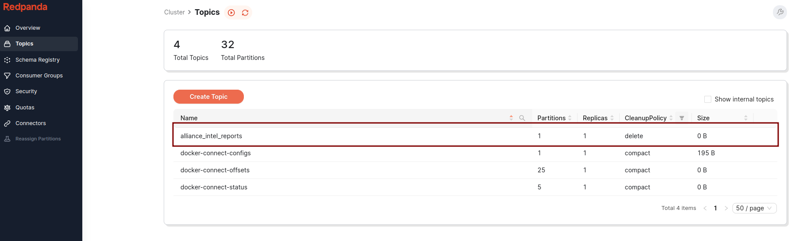
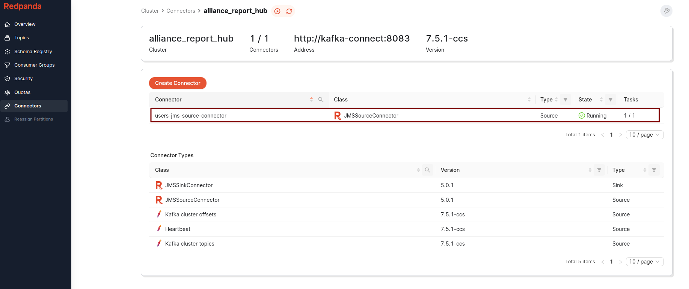
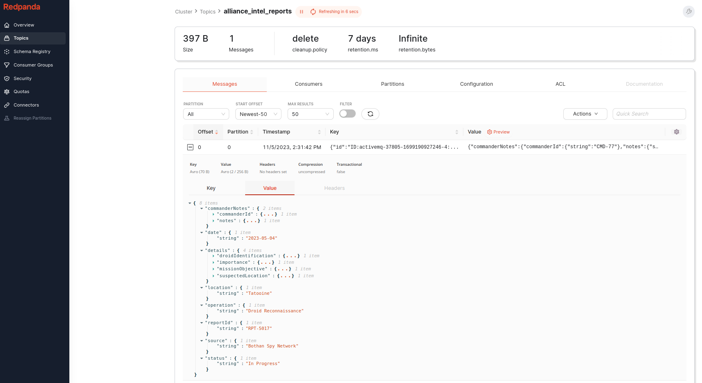

## A Long Time Ago in an IT Galaxy Far, Far Away…

In an era marked by a seismic shift in technology, a team of Jedi developers,
once guardians of legacy system strongholds, orchestrated a pivotal uprising.
Their ingenuity turned the tide against the monolithic communication frameworks
that had long dominated the galaxy's data streams.

## The Legacy of JMS

In the galaxy of data and messages, the first system, JMS (Jedi Messaging
Service), had long governed interstellar communications. Reliable and steadfast,
much like the protocol droid C-3PO, JMS had served diligently, ensuring messages
traversed the vast expanses of network architectures. Yet, as the galaxy's data
needs to be expanded exponentially, JMS's limitations became more evident,
reminiscent of an ancient protocol struggling in a rapidly evolving galaxy.

## The Rise of Kafka

Enter Kafka, a nimble and agile system, quickly rising as a new hope within the
Rebellion. Far more than a mere messenger, capable of storing, streaming, and
processing data in unprecedented ways. It promised a new era in data management,
but transitioning from the age-old JMS to this groundbreaking technology was
laden with potential challenges and conflicts.

## The Offloading Strategy

Our journey was riddled with challenges, including message disorder and system
failures. But armed with a strategic plan, the right technological arsenal, and
a touch of the Force, we embarked on our mission to harmoniously blend the old
and the new.

## Apache Kafka

Kafka's robust architecture and superior handling of real-time data make it an
ideal choice for businesses seeking to improve their data processing systems.

But how do we transition from using JMS to Kafka without causing disruption to
existing systems? The answer lies in using Kafka Connect.

In this post, we will explore the process of offloading messages from JMS queues
to Kafka using Kafka Connect.

We'll start with an overview of JMS and Kafka, and the need for offloading.

Then we'll dive into a step-by-step guide on how to accomplish the offloading
process.

Whether you're a seasoned software architect or a beginner in the field, this
article aims to provide you with practical knowledge to facilitate your JMS to
Kafka offloading journey.

Join us as we delve into the world of Kafka, demystify the offloading process,
and help you harness the power of real-time data for your business.

## Understanding JMS and Its Limitations

JMS, short for Java Message Service, is a specification that operates within the
Java Virtual Machine (JVM).

Although it's a Java-centric service, languages such as Kotlin and Scala can
interact with it due to their compatibility with Java.

JMS allows Java components to create, read, send and receive messages and will
leverage the communication between different components in a distributed
application to make it loosely coupled, asynchronous and reliable.

In the modern software landscape, especially in complex, multi-tiered
applications employing microservices, a diverse array of programming languages
and frameworks are often utilized.

This diversity allows different components of the application to utilize the
strengths of different languages and frameworks.

However, JMS's reliance on Java can be a significant constraint in such
heterogeneous environments, limiting its interoperability across different parts
of the system that are not Java-based.

## What Sets Kafka Apart?

Apache Kafka is a distributed streaming platform. What makes Kafka different
from other messaging systems?

### Multiple Producers

Apache Kafka is designed to handle multiple producers, thus facilitating data
aggregation from various frontend systems. This capacity simplifies the data
stream, making it more manageable, particularly when working with multiple
microservices.

### Multiple Consumers

Kafka supports multiple consumers to read the same stream of messages without
interference. Unlike many other systems where a consumed message is no longer
available, Kafka allows multiple consumers to share and process a given message
just once, if they operate as part of a group.

### Disk-Based Retention

Apache Kafka provides durable message retention, which means messages are
written to disk based on customizable retention rules. This attribute permits
non-real-time operation of consumers, safeguards data during traffic spikes or
slow processing, and allows for maintenance of consumers without the risk of
data loss.

### Scalability

Kafka offers flexible scalability, permitting users to start with a single
broker and expand to larger clusters as needed. This capacity allows for
continuous operation of the system, even during expansions or the failure of an
individual broker.

### High Performance

Apache Kafka is characterized by high performance under heavy load. It supports
scaling out of producers, consumers, and brokers to handle large message streams
while preserving subsecond message latency.

### Platform Features

The Apache Kafka project includes APIs and libraries for stream processing and
data migration. Kafka Connect aids in moving data from a source system to Kafka
or vice versa, while Kafka Streams offers a library for developing scalable,
fault-tolerant stream processing applications.

## The Flexibility and Resilience of Kafka Connect

### Deployment Options and Scalability of Kafka Connect

Kafka Connect, as a client-side application, provides two different deployment
methods:

- individual, standalone application on a single host or
- as a distributed system spanning multiple hosts.

Each host running Kafka Connect is referred to as a 'worker'.

### Handling Varied Workloads

This dual deployment strategy offers Kafka Connect the versatility to
accommodate a wide range of workloads.

It can easily manage anything from a single data pipeline with a few events to a
network of dozens of workers handling millions of events per second.

The dynamic nature of Kafka Connect allows you to add or subtract workers from
the cluster during runtime, tailoring capacity to match demand.

### Kafka Connect in a Cluster Setup

When Kafka Connect is deployed as a distributed cluster, each worker
collaborates, taking on a portion of the workload.

This distributed approach enhances the reliability and resilience of Kafka
Connect.

If one worker fails, the remaining workers can instantly redistribute and manage
the disrupted workload, minimizing downtime and maintaining productivity.

## Other components used in this example

### [karapace](https://www.karapace.io/)

Karapace is a free and Open Source tool that provides an API-compatible
alternative to the Confluent Schema Registry for use with Apache Kafka. When
working with Kafka, especially when leveraging Avro serialized data, the schema
registry becomes an essential component. The schema registry stores Avro Schemas
for Kafka producers and consumers and ensures that written and read data is
always compatible with the schema.

### [redpanda console](https://redpanda.com/redpanda-console-kafka-ui)

Redpanda Console gives you a simple, interactive approach for gaining visibility
into your topics, masking data, managing consumer groups, and exploring
real-time data with time-travel debugging.

### [activemq](https://activemq.apache.org/)

Apache ActiveMQ is an open-source message broker written in Java. It is known
for its robustness, flexibility, and broad feature set. ActiveMQ is a fully JMS
(Java Message Service) compliant messaging system and supports many
cross-language clients and protocols.

### [JMS Source Connector](https://docs.lenses.io/5.3/connectors/sources/jmssourceconnector/)

A Kafka Connect JMS source connector to subscribe to messages on JMS queues and
topics and write them to a Kafka topic.  
It's using the KCQL (Kafka Connect Query Languages) is a SQL like syntax
allowing a streamlined configuration of a Kafka Connect Sink/Source.

## Offloading from JMS to Kafka: A Star Wars Saga

### Establishing Kafka: The Starlight Jedi Stronghold

The first phase of our mission involved establishing Kafka as the Rebellion's
Starlight Station. Utilizing the KRaft consensus protocol, we aimed to create a
beacon free from the constraints of the old ZooKeeper system, signifying a new
approach to managing metadata.

- Use the Force (of Docker Compose)

We'll utilize the power of Docker Compose to construct our Kafka Starlight
Station:

```yaml
kafka:
  image: confluentinc/cp-kafka:7.5.0
  hostname: kafka
  container_name: kafka
  ports:
    - "9092:9092"
  environment:
    KAFKA_NODE_ID: 1
    KAFKA_LISTENER_SECURITY_PROTOCOL_MAP: "CONTROLLER:PLAINTEXT,PLAINTEXT:PLAINTEXT,PLAINTEXT_HOST:PLAINTEXT"
    KAFKA_ADVERTISED_LISTENERS: "PLAINTEXT://kafka:29092,PLAINTEXT_HOST://localhost:9092"
    KAFKA_OFFSETS_TOPIC_REPLICATION_FACTOR: 1
    KAFKA_GROUP_INITIAL_REBALANCE_DELAY_MS: 0
    KAFKA_TRANSACTION_STATE_LOG_MIN_ISR: 1
    KAFKA_TRANSACTION_STATE_LOG_REPLICATION_FACTOR: 1
    KAFKA_PROCESS_ROLES: "broker,controller"
    KAFKA_CONTROLLER_QUORUM_VOTERS: "1@kafka:29093"
    KAFKA_LISTENERS: "PLAINTEXT://kafka:29092,CONTROLLER://kafka:29093,PLAINTEXT_HOST://0.0.0.0:9092"
    KAFKA_INTER_BROKER_LISTENER_NAME: "PLAINTEXT"
    KAFKA_CONTROLLER_LISTENER_NAMES: "CONTROLLER"
    KAFKA_LOG_DIRS: "/tmp/kraft-combined-logs"
    # Replace CLUSTER_ID with a unique base64 UUID using "bin/kafka-storage.sh random-uuid"
    # See https://docs.confluent.io/kafka/operations-tools/kafka-tools.html#kafka-storage-sh
    CLUSTER_ID: "MkU3OEVBNTcwNTJENDM2Qk"
```

This configuration allows our Kafka Starlight Station to operate autonomously,
without the support of the old guardian, ZooKeeper.

### Mastering the Kafka Starlight Station with the Redpanda Command Center

The Redpanda Console emerges as the Rebellion's advanced command center, pivotal
for controlling the Kafka Starlight Station.

```yaml
redpanda-console:
  container_name: redpanda-console
  image: docker.redpanda.com/vectorized/console:latest
  entrypoint: /bin/sh
  command: -c 'echo "$$CONSOLE_CONFIG_FILE" > /tmp/config.yml; /app/console'
  environment:
    CONFIG_FILEPATH: /tmp/config.yml
    CONSOLE_CONFIG_FILE: |
      kafka:
        brokers: ["kafka:29092"]
        schemaRegistry:
          enabled: false
  ports:
    - "8080:8080"
  depends_on:
    kafka:
      condition: service_healthy
```

Launching the Command Center:

```shell
docker compose up -d
```

#### Mission Control:

Navigate to the [Redpanda Command Center](http://localhost:8080). Here, you'll
be greeted by the Redpanda Console.

It's time to define our intel reports. Initiate a new Kafka topic:
`alliance_intel_reports` This topic will serve as a repository for vital
intelligence reports, gathering crucial information that will aid the Rebel
Alliance in making informed decisions and planning strategic operations across
the galaxy.



### The Karapace Schema Registry

the Karapace Registry supports the storage of schemas, serving as a pivotal hub
for the serialization and deserialization of messages within the Kafka
ecosystem.

#### Setting up the Karapace Registry

To integrate this critical component into our Kafka Starlight Station, we
configure the Karapace Registry as follows:

```yaml
karapace-registry:
  container_name: karapace-registry
  image: ghcr.io/aiven-open/karapace:latest
  entrypoint:
    - /bin/bash
    - /opt/karapace/start.sh
    - registry
  depends_on:
    kafka:
      condition: service_healthy
  ports:
    - "8081:8081"
  environment:
    KARAPACE_ADVERTISED_HOSTNAME: karapace-registry
    KARAPACE_BOOTSTRAP_URI: kafka:29092
    KARAPACE_PORT: 8081
    KARAPACE_HOST: 0.0.0.0
    KARAPACE_CLIENT_ID: karapace
    KARAPACE_GROUP_ID: karapace-registry
    KARAPACE_MASTER_ELIGIBILITY: "true"
    KARAPACE_TOPIC_NAME: _schemas
    KARAPACE_LOG_LEVEL: WARNING
    KARAPACE_COMPATIBILITY: FULL
```

```shell
docker compose up -d karapace-registry
```

Update the Redpanda Console’s configuration to connect with the Karapace
Registry:

```text
  redpanda-console:
    ... [existing configuration]
      CONSOLE_CONFIG_FILE: |
        kafka:
          brokers: ["kafka:29092"]
          schemaRegistry:
            enabled: true
            urls: ["http://karapace-registry:8081"]
    ... [remaining configuration]
```

For the changes to take effect in the Redpanda Console, initiate a rebuild
sequence:

```shell
docker compose up -d --build redpanda-console
```

The Redpanda Command Center's interfaces illuminate, echoing the station's
readiness to synchronize with the advanced functionalities of the Karapace
Schema Registry.

### Ancient ActiveMQ - The Galactic Message Relay Station

Within the realm of the Rebel Alliance's data strategies, alongside the Kafka
Starlight Station, stands ActiveMQ, an ancient and sophisticated message relay
system.

#### Setting up the ActiveMQ Relay Station

```yaml
activemq:
  image: symptoma/activemq:5.17.3
  hostname: activemq
  container_name: activemq
  ports:
    - "61616:61616"
    - "8161:8161"
```

To commence its operations:

```shell
docker compose up -d activemq
```

### Configuring the `alliance_intel_reports` Transmission Queue

ActiveMQ's control panel is a portal to an array of message relay
functionalities:

1. Accessing the Control Panel: Navigate to
   [ActiveMQ's Galactic Interface](http://localhost:8161).
   - Username: `admin`
   - Password: `admin`
2. Configuring the Relay Queue:
   - Click on 'Manage ActiveMQ broker'.
   - Proceed to 'Queues'.
   - Enter `alliance_intel_reports` for the Queue name and create it.
3. Send a message to the Alliance::
   - Locate the `alliance_intel_reports` queue and click on send to.

```json
{
  "reportId": "RPT-5017",
  "date": "2023-05-04",
  "source": "Bothan Spy Network",
  "location": "Tatooine",
  "operation": "Droid Reconnaissance",
  "details": {
    "missionObjective": "Locate missing astromech droid",
    "suspectedLocation": "Mos Eisley",
    "droidIdentification": "R2-D2",
    "importance": "High - Contains Death Star plans"
  },
  "status": "In Progress",
  "commanderNotes": {
    "commanderId": "CMD-77",
    "notes": "Increase surveillance in Mos Eisley. Possible Imperial entanglement."
  }
}
```


### The Galactic Integration - Kafka Connect: The Master Yoda's Gift

Within the interstellar communications network, Kafka Connect stands as a nexus
point, transitioning various data realms.

Our integration is based on an open-source connector from
[Lenses.io](https://docs.lenses.io/5.0/integrations/connectors/stream-reactor/sources/jmssourceconnector/)
and the foundational base image for Kafka Connect from
[Confluent](https://docs.confluent.io/platform/current/connect/index.html).

#### Installing the JMS Source Connector from Lenses.io

The symbiosis of the JMS source connector with the Confluent's Kafka Connect is
an odyssey in itself. Here's the sacred script that forges their alliance:

```dockerfile
FROM confluentinc/cp-kafka-connect:7.5.1

USER root

RUN yum update -y && yum install -y unzip

RUN mkdir -p /usr/local/share/kafka/plugins/kafka-connect-jms

# Fetch the kafka-connect-jms zip file and extract its contents
RUN wget -O /tmp/kafka-connect-jms-5.0.1.zip https://github.com/lensesio/stream-reactor/releases/download/5.0.1/kafka-connect-jms-5.0.1.zip && \
    unzip /tmp/kafka-connect-jms-5.0.1.zip -d /usr/local/share/kafka/plugins/kafka-connect-jms && \
    rm /tmp/kafka-connect-jms-5.0.1.zip

# Fetch the activemq-client jar and activemq-all jar files and place them in the same directory
RUN wget -O /usr/local/share/kafka/plugins/kafka-connect-jms/activemq-client-5.12.3.jar https://repo1.maven.org/maven2/org/apache/activemq/activemq-client/5.12.3/activemq-client-5.12.3.jar && \
    wget -O /usr/local/share/kafka/plugins/kafka-connect-jms/activemq-all-5.12.3.jar https://repo1.maven.org/maven2/org/apache/activemq/activemq-all/5.12.3/activemq-all-5.12.3.jar

# Cleanup
RUN yum remove -y wget unzip && yum clean all

USER appuser
```

```yaml
kafka-connect:
  build:
    context: kafka-connect
    dockerfile: Dockerfile
  hostname: kafka-connect
  container_name: kafka-connect
  ports:
    - "8083:8083"
  environment:
    CONNECT_BOOTSTRAP_SERVERS: "kafka:29092"
    CONNECT_REST_PORT: 8083
    CONNECT_GROUP_ID: compose-connect-group
    CONNECT_CONFIG_STORAGE_TOPIC: docker-connect-configs
    CONNECT_OFFSET_STORAGE_TOPIC: docker-connect-offsets
    CONNECT_STATUS_STORAGE_TOPIC: docker-connect-status
    CONNECT_KEY_CONVERTER: io.confluent.connect.avro.AvroConverter
    CONNECT_KEY_CONVERTER_SCHEMA_REGISTRY_URL: "http://karapace-registry:8081"
    CONNECT_VALUE_CONVERTER: io.confluent.connect.avro.AvroConverter
    CONNECT_VALUE_CONVERTER_SCHEMA_REGISTRY_URL: "http://karapace-registry:8081"
    CONNECT_INTERNAL_KEY_CONVERTER: "org.apache.kafka.connect.json.JsonConverter"
    CONNECT_INTERNAL_VALUE_CONVERTER: "org.apache.kafka.connect.json.JsonConverter"
    CONNECT_REST_ADVERTISED_HOST_NAME: "kafka-connect"
    CONNECT_LOG4J_ROOT_LOGLEVEL: "INFO"
    CONNECT_LOG4J_LOGGERS: "org.apache.kafka.connect.runtime.rest=WARN,org.reflections=ERROR"
    CONNECT_CONFIG_STORAGE_REPLICATION_FACTOR: "1"
    CONNECT_OFFSET_STORAGE_REPLICATION_FACTOR: "1"
    CONNECT_STATUS_STORAGE_REPLICATION_FACTOR: "1"
    CONNECT_PLUGIN_PATH: "/usr/share/java,/etc/kafka-connect/jars,/usr/share/confluent-hub-components,/usr/local/share/kafka/plugins"
    CLASSPATH: "/usr/local/share/kafka/plugins/*"
  depends_on:
    kafka:
      condition: service_healthy
    karapace-registry:
      condition: service_healthy
```

```shell
docker compose up -d kafka-connect
```

Update RedPanda console

```text
  redpanda-console:
    ... [existing configuration]
      CONSOLE_CONFIG_FILE: |
        kafka:
          brokers: ["kafka:29092"]
          schemaRegistry:
            enabled: true
            urls: ["http://karapace-registry:8081"]
        connect:
          enabled: true
          clusters:
            - name: alliance_report_hub
              url: http://kafka-connect:8083
    ... [remaining configuration]
```

For the changes to take effect in the Redpanda Console, initiate a rebuild
sequence:

```shell
docker compose up -d --build redpanda-console
```

#### Accessing the Kafka Connect Container

To initiate our mission-critical operation, we must access the Kafka Connect
container:

```shell
docker exec -it kafka-connect bash
```

This command teleports us into the command center of Kafka Connect, where we
will orchestrate the creation of the connector.

#### Crafting the Intergalactic Connector

In the control room, we execute the sacred script that conjures the connector:

```shell
curl --location 'http://localhost:8083/connectors' \
--header 'Content-Type: application/json' \
--data '{
         "name": "users-jms-source-connector",
         "config": {
            "connector.class": "com.datamountaineer.streamreactor.connect.jms.source.JMSSourceConnector",
            "task.max": 1,
            "key.converter": "io.confluent.connect.avro.AvroConverter",
            "value.converter": "io.confluent.connect.avro.AvroConverter",
            "key.converter.schema.registry.url": "http://karapace-registry:8081",
            "value.converter.schema.registry.url": "http://karapace-registry:8081",
            "connect.jms.kcql": "INSERT INTO alliance_intel_reports SELECT * FROM alliance_intel_reports WITHTYPE QUEUE",
            "connect.jms.initial.context.factory":"org.apache.activemq.jndi.ActiveMQInitialContextFactory",
            "connect.jms.url":"tcp://activemq:61616",
            "connect.jms.connection.factory":"ConnectionFactory",
            "connect.jms.source.default.converter":"com.datamountaineer.streamreactor.connect.converters.source.JsonSimpleConverter"
         }
}'
```

This incantation sets up a JMS source connector, tasked with a crucial mission:
to offload messages from the JMS alliance_intel_reports queue to the
alliance_intel_reports topic.

#### Connector is now visible in the Redpanda console



#### Witnessing the Offloading Miracle

With the connector operational, we observe the first messages being offloaded
from JMS to Kafka, marking a new era in intergalactic communication.



This pivotal moment in our narrative illustrates the seamless merging of two
powerful communication realms.

## Archives of Wisdom

The complete codex of our journey, detailing every maneuver and strategy
employed in this grand mission, can be accessed in the
[Galactic Code Repository](https://github.com/bespinian/jms-to-kafka-offloading).

## Holocron Archives

- [Kafka: The Definitive Guide](https://www.oreilly.com/library/view/kafka-the-definitive/9781491936153/)  
  By
  Gwen Shapira, Todd Palino, Rajini Sivaram, Krit Petty
- [Kafka Connect](https://www.oreilly.com/library/view/kafka-connect/9781098126520/)  
  By
  Mickael Maison, Kate Stanley
- [Kafka Connect - Udemy](https://www.udemy.com/course/kafka-connect/) By
  Stephane Maarek

## Epilogue

Thus, a new chapter in our galactic saga has been written. The once-distant
worlds of JMS and Kafka are now united, ensuring that the flow of information
across the cosmos is more seamless and efficient than ever before. The galaxy
watches in awe as these two mighty forces come together, forging a new destiny
in the annals of data streaming.
