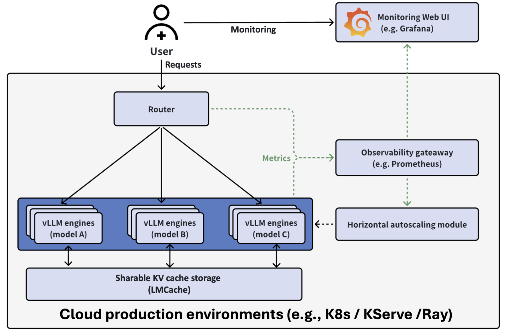

Large language models (LLMs) power many modern apps. Chatbots, coding helpers,
and document tools all use them. The question isn't whether you need LLMs, but
how to run them well. Kubernetes helps you deploy and manage these heavy
workloads next to your other services.

Running LLMs on Kubernetes gives you a few benefits. You get a standard way to
deploy them. You can easily manage GPU resources. Furthermore, you can scale up
when demand grows. Most importantly, though, you can keep your data private by
hosting models yourself instead of calling external APIs.

Here, we'll look at two ways to deploy LLMs on Kubernetes. First, we'll cover
**Ollama** for simple setups. Then, we'll explore **vLLM** Production Stack for
high-traffic scenarios.

## Ollama

[Ollama](https://ollama.ai/) is popular because it's easy to use. You download a
model, and it just works. The
[Ollama Helm Chart](https://github.com/otwld/ollama-helm) brings this same ease
to Kubernetes.

### What You Need

For CPU-only use, you need Kubernetes 1.16.0 or newer. For GPU support with
NVIDIA or AMD cards, you need Kubernetes 1.26.0 or newer.

### How to Install

Add the Helm repository and install:

```bash
helm repo add otwld https://helm.otwld.com/
helm repo update
helm install ollama otwld/ollama --namespace ollama --create-namespace
```

This sets up Ollama with good defaults. The service runs on port `11434`. You
can use the normal Ollama tools to talk to it.

To test your deployment, forward the port to your local machine and run a model:

```bash
kubectl port-forward -n ollama svc/ollama 11434:11434
```

Then, in another terminal, you can interact with Ollama:

```bash
curl http://localhost:11434/api/generate -d '{
  "model": "llama3.2:1b",
  "prompt": "Why is the sky blue?",
  "stream": false
}'
```

### Adding GPU Support

To use a GPU, create a file called `values.yaml`:

```yaml
ollama:
  gpu:
    enabled: true
    type: "nvidia"
    number: 1
```

Then update the install:

```bash
helm upgrade ollama otwld/ollama --namespace ollama --values values.yaml
```

### Downloading Models Early

Ollama downloads models when you first ask for them. This can be slow. You can
tell it to download models when the pod starts:

```yaml
ollama:
  gpu:
    enabled: true
    type: "nvidia"
    number: 1
  models:
    pull:
      - llama3.2:1b
```

### Making Custom Models

You can also make custom versions of models with different settings:

```yaml
ollama:
  models:
    create:
      - name: llama3.2-1b-large-context
        template: |
          FROM llama3.2:1b
          PARAMETER num_ctx 32768
    run:
      - llama3.2-1b-large-context
```

This creates a version of Llama 3.2 that can handle longer text.

### Opening Access from Outside

To let people reach the API from outside the cluster, add an Ingress:

```yaml
ollama:
  models:
    pull:
      - llama3.2:1b
ingress:
  enabled: true
  hosts:
    - host: ollama.example.com
      paths:
        - path: /
          pathType: Prefix
```

Now you can reach the API at `ollama.example.com`.

### When to Use Ollama

Ollama is great when you want things simple. It works well for getting started
fast, running different models without much setup, or when you don't need to
handle lots of traffic. If you've used Ollama on your laptop, using it on
Kubernetes will feel familiar.

## vLLM

[vLLM](https://github.com/vllm-project/vllm) is built for speed. It uses
performance optimizations like
[Paged Attention](https://huggingface.co/docs/text-generation-inference/en/conceptual/paged_attention),
[Continuous Batching](https://huggingface.co/docs/transformers/main/en/continuous_batching),
and
[Prefix Caching](https://bentoml.com/llm/inference-optimization/prefix-caching)
to handle many requests at once. The
[vLLM Production Stack](https://github.com/vllm-project/production-stack) wraps
vLLM in a Kubernetes-friendly package with routing, monitoring, and caching.

### How It Works

The stack has three main parts. First, serving engines run the LLMs. Second, a
router sends requests to the right place. Third, monitoring tools (Prometheus
and Grafana) show you what's happening.

This setup lets you grow from one instance to many without changing your app
code. The router uses an API that works like OpenAI's, so you can swap it in
easily.



### How to Install

Add the Helm repository and install with a config file:

```bash
helm repo add vllm https://vllm-project.github.io/production-stack
helm install vllm vllm/vllm-stack -f values.yaml
```

A simple `values.yaml` looks like this:

```yaml
servingEngineSpec:
  runtimeClassName: ""
  modelSpec:
    - name: "llama3"
      repository: "vllm/vllm-openai"
      tag: "latest"
      modelURL: "meta-llama/Llama-3.2-3B-Instruct"
      replicaCount: 1
      requestCPU: 6
      requestMemory: "16Gi"
      requestGPU: 1
```

After it's ready, you'll see two pods. One is the router. One runs the model:

```
NAME                                          READY   STATUS    AGE
vllm-deployment-router-859d8fb668-2x2b7       1/1     Running   2m
vllm-llama3-deployment-vllm-84dfc9bd7-vb9bs   1/1     Running   2m
```

### Using the API

Forward the router to your machine:

```bash
kubectl port-forward svc/vllm-router-service 30080:80
```

Check which models are available:

```bash
curl http://localhost:30080/v1/models
```

Send a chat message:

```bash
curl -X POST http://localhost:30080/v1/chat/completions \
  -H "Content-Type: application/json" \
  -d '{
    "model": "meta-llama/Llama-3.2-3B-Instruct",
    "messages": [{"role": "user", "content": "Why is the sky blue?"}]
  }'
```

### Running More Than One Model

You can run different models at the same time. The router sends each request to
the right one:

```yaml
servingEngineSpec:
  modelSpec:
    - name: "llama3"
      repository: "vllm/vllm-openai"
      tag: "latest"
      modelURL: "meta-llama/Llama-3.2-3B-Instruct"
      replicaCount: 1
      requestCPU: 6
      requestMemory: "16Gi"
      requestGPU: 1
    - name: "mistral"
      repository: "vllm/vllm-openai"
      tag: "latest"
      modelURL: "mistralai/Mistral-7B-Instruct-v0.3"
      replicaCount: 1
      requestCPU: 6
      requestMemory: "24Gi"
      requestGPU: 1
```

### Logging In to Hugging Face

Some models need a Hugging Face account. You can add your token like this:

```yaml
servingEngineSpec:
  modelSpec:
    - name: "llama3"
      repository: "vllm/vllm-openai"
      tag: "latest"
      modelURL: "meta-llama/Llama-3.2-3B-Instruct"
      replicaCount: 1
      requestCPU: 6
      requestMemory: "16Gi"
      requestGPU: 1
      env:
        - name: HF_TOKEN
          value: "your-huggingface-token"
```

For real deployments, store the token in a Kubernetes Secret instead.

### Watching How It Runs

The stack comes with a Grafana dashboard. It shows you how many instances are
healthy, how fast requests finish, how long users wait for the first response,
how many requests are running or waiting, and how much GPU memory the cache
uses. This helps you spot problems and plan for growth.

### When to Use vLLM

Use vLLM and its production stack when you need to handle lots of requests fast.
Its router is smart about reusing cached work, which saves time and money. The
OpenAI-style API makes it easy to plug into existing apps. The monitoring tools
help you run it well in production.

## Wrapping Up

Ollama and vLLM serve different needs.

Ollama with its Helm chart gets you running fast with little setup. It's good
for development, lighter workloads, and teams that want things simple.

vLLM Production Stack gives you the tools for heavy traffic. The router,
multi-model support, and monitoring make it fit for production where speed and
uptime matter.

Both use standard Kubernetes and Helm, so they'll feel familiar if you know
containers. Pick based on how much traffic you expect and how much complexity
you're willing to manage.

> “Ollama runs one, vLLM a batch — take your time, pick a match”
>
> Lena F.

Do you want to run your own LLMs on Kubernetes? Check out our
[Pragmatic AI Adoption](/en/services/pragmatic-ai-adoption?utm_source=bespinian_blog&utm_medium=blog&utm_campaign=llms-on-kubernetes)
service and get your free workshop.
