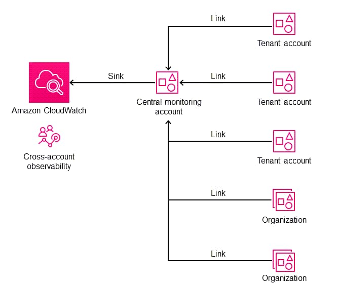
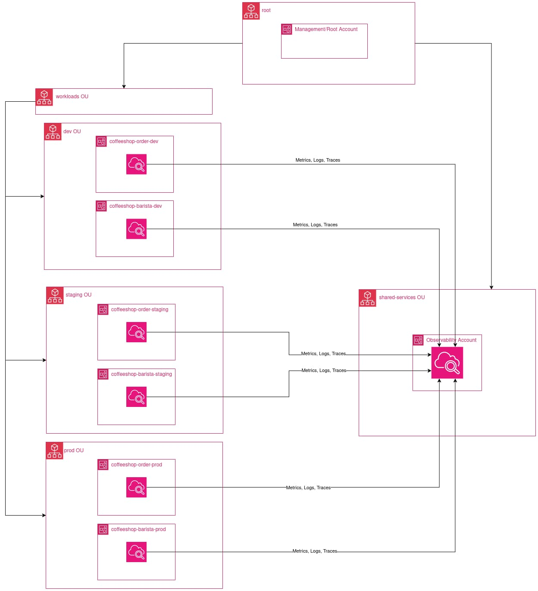
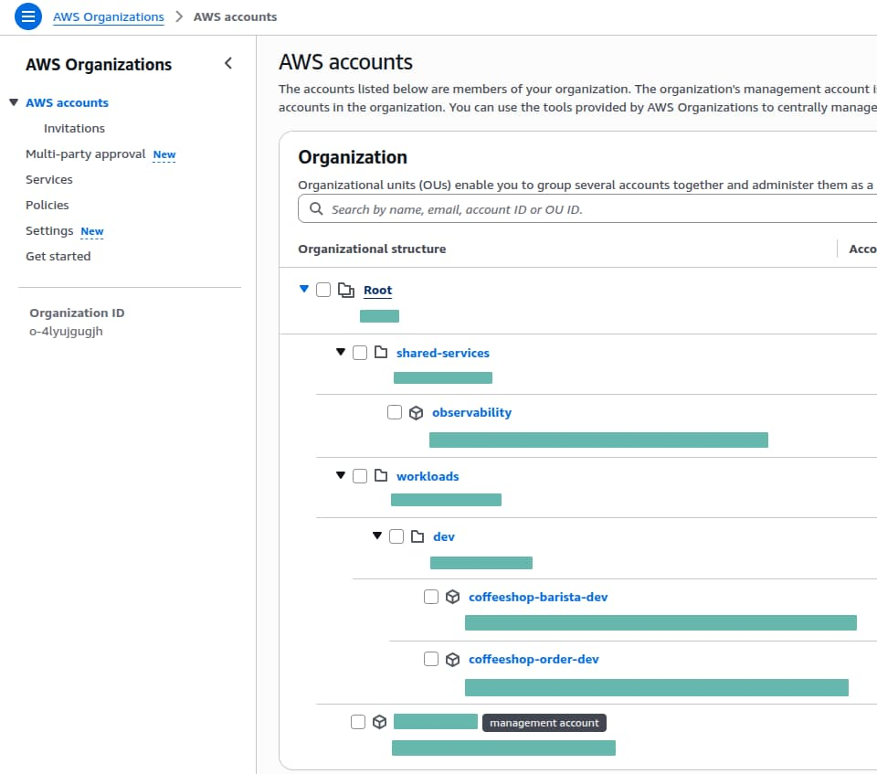
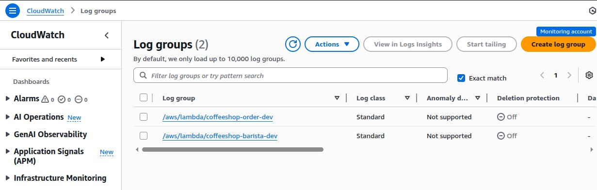
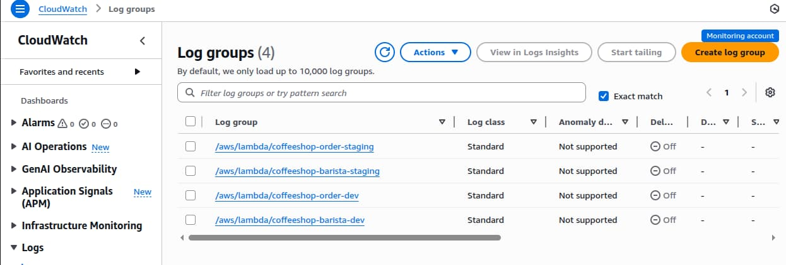

When you're running a multi-account AWS architecture, the question isn't if you
need centralized observability it's how you'll achieve it without drowning in
manual configuration.

## Challenge

Adopting a multi-account strategy (like the AWS Landing Zone pattern) offers
great isolation and security, but it introduces significant operational
friction:

- **Data Fragmentation:** Telemetry is scattered across dozens of accounts,
  forcing engineers to context-switch between consoles to debug a single
  transaction.
- **Manual Overhead:** Every time a new workload account is created, an engineer
  must manually configure log subscriptions and permissions.
- **Scaling and Maintenance:** As enterprises scale to hundreds of accounts,
  ensuring every single one is correctly linked to the monitoring system becomes
  a governance nightmare.

## Solution



Unified "Single Pane of Glass" experience that allows us to view logs, metrics,
and traces across the entire organization from one place.

It comes with no additional infrastructure cost and zero manual setup for new
accounts.

In this post, we will build a fully automated solution using:

- AWS Organizations for Organization structure.
- CloudWatch Observability Access Manager (OAM) for the cross-account data link.
- CloudFormation StackSets (Managed via Terraform) to automatically deploy the
  link to every new account.
- Sample Lambda workload that generates structured logs. This will allow us to
  verify the end-to-end flow and query data in the central account immediately
  after a new account is created.

> We will implement this using **Delegated Administration**, ensuring we don't
> need to use the Management account for daily operations.

## The "Coffee Shop" Architecture

We will follow the journey of a fictional "Coffee Shop" application with
multiple workloads deployed across separate AWS accounts.

Our Goal: To centralize logs, traces, and metrics into a dedicated Observability
Account automatically.



The application consists of two core microservices:

- **Order Workload**: Handles customer orders
- **Barista Workload**: Processes coffee preparation

Each microservice runs in its own dedicated account to simulate a real-world
use-case scenario.

Our Organizational Unit (OU) structure looks like this:

```txt
AWS Organization (r-coffee)
│
├── workloads OU
│   ├── dev OU
│   │   ├── coffeeshop-order-dev
│   │   └── coffeeshop-barista-dev
│   ├── staging OU
│   │   ├── coffeeshop-order-staging    <-- (Added later to prove automation)
│   │   └── coffeeshop-barista-staging  <-- (Added later to prove automation)
│   └── prod OU
│       └── ...
│
└── shared-services OU
    └── observability (Delegated Admin) <-- The Central Monitoring Hub
```

We will start by deploying the infrastructure for the Dev workloads.

Once that is running, we will add the Staging accounts to demonstrate how the
system automatically detects, links, and ingests telemetry from new accounts.

## Bootstrap the AWS Organization

### Prerequisites

#### 1. AWS Organization Must Exist

Before running this Terraform configuration, you must create an AWS
Organization:

Follow the AWS documentation to create an organization:
https://docs.aws.amazon.com/organizations/latest/userguide/orgs_manage_org_create.html

#### 2. Enable CloudFormation StackSets Access

> Use management/root administrator account credentials

Allow the Delegated Administrator (Observability account) to deploy StackSets to
member accounts automatically.

```shell
aws organizations enable-aws-service-access \
    --service-principal member.org.stacksets.cloudformation.amazonaws.com
```

Activate CloudFormation trusted access with Organizations.

```shell
aws cloudformation activate-organizations-access
```

#### 3. Archive OU Must Exist (Required for Safe Teardown)

Terraform does not create or manage the Archive OU.

You must create it manually once, under the Root OU.

The Archive OU is used to move all workload accounts before destroying the
organization structure.

> Use management/root administrator account credentials

```shell
# Get your Root OU ID:
aws organizations list-roots
# Create the Archive OU:
aws organizations create-organizational-unit \
    --parent-id <root_id> \
    --name archive
```

#### 3. Enable Service Control Policies (SCPs)

Since our Terraform code uses a data source to read the Organization (rather
than importing and managing the resource directly), Terraform cannot enable
Policy features for us. We must enable them manually to attach our security
guardrails.

First, find your Organization's Root ID (it starts with r-):

```shell
aws organizations list-roots
# Output example: "Id": "r-1234"
```

Next, use that ID to enable Service Control Policies:

```shell
aws organizations enable-policy-type \
    --root-id ORG_ROOT_ID \
    --policy-type SERVICE_CONTROL_POLICY
```

### Terraform: chicken/egg problem

Before we can manage our AWS Organization with Terraform, we face a classic
"Chicken and Egg" problem:

- We need an S3 bucket to store our Terraform state securely, but we want to
  create that S3 bucket using Terraform.

1. Initially leave the `backend "s3"` block commented out.

   This tells Terraform to store the state locally on our machine for the first
   run.

   ```hcl
   backend "s3" {
     bucket       = "org-state-REPLACE_ME_WITH_ACCOUNT_ID"
     key          = "01-org-bootstrap/terraform.tfstate"
     region       = "us-east-1"
     encrypt      = true

     # Native Locking (No DynamoDB required)
     use_lockfile = true
   }
   ```

2. Run the initial deployment:

   ```shell
   cd 01-org-bootstrap
   cp terraform.tfvars.example terraform.tfvars
   # update terraform.tfvars
   terraform init
   terraform plan
   terraform apply
   ```

   Terraform creates:
   - **Organizational Units (OUs)**: Separate OUs for workloads and shared
     services
   - **3 AWS Accounts**: One observability account + Two workload accounts
     (order, barista) in dev environment
   - **Delegated Administration**: Grants the observability account permission
     to deploy StackSets across all workload accounts
   - **Service Control Policy (SCP)**: Restricts StackSet execution roles to the
     workloads OU only
   - **S3 bucket**: For storing the Terraform state

3. Copy the output `tf_state_bucket_name` (e.g., org-state-123456789012) into
   `versions.tf` -> `backend.s3.bucket` block, uncomment it, and run:

   ```shell
   terraform init
   ```

4. Terraform detects the change and asks:
   `"Do you want to copy existing state to the new backend?"` We type `yes`.

> Result: Our state is now securely stored in S3 with locking enabled.

### Overview of the AWS Organization Units

In the previous Terraform run, we established a clean, scalable hierarchy.

Rather than having all accounts into the Root, we created a structure designed
for security isolation and automated targeting.



### Delegated Administration

Delegated administration allows you to assign specific AWS Organization–wide
responsibilities to a trusted member account instead of relying on the
management (root) account.

This reduces risk and operational overhead by following the principle of the
least privilege: only the delegated account receives the permissions needed for
its function.

In this architecture, the `Observability` account is the delegated administrator
for CloudFormation StackSets.

It can manage StackSet deployments into `workload` accounts, while having no
ability to deploy into other `shared-services` or `security` accounts.

This ensures controlled, auditable automation without exposing high-risk
privileges in the management account.

```hcl
resource "aws_organizations_delegated_administrator" "stacksets" {
  account_id        = aws_organizations_account.observability.id
  service_principal = "member.org.stacksets.cloudformation.amazonaws.com"
}
```

### Security Hardening with SCPs

Delegated administration empowers the Observability account to manage
CloudFormation StackSets across the organization, but we must ensure this power
is limited to the correct OU.

A Service Control Policy (SCP) acts as an organizational guardrail that prevents
StackSet execution roles from being used in sensitive `shared-services` or
`security` accounts.

This SCP denies any CloudFormation actions performed by the service-managed
StackSets execution role unless the target account is inside the Workloads OU.
This ensures that delegated automation cannot accidentally modify shared
services, identity, or security infrastructure.

```hcl
  # Block Service-Managed StackSets (the automation role) from running outside the Workloads OU.
  statement {
    sid       = "DenyStackSetExecOutsideWorkloads"
    effect    = "Deny"
    actions   = ["cloudformation:*"]
    resources = ["*"]

    # Target the auto-generated StackSet roles
    condition {
      test     = "StringLike"
      variable = "aws:PrincipalArn"
      values   = ["arn:aws:iam::*:role/stacksets-exec-*"]
    }

    # Exception: Allow if the account is in the Workloads OU path
    condition {
      test     = "ForAnyValue:StringNotLike"
      variable = "aws:PrincipalOrgPaths"
      values = [
        "${data.aws_organizations_organization.main.id}/${data.aws_organizations_organization.main.roots[0].id}/${aws_organizations_organizational_unit.workloads.id}/*"
      ]
    }
  }
```

## Setup Central Observability Account

Next, we will set up CloudWatch Observability Access Manager (OAM) in the
central observability account and automatically deploy OAM links to all workload
accounts using CloudFormation StackSets.

### Prerequisites

- Organization Bootstrap `01-org-bootstrap` Must Be Deployed
- Get Required Values from Bootstrap, will be used in
  `02-observability/terraform.tfvars`
  ```shell
  cd 01-org-bootstrap
  terraform output workloads_ou_id
  terraform output observability_account_id
  ```

### Initialize and Apply

This configuration must be applied with credentials for the
`observability account`, not the `management/root` account.

```shell
cd 02-observability
cp terraform.tfvars.example terraform.tfvars
terraform init
terraform plan
terraform apply
```

This will:

- Create the OAM Sink in the observability account
- Attach a sink policy that:
  - Allows `oam:CreateLink` and `oam:UpdateLink`
  - Restricts principals to accounts whose `aws:PrincipalOrgPaths` match the
    Workloads OU path
  - Limits allowed resource types to Metrics, Logs, and Traces
- Create a CloudFormation StackSet that:
  - Uses `permission_model = "SERVICE_MANAGED"`
  - Uses `call_as = "DELEGATED_ADMIN"`
  - Deploys an `AWS::Oam::Link` resource in each workload account
- Create StackSet instances targeting the Workloads OU with auto-deployment
  enabled

### Verify Deployment

After deployment, use the verification commands from the Terraform outputs:

```shell
terraform output verification_commands
```

- `list_attached_links` command should return `coffeeshop-order-dev` an
  `coffeeshop-barista-dev`
- `list_sinks` command should return `central-observability-sink`

### Migrate Terraform state to S3

See [Terraform: chicken/egg problem](#terraform-chickenegg-problem)

## Deploying Coffee Shop Microservices

With Organization infrastructure initialized and our Cross-Account Observability
automation listening for new accounts, it is time to deploy the actual "Coffee
Shop" Microservices.

### Workloads Directory Structure

```
03-workloads/
├── coffeeshop-order/
│   ├── dev/
│   ├── staging/
├── coffeeshop-barista/
│   ├── dev/
│   ├── staging/
└── modules/
    └── serverless-app/
```

### Workload Dev Deployment

- coffeeshop-order-dev

  > Use coffeeshop-order-dev administrator account credentials

  ```shell
  cd coffeeshop-order/dev
  terraform init
  terraform plan
  terraform apply
  ```

- coffeeshop-barista-dev
  > Use coffeeshop-barista-dev administrator account credentials
  ```shell
  cd coffeeshop-barista/dev
  terraform init
  terraform plan
  terraform apply
  ```

#### Migrate Terraform state to S3

See [Terraform: chicken/egg problem](#terraform-chickenegg-problem)

### Testing Lambda Functions

Once deployed, you can invoke the Lambda functions to generate logs:

#### Test coffeeshop-order-dev Lambda

```shell
aws lambda invoke \
    --function-name coffeeshop-order-dev \
    /dev/stdout
```

#### Test coffeeshop-barista-dev Lambda

```shell
aws lambda invoke \
    --function-name coffeeshop-barista-dev \
    /dev/stdout
```

### Verifying Logs in Observability Account

After invoking the Lambda functions, logs will be available in the observability
account.



## Automatically Monitor new accounts within the workload OU

### Add Staging Organization Unit and AWS Accounts

Update `01-org-bootstrap/terraform.tfvars`

`environments = ["dev"]` -> `environments = ["dev", "staging"]`

> Use management/root administrator account credentials

```shell
cd 01-org-bootstrap
terraform init
terraform plan
terraform apply
```

This will create Staging OU and AWS Accounts as follows

```
AWS Organization (r-coffee)
│
├── workloads OU
│   ├── dev OU
│   │   ├── coffeeshop-order-dev
│   │   └── coffeeshop-barista-dev
│   ├── staging OU
│   │   ├── coffeeshop-order-staging
│   │   └── coffeeshop-barista-staging
│   └── prod OU
│       └── ...
│
└── shared-services OU
    └── observability (Delegated Admin) <-- The Central Monitoring Hub
```

### Workload Staging Deployment

- coffeeshop-order-staging

  > Use coffeeshop-order-staging administrator account credentials

  ```shell
  cd coffeeshop-order/staging
  terraform init
  terraform plan
  terraform apply
  ```

- coffeeshop-barista-staging
  > Use coffeeshop-barista-staging administrator account credentials
  ```shell
  cd coffeeshop-barista/staging
  terraform init
  terraform plan
  terraform apply
  ```

#### Migrate Terraform state to S3

See [Terraform: chicken/egg problem](#terraform-chickenegg-problem)

#### Testing Lambda Functions

Once deployed, you can invoke the Lambda functions to generate logs:

#### Test coffeeshop-order-staging Lambda

```shell
aws lambda invoke \
    --function-name coffeeshop-order-staging \
    /dev/stdout
```

#### Test coffeeshop-barista-staging Lambda

```shell
aws lambda invoke \
    --function-name coffeeshop-barista-staging \
    /dev/stdout
```

### Verify Dev and Staging Logs in Central Observability Account



# Cleanup

- Delete coffeeshop-order-dev Resources:

  > Use coffeeshop-order-dev administrator account credentials

  ```shell
  cd 03-workloads/coffeeshop-order/dev/

  # migrate terraform state to local
  # comment out or remove backend "s3"
  terraform init -migrate-state

  # run
  terraform destroy
  ```

- Repeat the same commands for
  - `03-workloads/coffeeshop-order/staging/`
  - `03-workloads/coffeeshop-barista/dev/`
  - `03-workloads/coffeeshop-barista/staging/`
- Delete Observability Resources:

  > Use observability administrator account credentials

  ```shell
  cd 02-observability

  # migrate terraform state to local
  # comment out or remove backend "s3"
  terraform init -migrate-state

  # run
  terraform destroy
  ```

- Close AWS Accounts and Delete Organization Units:

  > Use management/root administrator account credentials

  > < 100 accounts – You can close up to 10 member accounts

  ```shell
  cd 01-org-bootstrap

  # Move all workload + observability accounts to archive OU
  terraform apply -var archive_accounts=true

  # migrate terraform state to local
  # comment out or remove backend "s3"
  terraform init -migrate-state

  # run
  terraform destroy
  ```

## Key Takeaways

- **Delegated administration** lets you manage observability without root
  credentials
- **Service-managed StackSets** eliminate IAM role boilerplate
- **SCPs** provide guardrails to prevent misconfiguration
- **OAM** centralizes logs and metrics with minimal performance overhead
- **Infrastructure as Code** makes this pattern repeatable and testable

## Git Repository

[aws-terraform-observability-bootstrap](https://github.com/bespinian/aws-terraform-observability-bootstrap)
